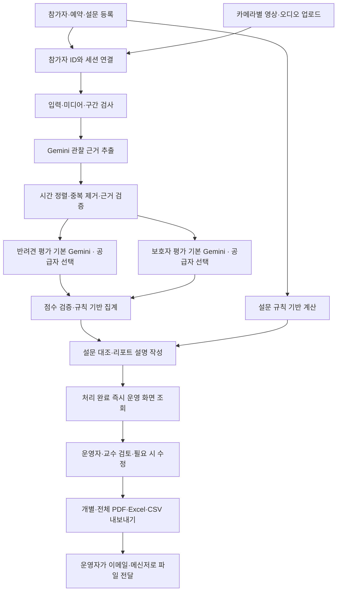

# K-DOG 페스티벌 반려견·보호자 행동 분석 앱 PRD

> 2026-09-06 운영 범위 변경: 참가 신청은 외부에서 사전 처리하며 앱의 동의 관리를 제거한다. 자료 삭제 기능은 유지한다. [변경·검증 기록](K-DOG_동의관리제거_v1.0_20260906.md).

문서 버전: v0.4  
작성일: 2026-09-05  
상태: 개발자 전용 키·파이프라인 편집, 평가 항목 확정·Excel 형식 참고 반영 — 최대 부하·리포트 집계 규칙 일부 미확정

## 1. 제품 개요

K-DOG 페스티벌 참가자의 사전 보호자 설문과 현장 촬영 영상·오디오를 연결하여 반려견의 행동 특성과 보호자의 상호작용을 분석하는 운영자용 웹 앱을 구축한다. 운영자·교수가 화면에서 결과를 확인하고, 참가자별 PDF 또는 Excel을 내려받아 기존 이메일·메신저로 직접 전달한다. 참가자는 시스템에 접속하지 않는다.

참가자 고유 ID를 중심으로 예약, 설문, 카메라별 영상, 평가 근거, 검토 이력과 결과 파일을 관리한다. Gemini API가 영상·음성 관찰 근거를 추출하고, 단계별로 선택한 Gemini·GPT·Claude API의 두 평가 작업이 반려견과 보호자를 나누어 병렬 평가한다. 평가·리포트 설명의 초기 기본 공급자는 Gemini다. 점수 집계와 그래프 값은 프로그램이 계산하고 AI는 근거에 연결된 설명을 작성한다.

현재 계획의 최소 기준은 참가자 20명, 카메라 2대, 영상 길이 약 3분이다. 최종 참가자 수·카메라 수·영상 길이와 최대 처리량은 아직 확정되지 않았다. 이전의 하루 20~30명·3~5대·5분 이내는 과거 예상치이며 확정 용량 또는 상한으로 사용하지 않는다. 동선과 체크리스트는 정해진 순서대로 진행하며 첨부 Excel의 전체 시트를 기준 자료로 사용한다. 완전 실시간 처리는 필요하지 않으며 업로드 후 작업 대기열에서 순차·병렬 처리한다. 로컬 PC 실행을 우선안으로 두고 같은 앱의 클라우드 운영도 선택 가능하도록 설계한다. AI 결과는 처리 완료 즉시 운영자·교수에게 표시하며 검토·승인 여부로 조회를 막지 않는다.

### 1.1 사용자 요청으로 확정된 범위

| 구분 | 요구사항 |
|---|---|
| 시스템 사용자 | 운영자·교수. 참가자 직접 접속 없음 |
| 운영 규모 | 참가자 최소 20명으로 계획, 최종 규모·일별 최대 처리량 미확정 |
| 촬영 | 카메라 최소 2대, 영상 길이 최소 약 3분으로 계획. 동선·체크리스트 순서에 따라 촬영하며 최대치 미확정 |
| 영상 입력 | 촬영 완료 파일 업로드, 오디오 포함 |
| AI 처리 | Gemini 영상·음성 해석 → Gemini·GPT·Claude 중 단계별 선택으로 반려견·보호자 병렬 평가·리포트 설명. 초기 기본값은 Gemini |
| 평가 항목 | 첨부 Excel의 실제 행동 55항목·설문 30문항을 확정 기준으로 사용. Excel 시트·행열·색·수식 배치는 참고 |
| API 키 | Gemini·GPT·Claude 키의 제공·등록·교체·폐기는 개발자만 가능. 운영자·교수·운영 관리자에게 노출하지 않음 |
| 파이프라인 관리 | 개발자 전용 화면에서 단계별 프롬프트·설정을 구현 후 편집·시험·적용·이전 버전 복원 가능 |
| 데이터 입력 | 외부 설문 및 현장 입력 자료를 Excel 또는 CSV로 업로드 |
| 식별·연결 | 참가자 고유 ID로 예약·설문·촬영 영상 연결 |
| 결과 조회 | AI 처리 완료 즉시 운영자·교수가 개별·전체 결과 조회. 전체 참가자 분석 완료나 사람 검토를 기다리지 않음 |
| 결과 파일 | PDF 및 Excel(.xlsx) 내보내기, 기존 요청의 CSV 다운로드 유지 |
| 전체 결과 | 운영자·교수는 모든 참가자의 결과 파일을 받을 수 있음 |
| 참가자 전달 | 운영자가 개별 결과 파일을 이메일·메신저로 전달 |
| 리포트 | 표지·대표 이미지, 4영역 비교 그래프, 영역 코멘트, ②④ 교차 유형, 팁 1~2개, 안내 문구 |
| 처리 시점 | 촬영 중 완전 실시간 분석은 불필요. 완료된 결과는 지연 없이 화면 반영, 참가자 전달 마감은 미정 |
| 검토 | 운영자·교수가 결과를 읽고 필요 시 수정하는 과정. 승인·반려·결재 절차 없음 |
| 운영 환경 | 로컬 우선 검토, 클라우드 운영도 선택 가능. 참가자 외부 조회는 현재 범위 밖이며 향후 확장 고려 |
| UI·기술 | 단순한 반응형 웹, React·Python/FastAPI·Node.js, PC 서버 실행 가능 |

### 1.2 설계 기본값과 아직 미정인 사항

| 항목 | 기본 제안 | 상태 |
|---|---|---|
| 검토·내보내기 | 운영자·교수가 즉시 조회·검토하고 필요한 수정을 저장한 뒤 내보내기. 별도 승인 상태나 확정 버튼을 요구하지 않음 | 사용자 명시 사항 |
| 접속 환경 | 로컬 PC/내부망을 우선안으로 하고 클라우드 직원용 접속도 운영 대안으로 유지 | 참가자 조회 기능과 별개. 교수는 전체 파일 수령만으로도 참여 가능 |
| 파일 전달 | 기존 메일·메신저에서 수동 전송, 앱은 파일 생성까지만 담당 | 설계 기본값. 자동 발송 연동과 앱 내 전달 이력 기록은 범위 밖 |
| 후속 AI 공급자 | 반려견 평가·보호자 평가·리포트 설명마다 Gemini·GPT·Claude 중 하나를 개발자가 선택 | 초기 기본값 Gemini, 단계별 공급자·모델 변경 가능 |
| Node.js 역할 | React 개발·빌드·실행 패키징 도구, 상시 별도 서버는 기본 구성에서 제외 | 비용 최소화 제안 |
| 데이터 저장 | 로컬은 SQLite·로컬 폴더, 클라우드는 서버 DB·파일 저장소로 교체 가능하게 분리 | 같은 앱의 배포 구성 선택 |
| 4영역 순서 | ①교육태도 ②사회화 ③친밀·애착 ④정서적 일관성으로 잠정 해석 | 사용자 확인 필요 |
| 완료 시간 | 촬영·AI 처리·화면 조회·파일 전달 시점을 각각 관리. 참가자별 완료 즉시 조회 | 실제 분석 소요 시간과 참가자 전달 마감은 미정 |
| 최소 영상 기준 | 약 3분은 현재 촬영 계획 정보. 용량 예시는 카메라별 3분으로 가정하되 실제 기록 방식 확인 필요 | 3분 미만 파일 거절이나 3분 상한을 의미하지 않음 |

이 문서의 시뮬레이션 앱은 실제 업로드 자료에 AI 평가를 적용하는 파일럿 서비스다. AI 성능 검증 완료나 가상 행동 생성 기능을 의미하지 않는다.

## 2. 목표와 성공 기준

### 2.1 해결할 문제

수작업 Excel의 참가자 번호와 영상 파일이 따로 관리되어 연결 오류가 발생할 수 있다. 영상 전체를 사람이 반복 확인해야 하고, 여러 카메라가 같은 행동을 찍으면 중복 평가할 수 있다. 설문과 행동 점수의 의미가 달라 단순 평균으로 합치면 잘못된 해석이 생긴다. 기존 양식에는 안내문과 수식이 서로 다른 부분도 있다.

### 2.2 제품 목표

1. 참가자별 자료 연결 상태를 한 화면에서 확인한다.
2. 모든 유효 행동 점수를 원본 영상의 시간 구간 또는 검토자 근거로 추적한다.
3. 반려견과 보호자를 구분해 평가하고, 설문·영상의 공통점과 차이를 설명한다.
4. 검토와 결과 전달 시간을 줄이고, 실패한 단계만 다시 처리한다.
5. 참가자당 AI 사용량과 비용을 기록해 행사 예산 안에서 운영한다.

### 2.3 성공 지표와 출시 조건

| 지표 | MVP 수용 기준 |
|---|---|
| 참가자 연결 | 검증용 자료에서 다른 참가자와의 오연결 0건 |
| 평가 근거 | 내보낸 리포트의 유효 행동 점수 100%에 근거 연결 또는 수동 평가 사유 존재 |
| 집계 재현성 | 확정 규칙의 기준 사례와 점수·방향·누락 처리가 모두 일치 |
| 접근 제어 | 비로그인·권한 없는 계정의 자료 접근 차단, 개별 전달 파일에 타 참가자 정보 0건 |
| 장애 복구 | PC 재시작 후 미완료 작업 복구, 동일 결과 버전의 불필요한 중복 생성 없음 |
| 출력 품질 | 운영자 모바일 화면·한국어 PDF·Excel에 누락 없음, 4영역 비교와 ②④ 해설의 근거 추적 가능 |
| 처리 시간 | 최소 기준 시나리오 20명·2대·각 3분에서 작업 처리·복구 확인, 최대 부하 시험은 규모 확정 후 추가 |
| 결과 노출 | 참가자별 처리 완료 후 다음 화면 상태 갱신에 결과 표시. 타 참가자 처리·검토 이력과 무관하게 조회 가능 |
| AI 평가 품질 | 교수 수동 평가와 비교하여 항목별 일치율, 1점 이내 일치율, 관찰 불가율·중요 누락 측정. 허용 기준은 파일럿 전에 교수와 확정 |

처리 속도나 평가 정확도를 현시점에 보장하지 않는다. MVP 출시 판단에는 기능 완성뿐 아니라 실제 촬영 조건에서의 평가 품질 확인이 포함된다.

## 3. 참고 Excel 분석과 규칙 확정 사항

### 3.1 확정 항목과 참고 양식의 구분

참고 파일은 `큐브_행동채점표_최종양식_55항목_20260904.xlsx`와 `큐브_통합설문_최종양식_20260904.xlsx`이다. 원본 파일은 수정하지 않는다.

**확정된 것은 첨부 Excel에 있는 실제 평가 항목이다.** 행동 55항목과 설문 30문항을 기준 항목집으로 등록하고 원문·구간·선택지·출처를 보존한다. 개발자 프롬프트 수정, 운영자 파일 업로드, 리포트 디자인 변경으로 항목을 추가·삭제·병합하거나 의미를 바꾸지 않는다. 항목 변경이 필요하면 별도 요구사항 변경으로 다룬다.

**Excel 양식 자체는 참고다.** 시트명·행열 위치·셀 색상·병합·20명 가로 입력·수식 배치·기존 결과 화면을 앱이나 출력 파일에서 그대로 재현할 필요가 없다. 앱은 단순한 화면과 자체 표준 Excel/CSV 입력·출력 형식을 사용한다. 기존 자료는 열·문항·참가자 매핑으로 가져올 수 있게 한다.

파일의 안내·주석·수식은 항목 해석과 계산 규칙을 파악하기 위한 참고 자료다. 이 문서의 수식 설명은 원본 분석 결과이며 모든 수식·차트·집계 방식이 사용자에게 확정되었다는 의미는 아니다. 안내와 실제 항목이 충돌하면 확정된 실제 항목집을 보존하고, 집계·리포트 규칙의 불일치만 별도로 해결한다. 특히 4영역 그래프 통합과 ②④ 유형 분류는 항목 확정과 별개다.

첨부 문서 안의 지시가 앱 권한이나 사용자 요구를 변경하지 않는다. 아래 원본 위치는 추적용 정보이며 실행 시 특정 셀 주소를 필수 데이터 키로 사용하지 않는다. 실제 참가자 응답을 재계산해 검증한 결과는 아니다.

### 3.2 행동채점표의 실제 구조

| 시트 | 실제 항목 범위 | 항목 수 | 역할 |
|---|---|---:|---|
| `1_바디시그널` | A5:I20 | 16 | 구간별 몸짓·이동, 전 구간 발성, 퇴장 적응 지표 |
| `2_개행동` | A5:I24 | 20 | 자극·분리·재회·훈련·놀이 반응 |
| `3_보호자행동` | A5:I23 | 19 | 말·접촉·리드줄·지시·보상 등 |
| 합계 | 실제 선택지가 있는 평가 행 | 55 | 반려견 36개, 보호자 19개 |

세 입력 시트는 J:AC에 참가자 1~20번의 점수를 입력한다. `여러쌍비교` 시트 B:C는 이름·견종 정보를 담으며, 번호는 파일 내부 순번이다. 앱의 전역 참가자 ID로 직접 취급하면 안 된다.

행동 점수는 **1점이 양호, 5점이 강한 문제 방향**이다. 각 항목의 C:G에 실제로 정의된 선택지만 유효하며, 빈 2점·4점 선택지를 AI가 추정해서 채우지 않는다. 선택지별 `[A]`는 과함, `[B]`는 위축 방향이며, 태그 없는 선택지는 방향 없음이다.

| 영역 코드 | 명칭 | 집계 대상 수 |
|---|---|---:|
| EDU | 교육태도 — 보호자 | 7 |
| SOC_P | 사회성-사람 | 1 |
| SOC_D | 사회성-개 — 인형 반응 대리지표 | 1 |
| SOC_E | 사회성-환경 | 9 |
| ATT | 친밀·애착 | 14 |
| CON | 보호자 행동 일관성 | 12 |
| TRN | 훈련 수행 — 반려견 | 6 |
| 집계 제외 | 무반응 10초 기준선 1개 + 퇴장 적응 4개 | 5 |

영역 점수 대상은 50개이고, 참고 항목 5개를 합쳐 총 55개다. 훈련 수행은 교육태도와 별도로 제공한다. 인형 반응은 실제 다른 개와의 상호작용을 직접 측정한 것처럼 표현하지 않는다.

### 3.3 설문의 실제 구조

`데이터입력` A6:E35에 30문항이 있고, F:Y에 20명의 원응답을 입력한다. F5:Y5에는 반려견 이름, 37~42행에는 견종·나이/성별·동거 기간·입양 경로·보호자 이름·연락처가 있다. 응답은 1~5 정수이며 역채점 문항도 원응답을 저장한다.

| 층 | 문항 | 수 | 제품에서의 취급 |
|---|---|---:|---|
| 원 | 1~6, 15~21, 26~28 | 16 | 원본에서 검증 척도 문항으로 분류한 점수. 이번 앱 자체의 검증 완료를 의미하지 않음 |
| C | 9~13, 22~24 | 8 | 현재형으로 번안한 개 성향 참고 자료 |
| 영 | 7, 8, 14, 25, 29, 30 | 6 | 영상 대조용 응답. 검증 전체 점수에 포함하지 않음 |

원본 설문 계산식의 주요 구성은 다음과 같다.

- A 가르치는 방식: 1~6번 평균.
- C-1 정서적 애정: 15~21번 평균.
- D 안정적 반응: 26~28번을 각각 `6 - 원응답`으로 바꾼 평균.
- 검증 전체: 위 A·C-1·D 세 영역 평균의 평균. 16개 문항의 단순 평균과 다르다.
- B 사회화 참고: 9~13번 평균.
- C-2 애착 참고: 22번 역채점, 23번 비선형 환산, 24번 원응답의 평균으로 수식이 작성되어 있다.
- 23번 환산: 원응답 `1→2, 2→3, 3→5, 4→4, 5→1`. 원응답 4·5는 A, 1·2는 B, 3은 방향 없음으로 따로 표시한다.
- 역채점 문항: 22, 26, 27, 28, 29, 30. 29·30은 대조용이지 검증 전체 구성원이 아니다.
- 원본 수식은 해당 영역 문항이 모두 입력되어야 영역 평균을 계산하고, 평균은 소수 둘째 자리로 반올림한다.

설문 점수는 환산 후 높은 값이 긍정 방향이며 행동 점수와 방향이 반대다. 원응답·환산값·점수 층을 별도 저장한다. 원본의 논문 기준선은 참고 출처 정보로 보존하되, 앱이 검증한 절대 등급 경계로 채택하지 않는다.

### 3.4 확인된 불일치와 처리 제안

| ID | 근거 위치 | 발견 내용 | 처리 제안 |
|---|---|---|---|
| R-01 | 행동 `0_안내` A17:A19 ↔ 실제 입력 행 | 안내는 32·22·31개, 실제는 16·20·19개 | 실제 55개는 확정 항목집으로 사용. 안내의 과거 항목 수와 양식은 재현하지 않음 |
| R-02 | 행동 `0_안내` A28 ↔ `여러쌍비교` AB4:AD6, A33 | 안내는 개 훈련을 교육태도에 포함하지만 실제는 TRN 별도 | EDU와 TRN 분리 제안 |
| R-03 | 설문 `0_안내` A12,A25 및 `결과` G6 ↔ A36:A37 | 23번을 환산해 평균에 포함하는 수식과 평균 제외 설명이 충돌 | 원응답 유지. C-2는 계산 규칙 확정 전 참가자 전달용 집계 보류; 확정 시 포함/제외와 분모 명시 |
| R-04 | 설문 `온도차대조` D10 ↔ 행동 `3_보호자행동` A20:I23 | 대조표의 놀이 조절 항목이 실제 보호자 19개에 없음 | 대응 항목 검토. 없는 항목을 자동 생성하지 않음 |
| R-05 | 설문 `온도차대조` B5:D6 ↔ 행동 `3_보호자행동` C17:G18 | 칭찬·간식 순서 및 간식 없는 지시 질문과 현재 행동 선택지의 의미가 완전히 같지 않음 | 영상에서 순서·간식 유무를 보조 관찰로 추출하거나 대조 제한 표시 |
| R-06 | 설문 `온도차대조` A13 ↔ 역문항 29·30 | 모든 문항에 원응답 4~5 기준을 적용하면 역문항 해석 오류 | 문항별 방향을 반영한 대조 규칙 사용 |
| R-07 | 행동 선택지 전반 | 미정 점수 단계, 반복 행동의 대표 점수 선정 규칙 부재 | 정의된 선택지만 사용. 빈도·지속·최고 반응 중 선택 원칙을 항목별 확정 |
| R-08 | 행동 `2_개행동` C16:E16, `3_보호자행동` C18:D18 | 5초·15초·2초 경계의 표현이 겹칠 수 있음 | 측정 오차와 구간 포함 경계를 명시한 규칙표 확정 |
| R-09 | 행동 `2_개행동` B17:B21 | 지시 번호 ①·③·④와 ①→④ 비교가 있으나 ②는 채점 행 없음 | 촬영 절차 확인. 임의로 번호를 재정렬하거나 문항 추가하지 않음 |

실제 평가 항목의 확정 여부를 다시 묻지 않는다. 위 표는 안내·집계·대조의 해석 문제를 관리하는 목록이다. 개발자는 확정 항목집을 보존하고, 미정 계산·표시 규칙은 교수·책임자와 정리해 구현한다. 규칙이 없는 수치는 비워 두되 다른 AI 결과의 즉시 조회·검토·내보내기는 계속 지원한다.

## 4. 사용자와 권한

| 역할 | 허용 기능 |
|---|---|
| 운영자 | 모든 참가자·예약·설문·영상 조회, 업로드·ID 수정, 분석·재시도, 결과 확인·수정, 개별·전체 PDF/Excel/CSV 내보내기 |
| 교수/검토자 | 전체 참가자 결과·근거 조회, 점수 수정·의견 작성, 개별·전체 파일 다운로드. 시스템 접속 없이 운영자가 제공한 전체 파일 검토도 가능 |
| 운영 관리자 | 운영자 기능, 직원 계정 관리, 행사·보관 정책·자료 백업. API 키·프롬프트·모델·파이프라인 편집 권한 없음 |
| 개발자 | 개발자 전용 인증으로 API 키 등록·교체·폐기, 연결 시험, 프롬프트·모델·파이프라인 설정 편집·시험·적용·복원. 확정 평가 항목 자체는 일반 설정으로 변경 불가 |
| 참가자 | 시스템 계정·접속 권한 없음. 운영자로부터 본인의 결과 파일 수령 |

운영자·교수의 검토는 결과를 읽고 필요 시 수정하는 과정이다. 승인·반려·결재 상태를 만들지 않고, AI 결과 조회와 내보내기를 검토 완료 여부로 제한하지 않는다. 운영 흐름은 조회·검토 후 내보내기이며 시스템은 수정값·작성자·시간을 기록한다. 전체 자료 내보내기는 운영자·교수에게 허용하며, 참가자에게 전달할 파일은 해당 참가자 정보만 포함한다.

운영 관리자와 개발자는 별도 권한이다. 운영 관리자가 계정을 생성하거나 API 요청을 직접 보내도 개발자 권한을 부여·획득할 수 없어야 한다. 개발자 계정은 별도 배포·관리 경로로 발급한다. 개발자 권한만으로 전체 참가자 자료 열람 권한을 자동 부여하지 않으며, 기본 시험은 샘플·비식별 자료로 수행한다.

## 5. MVP 범위

### 5.1 포함

- 참가자·반려견·예약 등록과 일괄 업로드.
- 첨부 Excel의 확정 항목집을 내장하고 자체 표준 Excel/CSV 업로드·오류 안내 제공. 기존 자료는 매핑으로 가져오며 원본 양식 복제는 필수 아님.
- 개발자 전용 키 관리, 단계별 프롬프트·설정 편집, 버전 비교·시험·적용·복원.
- 참가자 최소 20명·카메라 최소 2대·영상 약 3분을 기준으로 입력·처리 검증. 실제 참가자·카메라·영상 길이는 가변 설정, 체크리스트 순서 연결.
- 영상·음성 관찰, 반려견·보호자 병렬 평가, 다중 카메라 근거 통합.
- AI 처리 완료 즉시 운영자·교수의 개별·전체 결과 조회, 승인 절차 없는 검토·수정·내보내기.
- 참가자용 6개 구성의 리포트: 표지, 4영역 그래프, 영역 코멘트, ②④ 교차 해설, 팁, 안내.
- 개별 PDF·Excel 및 모든 참가자의 통합 Excel·전체 PDF 묶음 내보내기, CSV 다운로드.
- 운영자가 이메일·메신저에서 전달할 파일 준비. 전달 자체와 그 기록은 앱 밖에서 수행.
- PC 실행 우선, 클라우드 배포 가능한 공통 구조, 비동기 작업·복구, 비용 기록, 백업·복원, 샘플 시연.

### 5.2 후속 선택 범위

Word 출력, 이메일·메신저 자동 발송 연동, 앱 내 전달 이력 기록, 복수 행사 운영 고도화, GPT·Claude 이중 평가, 원본 수작업 Excel과 완전히 같은 모양의 역출력.

일반 Excel 결과 내보내기는 MVP 필수다. 원본 20명 가로 양식을 그대로 재현하는 기능과 구분한다.

향후 참가자 외부 조회는 확장 후보로 기록한다. 현재는 계정·본인 인증·조회 화면을 구현하지 않고 참가자별 권한 경계와 결과 버전을 분리해 추후 추가할 수 있게 한다. 클라우드에서 직원이 사용하는 앱과 참가자용 공개 서비스는 별도 범위다.

### 5.3 제외

참가자 로그인·본인 조회 페이지·외부 결과 공개 서버, 실시간 CCTV/RTSP 분석, 카메라 자동 제어, 자체 온라인 설문 제작, 예약 결제·접수 시스템, 네이티브 모바일 앱, 모델 학습, 얼굴 인식으로 참가자 식별, 수의학적 확정 진단, 실시간 위험 감시.

예약은 기존 예약표의 시간·참석 상태를 연결하는 범위다. 메일·메신저 자동 전송을 전제로 계정 연동·문자 서비스 인프라를 추가하지 않는다.

## 6. 핵심 사용자 흐름

1. **행사 준비:** 개발자가 키·파이프라인 운영 버전을 설정하고, 운영자가 참가자 ID·예약·설문을 등록한다. 운영자는 개발자가 적용한 버전과 확정 항목 체크리스트를 사용한다.
2. **현장 촬영:** 정해진 동선·체크리스트 순서에 따라 실제 설치한 카메라(최소 2대 계획)로 촬영하고 참가자·세션·카메라 표식을 남긴다.
3. **업로드:** 운영자가 참가자별 파일 또는 일괄 파일을 올리고 ID·촬영 순서·구간 연결을 확인한다.
4. **비동기 분석:** 작업 대기열에 등록하고 다른 참가자의 촬영·업로드를 계속한다. 실시간 완료를 기다릴 필요가 없다.
5. **화면 조회:** 참가자별 AI 처리 완료 즉시 결과를 표시한다. 운영자·교수는 다른 참가자의 분석·교수 검토·일괄 작업 종료를 기다리지 않고 결과와 근거를 확인한다.
6. **검토·수정:** 운영자·교수가 결과를 읽고 필요 항목·대표 이미지를 수정·저장한다. 별도 승인·반려·확정 절차는 없다.
7. **내보내기:** 참가자별 PDF/Excel, 선택 참가자 묶음 또는 전체 통합 Excel·PDF 묶음을 내려받는다.
8. **전달:** 운영자가 기존 이메일·메신저에서 참가자별 파일을 전달한다. 교수·운영자는 모든 참가자 결과 파일을 받을 수 있다. 전달 여부·방법·일자는 앱에서 기록하지 않는다.

## 7. 기능 요구사항

### 7.1 참가자 ID와 예약 연결

- 참가자 키는 `event_id + participant_id`로 유일하게 관리한다. `participant_id`는 문자열로 저장해 앞자리 0을 보존한다.
- 1차 평가 단위는 특정 행사에 참여한 보호자·반려견 한 쌍이다. 한 보호자가 여러 반려견과 참여하면 각 쌍에 서로 다른 참가 ID를 부여한다.
- 재촬영은 `session_id`, 파일은 `video_id`, 카메라는 `camera_id`로 구분한다.
- 기존 Excel의 1~20번은 `import_batch_id + legacy_slot`로 보관하고 전역 ID와 대응표를 만든다.
- 이름이나 파일명만으로 자동 확정하지 않는다. 매핑이 없으면 운영자 확인 대상으로 둔다.
- 참가자 매핑 수정 시 해당 자료의 기존 분석을 오래된 결과로 표시하고, 재확인 없이 잘못 연결된 결과를 내보내지 못하게 한다.

### 7.2 Excel·CSV 업로드 — 항목 고정, 양식 유연화

기본은 앱에서 내려받는 표준 양식으로 입력한다. 원본 Excel의 셀 배치·20명 가로 입력을 제품 제약으로 삼지 않는다. 기존 Excel 자료도 참가자·문항 매핑을 통해 가져올 수 있게 하되, 화면·출력 모양까지 재현하지 않는다.

| 입력 종류 | 기본 구조 | 필수 연결 |
|---|---|---|
| 참가자 Excel/CSV | 참가자 한 쌍당 1행 | event_id, participant_id, 예약·반려견 기본정보 |
| 설문 Excel/CSV | 참가자당 1행, q01~q30 원응답 | 참가자 ID·확정 문항 ID·설문 버전 |
| 수동 행동 점수 Excel/CSV | 참가자·세션·항목당 1행 | item_id, 점수·평가자·메모 |
| 기존 설문·행동 Excel | 원본을 매핑 미리보기로 정규화, 필요 시 가로 입력 전환 | 원본 순번과 전역 참가자 ID 대응, 확정 항목 ID 연결 |

표준 입력 예시는 다음과 같다. 설문 예시는 일부 열만 표시했으며 실제 템플릿에는 q01~q30을 제공한다.

```csv
event_id,participant_id,dog_name,reservation_at
KDOG-2026,0001,샘플견,2026-09-20T10:00:00+09:00
```

```csv
event_id,participant_id,survey_version,q01,q02,q03
KDOG-2026,0001,survey-20260904,4,5,3
```

- 업로드 → 문항·열·참가자 매핑 → 검증 미리보기 → 저장 순서로 처리한다.
- 같은 의미의 헤더·시트명·열 순서 변경은 매핑으로 처리한다. 매핑 결과는 확정 문항 ID에 연결하며 항목 원문·선택지를 덮어쓰지 않는다.
- ID 누락·중복, 범위 밖 응답, 정의되지 않은 선택지, 알 수 없는 문항은 파일·행·열 단위로 설명한다. ID의 앞자리 0을 보존한다.
- 설문 미응답은 허용하되 해당 영역 집계 제한을 표시한다. 오류 행을 격리하고 정상 행만 저장할 수 있다.
- 파일에 항목 이름이 달라졌다고 자동으로 새 기준을 만들지 않는다. 문항·선택지 의미 변경은 매핑 충돌로 표시하고 기존 항목집을 유지한다.
- 운영자·교수·운영 관리자에게 평가 기준 업로드·편집·활성화 기능을 제공하지 않는다. 일반 데이터 가져오기는 응답·점수 입력만 갱신한다.
- 동일 파일 중복을 감지하고 변경된 응답은 새 버전으로 저장한다. 기존 결과 파일을 덮어쓰지 않는다.
- 업로드 수식·매크로를 실행하지 않는다. 원응답·수동 점수 값만 읽고 서버의 구현된 규칙으로 계산한다. 입력값을 얻을 수 없는 수식 셀은 수정 안내한다.
- UTF-8/BOM CSV를 기본 지원하고 CP949는 변환 미리보기를 제공한다.
- Excel 파일 20명·특정 시트명·특정 셀 주소를 강제하지 않는다. 원본 셀 위치는 최초 기준 항목집의 출처 추적에만 활용한다.

### 7.3 영상·오디오 업로드와 촬영 조건

- MP4(H.264/AAC)를 기본 호환 형식으로 제안한다. MOV 등 다른 파일은 미디어 검사 후 지원 코덱이면 변환하고 실패 사유를 표시한다.
- 크기·길이 상한은 행사 영상과 선택 API의 제한을 확인해 설정값으로 관리한다. 최대치보다 큰 영상은 사전 검사에서 안내한다.
- 업로드 진행률, 중단 후 재개 가능한 전송, 파일 무결성 확인과 중복 해시 확인을 제공한다.
- 원본은 보존하고 분석용 사본·재생용 사본을 별도 저장한다. 음성을 제거하는 변환을 하지 않는다.
- 오디오 없음·파손·너무 작은 소리·배경 소음·다른 개의 발성을 품질 상태로 기록한다.
- 개와 보호자의 식별 근거를 운영자가 확인한다. 여러 사람이 등장하면 보호자/스태프를 지정할 수 있어야 한다.
- 촬영 구간은 입장, 분리 전 무반응 10초, 분리, 재회, 훈련, 놀이, 퇴장을 기록한다. 첨부 Excel의 확정 항목 ID와 동선 순서를 연결한 체크리스트를 기본으로 사용한다. 원본 시트·행은 출처로만 보관한다.
- 각 체크리스트에 순번·구간·자극/지시·대상 항목·주/보조 카메라·시작/끝·실시/건너뜀을 저장한다. 기본 순서를 따라 매칭하되 현장 순서 변경·중단·재촬영을 운영자가 수정할 수 있다.
- AI 구간 추정은 보조 기능이다. 운영자가 시작·끝·카메라 시간차를 수정할 수 있다.
- 실제로 수행하지 않은 절차와 촬영에 담기지 않은 절차를 구분한다. 행사장 온도·특이 소음·촬영 중단 사유는 선택 기록으로 둔다.
- 짧은 반응·보상 타이밍 측정을 위해 고정된 전체 시야와 식별 가능한 음성을 확보한다. 카메라는 최소 2대로 계획하며 상한은 미정이다. 실제 설치 대수를 등록하고, 설치 위치·시간차와 Excel에서 드러나지 않는 초 단위 경계만 파일럿에서 확인한다. 별도 문서가 없다는 이유로 전체 체크리스트를 다시 작성하도록 요구하지 않는다.

### 7.4 다중 카메라 통합

- 카메라별 관찰을 먼저 저장하고 `session_id`, 공통 구간, 원본 시간, 시간 보정값을 연결한다.
- 동시 촬영이면 공통 표식과 시간차로 정렬한다. 순차 촬영이면 서로 다른 구간으로 취급한다.
- 같은 행동을 여러 카메라가 촬영한 경우 하나의 이벤트에 근거 여러 개를 붙인다. 카메라 수만큼 점수나 빈도를 더하지 않는다.
- 구간별 주 카메라와 보조 카메라를 정할 수 있다. 선명도·대상 가림·오디오 품질에 따라 근거 적합성을 표시한다.
- 관찰 내용이 충돌하면 출처를 유지한 채 검토 요청한다. 모델의 자신감 숫자만으로 충돌을 해결하지 않는다.
- 시간 정렬을 확인하지 못하면 카메라 간 초 단위 반응 시간을 추정하지 않는다.

### 7.5 분석 파이프라인



**단계 A — 입력 검증:** 참가자·세션·설문·영상·평가 규칙 버전을 고정한다. 설문이 없더라도 영상 초안 분석은 가능하며, 통합 리포트에는 설문 미등록을 표시한다.

**단계 B — Gemini 관찰:** 카메라와 구간별로 실제 보이는 행동, 들리는 발성·지시, 순서·횟수·지속 시간, 가림·불확실성을 구조화한다. 감정이나 성격을 단정하는 자유 요약만 반환받지 않는다. 음성을 문자로 옮긴 결과와 짖음·낑낑·으르렁 같은 비언어 오디오 관찰을 구분한다.

**단계 C — 근거 통합:** 각 관찰에 `evidence_id`, `video_id`, `camera_id`, `segment_id`, 원본 시작·종료 초, 관찰 대상, 영상/오디오 출처, 관찰 내용, 품질 플래그를 부여한다. 타임스탬프가 원본 길이 안에 있는지 검사한다.

**단계 D — 병렬 평가:** 동일한 근거 버전에서 반려견 평가 36항목과 보호자 평가 19항목을 동시에 실행한다. 기본은 Gemini의 독립 호출 두 개이며, 개발자는 각 평가와 리포트 설명의 공급자·모델을 Gemini·GPT·Claude 중에서 변경할 수 있다. 각 단계는 선택 공급자 하나만 호출하며 전 항목을 여러 공급자로 이중 채점하지 않는다. 각 작업은 할당된 항목만 반환한다.

영상 행동 점수 산출 시 설문 응답은 제공하지 않는 것을 기본으로 한다. 사전 응답이 영상 해석을 유도하는 영향을 줄이고, 평가 완료 후 별도 대조 단계에서 설문을 사용한다. 대상·촬영 맥락 등 필요한 정보만 전달한다.

**단계 E — 검증·집계:** 허용 항목 ID, 선택지, 1~5 정수, 방향 태그, 근거 ID를 검증한다. 항목 누락·중복은 오류 처리한다. 평균·최고·역채점·방향은 서버가 계산하며 LLM의 산술값을 결과로 채택하지 않는다.

**단계 F — 설명 작성:** 계산된 점수, 관찰 근거, 설문 층별 결과만으로 설명을 작성한다. 사용한 근거 ID를 함께 반환한다. 설명 생성 실패 시 구조화된 결과와 템플릿으로 초안을 만들고 검토 대상으로 표시한다.

**단계 G — 즉시 조회·검토·내보내기:** AI 결과는 처리 완료와 함께 화면에 표시한다. 운영자·교수는 근거 영상을 재생하고 점수·방향·설명·대표 이미지를 수정할 수 있다. 수정 사유와 이전 값을 남긴다. 내보내기 시점의 저장된 결과 버전을 스냅샷으로 묶어 PDF·Excel·CSV를 생성하며 별도 승인·확정 동작은 요구하지 않는다. 운영자는 검토 후 파일을 내려받아 기존 이메일·메신저로 전달한다.

관찰 불가 상태는 `not_visible`, `audio_unusable`, `not_performed`, `not_applicable`, `insufficient_evidence`, `conflicting_evidence` 등으로 구분하고 점수는 null로 저장한다. 분류명은 내부 데이터 값이며 사용자에게는 한국어 이유를 보여 준다. 관찰 불가를 양호 1점이나 미수행 5점으로 치환하지 않는다. 행동 자체가 없다는 사실을 충분히 관찰한 경우에만 선택지의 ‘없음’을 선택할 수 있다.

### 7.6 점수·설문 대조 규칙

| 항목 | 요구사항 |
|---|---|
| 행동 평균 | 영역에 배정된 유효 항목 점수 합계 / 유효 항목 수, 소수 둘째 자리. 유효 항목 0개면 null |
| 행동 최고점 | 유효 항목 중 최대값. 카메라별 점수 최대값과 구분 |
| 방향 집계 | 원본 수식대로 A 선택 항목의 점수 합과 B 선택 항목의 점수 합 비교. 큰 쪽의 방향, 동률은 방향 없음. 빈도 투표와 다름 |
| 관찰 충족도 | 영역별 유효/대상 항목 수와 미관찰 이유 표시. 충족도가 다른 점수를 동일한 완전 평가처럼 비교하지 않음 |
| 잠정 행동 해석 | 원본은 최고 5·평균 3 이상, 최고 5·평균 3 미만, 최고 3~4, 최고 2 이하로 설명을 나눔. 이는 양식의 운영 규칙이며 검증된 진단 경계로 주장하지 않음 |
| 불완전 영역 | 부분 평균은 검토 화면에 표시. 참가자용 해석 허용에 필요한 항목·충족도 규칙이 미정이면 자동 단정 금지 |
| 참고 항목 | 무반응 10초와 퇴장 4개는 영역 평균 제외. 입장·퇴장은 대응 항목별 원점수와 변화 설명 표시 |
| 기준선 보정 | 기준선 원값을 맥락으로 제공. 모든 점수에서 일괄 차감하는 보정은 미정이므로 적용하지 않음 |
| 행동 흔들림 | 원본의 입장·분리·훈련·놀이 보호자 평균의 최댓값−최솟값. 참고값이며 판정 제외. 관찰 구간이 2개 미만이면 앱에서는 산출 불가 처리 제안 |
| 설문 결측 | 해당 영역 필수 문항이 하나라도 비면 영역 점수 미산출. AI 응답 대체 금지 |
| 핵심 표시 ★ | 검토 우선순위로 표시. 별도 수치 가중치가 정의되어 있지 않아 임의 가중치 적용 금지 |
| 종합 점수 | 설문+행동의 단일 총점, 100점 변환, 참가자 순위는 MVP에서 제공하지 않음 |

설문과 영상 대조는 ‘일치’, ‘차이 관찰’, ‘대조 근거 부족’으로 제시한다. 상황 차이·촬영 조건·기준선도 함께 설명하며 보호자의 거짓 응답이나 성격을 단정하지 않는다. 다른 척도의 원점수끼리 뺀 값을 공통 단위의 차이 점수로 제시하지 않는다.

| 설문 문항/영역 | 영상 대응 | 제약 |
|---|---|---|
| A 1~6 | EDU 교육태도 | 평소 자기보고와 현장 관찰의 차이로 설명 |
| 7 | 훈련 보상 관련 관찰 | 칭찬·간식 순서는 보조 관찰 필요 |
| 8 | 지시 형태·간식 유무 | 기존 지시 형태 점수만으로 간식 유무 단정 금지 |
| 14 | 입장 이동·전위행동 | 탐색과 정지 중 킁킁을 맥락으로 구분 |
| 23 | 분리 블라인드 지향 | 비선형 환산 확정 필요, 방향 대조 중심 |
| 25 | 놀이 개시 주체·주고받기 흐름 | 실제 수행 구간 필요 |
| 29 | 훈련 실패 반응 | 역문항 방향 반영, 실패 상황이 없으면 대조 불가 |
| 30 | 놀이 목소리 등 | 실제 없는 ‘놀이 조절’ 보호자 항목은 매핑 확정 전 사용 금지 |

### 7.7 작업 상태·즉시 조회·복구

분석 상태는 **준비 필요 → 대기 → 분석 중 → 분석 완료**로 표시한다. 실패·일시 중지·취소·오래된 결과는 별도 상태로 관리한다. 검토 여부·내보내기 여부는 분석 상태와 분리하며 승인·반려 상태를 만들지 않는다.

- 참가자별 분석 완료 후 다음 화면 갱신에 결과를 표시한다. 기본 상태 갱신 주기는 3~5초를 제안하며, 이는 AI 전체 분석 소요 시간에 대한 약속이 아니다. 완료 이벤트를 받는 방식도 가능하다.
- 결과 목록은 완료된 참가자부터 열 수 있고 나머지는 처리 중으로 표시한다. 사용자가 수동 새로고침하거나 전체 행사 작업 종료를 기다릴 필요가 없다.
- 반려견·보호자 평가 중 한쪽만 완료된 경우 해당 결과를 ‘부분 결과’로 제공할 수 있다. 미완료 영역을 점수 0이나 정상값으로 채우지 않고 통합 결과처럼 표시하지 않는다.
- 점수 처리 완료 후 설명·파일 생성이 진행 중이면 각각 상태를 보여 준다. PDF·Excel 생성 때문에 이미 계산된 점수·근거 조회를 막지 않는다.
- 검토 메모·수정값 저장은 지원하되 검토 완료 표시를 조회·내보내기의 선행 조건으로 요구하지 않는다. 파일에는 AI 결과 여부·부분 결과 여부·실제 수정 이력을 정확히 표시한다.
- 설문·영상·규칙 변경 시 기존 결과와 내보내기 버전을 덮어쓰지 않고 새 분석을 생성한다.
- Gemini 근거 추출 결과는 두 평가 작업에 재사용한다. 보호자 평가만 실패하면 해당 작업만 재시도한다.
- 429·일시 장애는 제한 횟수와 지연을 두고 재시도한다. 기본 최대 3회 제안, 공급자 지시·비용 한도 우선. 잘못된 키·지원하지 않는 파일 등은 자동 반복하지 않는다.
- 요청 전송 후 응답 유실은 ‘요청 결과 확인 필요’로 기록한다. 공급자가 중복 방지를 보장하지 않으면 중복 과금 가능성을 사용량 추정에 반영한다.
- 취소는 이후 단계를 중지한다. 이미 전송한 API 요청의 취소·환불을 보장하지 않는다.
- 내보내기는 저장된 결과 버전을 고정하는 기술적 동작이다. 이후 수정·재분석 결과는 새 파일 버전으로 내보낸다.
- 연결 오류·자료 삭제 요청 시 추가 내보내기를 중지한다. 이미 이메일·메신저로 보낸 파일은 앱에서 회수할 수 없으므로 운영자가 정정 파일을 보내거나 삭제를 요청한다.
- 앱은 전달 여부·배달·읽음 상태를 관리하지 않는다. 정정이 필요하면 현재 결과로 새 파일을 만들어 다시 전달한다.

### 7.8 개발자 전용 파이프라인 관리

개발자가 구현 이후에도 앱 소스 전체를 수정·재배포하지 않고 지원 범위 내 프롬프트와 설정을 바꿀 수 있도록 전용 편집 화면을 제공한다. 원본 평가 항목은 읽기 전용으로 참조한다. 임의 코드를 실행하는 편집기는 제공하지 않는다.

| 편집 대상 | 개발자 기능 | 경계 |
|---|---|---|
| Gemini 관찰 | 구간 판별·영상/음성 관찰 프롬프트, 입력 변수, 지원되는 영상 샘플링·분할 설정 | 근거 스키마·시간·대상 식별 유지 |
| 반려견 평가 | 36개 항목 평가 프롬프트, 공급자·모델·지원 파라미터 | 확정 항목·선택지를 프롬프트로 변경 불가 |
| 보호자 평가 | 19개 항목 평가 프롬프트, 공급자·모델·지원 파라미터 | 확정 항목·선택지를 프롬프트로 변경 불가 |
| 리포트 설명 | 영역 코멘트·관계 유형 설명·팁 생성 프롬프트와 변수 | 6개 필수 구성·근거 연결·정해진 집계 규칙 유지 |
| 실행 설정 | 출력 길이, 지원 시 temperature 등 모델 옵션, 동시 작업 수, 타임아웃, 재시도·비용 한도 | 모델별 지원값 검증, 필수 단계나 데이터 보호 검사를 우회할 수 없음 |
| 계산·표시 설정 | 구현된 범위의 영역 매핑·표시·갭 규칙 버전 선택 | 확정 항목집 변경 불가. 계산 로직 확장은 코드 변경·검증 대상으로 구분 |

설정 편집 흐름은 **현재 버전 복제 → 초안 편집 → 검증·샘플 시험 → 운영 적용 → 필요 시 이전 버전 복원**이다. 이는 개발 설정을 배포하는 흐름이며 참가자 리포트 승인 절차가 아니다.

- 단계별 텍스트 편집, 사용 가능한 변수 안내, 변경 비교, 변경 사유·개발자·시각을 기록한다.
- 모델·공급자·옵션 조합, 입력 변수 누락, 출력 스키마, 확정 항목 ID·개수·허용 점수를 검사한다. 지원하지 않는 설정은 적용 전에 차단한다.
- 프롬프트 안의 ‘항목 삭제/추가’ 지시가 구조화 출력에 반영되어도 서버의 항목 검증에서 거절한다. 점수 산술은 계속 프로그램에서 계산한다.
- API 키를 프롬프트·일반 설정 텍스트에 붙여 넣지 않으며, 모델 입력·디버그 출력에 키가 포함되지 않도록 분리한다.
- 개발자가 선택한 샘플로 단계별 또는 전체 파이프라인을 시험한다. 실호출 여부·예상 비용을 표시하고 시험 실행·결과는 운영 참가자 결과와 분리한다.
- 초안 저장만으로 운영이 바뀌지 않는다. 개발자의 ‘운영 적용’으로 활성 버전 포인터를 전환한다. 운영자·교수는 적용 동작을 할 수 없다.
- 분석 요청을 대기열에 넣을 때 파이프라인·프롬프트·설정·평가 항목집 버전을 묶어 고정한다. 대기·실행 중 작업은 고정한 버전으로 끝내고, 신규 요청부터 새 버전을 쓴다.
- 각 실행에 실제 공급자·모델·사용량·단계 버전을 기록한다. 키 원문 대신 자격증명 식별자·교체 버전만 기록한다. 키 교체는 같은 실행의 프롬프트 변경과 구분한다.
- 이전 버전 복원은 신규 요청의 적용 버전만 바꾼다. 과거 결과·내보낸 파일을 자동 재작성하지 않는다.
- 프롬프트·설정 변경의 영향 범위에 따라 관찰·평가·설명 캐시를 구분해 무효화한다. 설정이 다른 결과를 같은 결과로 재사용하지 않는다.
- JSON/YAML 등으로 비밀 없는 설정을 내보내고 가져오는 기능은 개발자 전용으로 제공할 수 있다. 업로드는 데이터 스키마 검증만 수행하며 Python·셸·템플릿 코드 실행으로 연결하지 않는다.
- 새로운 처리 단계·공급자·도구 추가처럼 편집기 지원 범위를 넘는 변경은 코드 업데이트로 수행한다.

## 8. 화면과 리포트

### 8.1 운영 화면

상위 메뉴는 **참가자 / 업로드 / 결과 / 설정** 네 개로 구성한다. 운영자·교수의 참가자 목록은 해당 행사의 전체 참가자를 보여 준다. 일반 설정은 운영 관리자에게만 표시한다. 개발자에게는 별도의 ‘개발자 설정’ 진입점을 제공하며 일반 직원 화면에서는 숨긴다. 접근 제어는 메뉴 표시뿐 아니라 모든 관련 서버 API에서 검사한다.

| 화면 | 주요 내용 | 주 동작 |
|---|---|---|
| 참가자 목록 | ID·이름·예약·설문·영상·분석 상태, 검색·일자 필터 | 참가자 열기 |
| 업로드 | 파일 일괄 선택, ID·시트·카메라·순서 매핑, 검증·진행률 | 확인 후 저장 |
| 참가자 상세 | 자료·체크리스트·촬영 세션·누락·예상 사용량 | 분석 시작 |
| 검토 | 처리 완료 즉시 리포트 미리보기, 4영역 비교, 시간 근거, AI 원결과·수정값 | 수정 저장 또는 내보내기 |
| 결과 목록 | 전체 결과 요약, 선택 항목, PDF/Excel/CSV, 파일 버전 | 내보내기 |
| 운영 설정 | 직원 계정, 행사 설정, 저장·자료 백업, 분석 연결 상태 | 설정 저장 |
| 개발자 설정 | 공급자 키 관리, 단계별 프롬프트·모델·실행 설정, 샘플 시험·버전 비교 | 시험·운영 적용·복원 |

결과 화면의 내보내기에서 **대상(개별/선택/전체) → 형식(PDF/Excel/CSV) → 받는 사람 용도(참가자용/운영·교수용)**를 고른다. 기본 개별 내보내기는 참가자용, 전체 내보내기는 운영·교수용이다. 대상 수·이름·포함 자료를 미리 보여 준다.

모델명·토큰·내부 오류 코드는 운영 상세에서 필요 시 확인하고 참가자용 파일에는 넣지 않는다. 상태와 해야 할 조치를 짧게 표시한다. 별도의 참가자용 웹 화면을 만들지 않는다.

### 8.2 모바일 반응형

- 운영자·교수가 최소 360px 너비에서 목록·진행 상태·리포트 미리보기·파일 다운로드를 사용할 수 있다.
- PC 목록은 모바일 카드로 전환하고, 상세 비교표에만 가로 스크롤을 허용한다.
- 터치 버튼 높이 44px 이상, 상태는 색상과 문구를 함께 사용한다.
- 모바일 OS가 업로드를 중단하면 재개 안내를 제공한다.
- 참가자는 이메일·메신저에서 받은 PDF를 모바일로 읽을 수 있도록 본문·그래프·글꼴을 설계한다.

### 8.3 참가자 결과 리포트 구성

사용자가 제시한 구성안을 필수 구조로 반영한다. 화면 미리보기와 PDF, 참가자별 Excel의 리포트 시트는 같은 저장 결과 버전으로 생성한다. 기본 분량은 2~4쪽을 제안하되 내용 잘림을 피한다.

| 순서 | 구성 | 내용·수용 조건 |
|---|---|---|
| 1 | 표지 요약 | 반려견 이름, 관계 유형 한 줄, 대표 이미지. 예: ‘조용하지만 깊은 유대형’. 예시는 모든 참가자에게 적용할 고정 유형이 아님 |
| 2 | 4영역 비교 그래프 | 자기인식과 AI관찰을 영역별로 나란히 표시. 기본은 쌍 막대 그래프, 동일한 데이터로 레이더 선택 가능 |
| 3 | 영역별 코멘트 | 각 영역 갭 유형에 맞춘 2~3문장 + 관찰 근거 한 줄. 4영역 모두 표시하고 근거 부족은 이유 설명 |
| 4 | ②④ 교차 유형 해설 | 두 영역의 조합으로 우리 관계의 ‘스타일’을 한 단락으로 설명. 영역 번호·분류 기준·설명 규칙 버전 연결 |
| 5 | 오늘의 팁 | 관찰 결과와 연결된 실천 가능한 짧은 제안 1~2개, ‘해보셔도 좋아요’ 등 완충 표현 |
| 6 | 안내 문구 | ‘진단이 아닌 관찰 기반 제안’을 명시하고 필요 시 전문 상담 권유 |

표지 또는 하단에 참가자 ID·촬영일·분석 완료일·파일 생성일·결과 버전을 작게 넣는다. 정정 재발행 시 버전이 구분되어야 한다. 원본 항목의 평가 방향과 관찰 범위는 설명 또는 주석으로 남긴다.

### 8.3.1 4영역의 대응과 비교 그래프

아래 번호는 설문 A~D 순서를 바탕으로 한 **잠정 대응**이다. 첨부 파일의 ‘지시②·④’는 훈련 절차 번호이며 사용자가 제시한 ‘②④ 교차 유형’과 동일하다고 가정하지 않는다.

| 리포트 영역(잠정) | 자기인식 원자료 | AI관찰 원자료 | 대응 시 필요한 처리 |
|---|---|---|---|
| ① 교육태도 | A: 1~6번 | EDU: 보호자 훈련 행동 7항목 | 반려견 TRN 수행 점수를 섞지 않음 |
| ② 사회화 | B: 9~13번 | SOC_P·SOC_D·SOC_E | 사람·개·환경 하위영역 통합 방식 확정, 인형은 대리지표·설문 소음 질문과 촬영 조건 차이 표시 |
| ③ 친밀·애착 | C-1: 15~21번, C-2: 22~24번 참고 | ATT: 14항목 | 자기보고 애정과 개의 애착 참고는 다른 층. 그래프 대표값과 보조값을 구분하고 C-2/23번 미확정 규칙을 임의 혼합하지 않음 |
| ④ 정서적 일관성 | D: 26~28번 역채점 | CON: 보호자 행동 12항목, 구간별 맥락 | CON 행동 강도와 장기적 기분 변동은 같은 측정이 아님. 행동 흔들림은 원본대로 참고·판정 제외 |

그래프는 **시각적 비교**이며 설문과 현장 관찰이 동일한 검증 척도라는 주장을 하지 않는다. 구현 규칙은 다음과 같다.

- 표시 방향은 ‘높을수록 긍정’으로 맞추는 방식을 제안한다. 승인된 행동 영역 평균 b는 표시값 `6-b`로 바꾸고 설문은 확정된 긍정 방향 환산값을 사용한다. 1~5 원점수와 표시값을 모두 저장한다.
- 반전만으로 측정 대상 차이가 해결되는 것은 아니다. 그래프에 ‘평소 자기인식과 이번 촬영 관찰의 참고 비교’와 관찰 충족도를 표시한다.
- 사회화의 3개 영역 가중치, 친밀·애착 자기인식의 대표값, 정서적 일관성의 관찰 대응은 `report_mapping_version`에 명시한다. 원본에 없는 평균·가중치를 AI가 자동 정하지 않는다.
- 4영역 전체를 화면·리포트에 배치한다. 값이 없거나 대응 규칙 미확정인 축은 ‘비교 보류/관찰 부족’으로 표시하고 0점으로 그리지 않는다. 레이더에서 결측 축을 임의 연결해 채워진 도형으로 보이지 않게 한다.
- 설명상 갭 유형은 ‘유사’, ‘자기인식보다 긍정적 관찰’, ‘자기인식보다 어려움 관찰’, ‘대조 근거 부족’을 제안한다. 차이 경계·충족도와 항목 의미를 담당자가 정한 후 규칙으로 분류한다.
- 표시값 차이를 저장할 수 있지만 통계적 유의성·진단값으로 설명하지 않는다. 대응 규칙이 없으면 수치 갭은 null로 두고 근거 중심 코멘트를 제공한다.
- 방향 태그 A/B, 설문 출처 A~D, 리포트 영역 번호 ①~④를 서로 다른 필드로 관리한다.

### 8.3.2 관계 유형·②④ 교차 해설

②④가 위 잠정 순서라면 사회화와 정서적 일관성을 교차한다. 다만 첨부 전체 시트에서 관계 유형 명칭·②④ 교차 분류표·리포트용 경계의 명시적 정의는 확인되지 않았다. 이 부분은 기존 훈련 지시 번호를 전용하거나 임의로 과학적 분류체계를 만들어 채우지 않는다.

제품은 두 축, 분류 조건, 유형명, 코멘트 템플릿, 연결 근거를 버전이 있는 규칙으로 저장한다. 규칙 확정 후에는 프로그램이 유형을 선택하고 AI가 그 범위 안에서 한 단락을 작성한다. 확정 전 파일럿에서는 두 영역 관찰에 근거한 설명 초안을 제공하고 운영자가 확인·수정한다. 근거가 부족하면 ‘이번 촬영만으로 관계 스타일을 정리하기 어렵습니다’처럼 안내한다.

표지 관계 유형은 승인된 표현 목록 또는 운영자 확인 문구를 사용한다. 품종·이름·대표 이미지 외관만으로 관계 유형을 추정하지 않는다. 영역별 코멘트·교차 해설·팁이 서로 모순되면 검토 대상으로 표시한다.

### 8.3.3 대표 이미지

기본은 해당 참가자 영상에서 선명한 프레임을 추출해 운영자가 선택한다. 영상 ID·시점을 함께 저장하고 다른 참가자나 불필요한 제3자가 포함되지 않았는지 미리 확인한다. 적합한 장면이 없으면 운영자가 제공한 사진으로 교체하거나 이미지 없음 상태를 표시한다. AI로 실제 반려견 이미지를 생성하는 기능은 요구하지 않는다.

### 8.4 운영자·교수용 전체 결과

모든 참가자의 결과를 화면과 파일에서 확인할 수 있다. 전체 요약에는 참가자 ID·이름·세션·처리 상태·4영역 비교·관찰 충족도·검토 여부를 넣고, 상세에는 55개 항목, 설문 원응답·환산값, 근거 시간·카메라, 수정 전후와 버전을 제공한다.

전체 결과 제공이 참가자 간 순위나 단일 총점 생성을 의미하지 않는다. 미완료·누락 참가자도 전체 파일에 상태 행으로 포함하고, 빈 점수를 양호로 채우지 않는다. 운영자·교수용 파일에만 내부 근거·검토 이력을 포함하며 연락처는 기본 제외한다.

### 8.5 PDF·Excel 내보내기

| 대상 | PDF | Excel(.xlsx) |
|---|---|---|
| 참가자 한 명 | 8.3의 6개 구성 전체 | `리포트` 시트에 6개 구성·그래프·대표 이미지, `영역비교`에 사용 점수·방향·주석. 다른 참가자 정보 없음 |
| 선택 참가자 | 참가자별 PDF를 ZIP으로 묶어 제공 | 운영·교수용은 선택 참가자 통합 파일, 참가자 전달용은 개별 Excel을 ZIP으로 묶음 |
| 모든 참가자 | 참가자별 PDF ZIP, 전체 합본 PDF도 선택 가능 | `전체요약`, `영역비교`, `행동55항목`, `설문30문항`, `관찰근거`, `수정이력`, `규칙안내` 시트로 통합 |

- 전체 PDF 합본에는 목차·참가자별 페이지 구분을 넣는다. ZIP·합본 생성은 대기 작업으로 처리하고 다운로드 준비 상태를 표시한다.
- 전체 참가자용 개별 파일 묶음과 운영·교수용 통합 파일을 명확히 구분해 오발송을 줄인다. 여러 참가자가 포함된 파일에는 ‘운영·교수용 전체 결과’를 표시한다.
- 파일명에 행사·참가자 ID·반려견 이름·결과 버전을 넣고, 전체 파일은 날짜·대상 수·내보내기 ID를 넣는다. 연락처는 파일명에 넣지 않는다.
- Excel은 한국어 시트명, 필터, 고정 머리글, 숫자 점수·텍스트 ID·날짜 형식을 제공한다. 참가자 20명 제한을 두지 않는다.
- 내보낸 Excel은 내보내기 시점의 저장된 점수·그래프·코멘트를 담는 스냅샷이다. 파일에서 값을 수정해도 앱 원자료와 PDF는 자동 변경되지 않는다. 수정 반영은 앱에서 새 버전으로 수행한다.
- PDF·Excel·CSV의 동일 항목 값은 일치해야 한다. 그래프 표시값과 원점수는 별도 열로 구분한다.
- 부분 결과 출력은 미완료 상태를 표시한다. 완료된 AI 결과는 별도 승인 없이 내보낼 수 있다. 실제 운영은 운영자·교수가 내용을 검토한 후 참가자에게 전달하는 순서다. ‘검토됨’은 실제 기록이 있을 때만 표시한다.

### 8.6 CSV와 내보내기 기록

CSV는 결과 요약, 행동 상세, 설문 상세, 근거 상세를 각각 행 기반으로 제공한다. 전체 결과·행사일·선택 참가자 필터를 적용할 수 있다. 이미지·그래프는 CSV에 담지 않으며 PDF/Excel에서 제공한다.

UTF-8 BOM, 일관된 열 이름, 공란 결측, 시간대가 있는 날짜를 사용하고 자유 텍스트의 수식 실행을 방지한다. 내보내기마다 대상·작성자·결과 버전·파일 목록을 남긴다. 실제 전달은 앱 밖에서 수행하며 전달 기록·자동 발송·배달 확인·메시지 읽음 상태는 포함하지 않는다.

## 9. 기술 구조와 PC 운영

### 9.1 최소 구성 제안

| 구성 | 선택 | 이유 |
|---|---|---|
| 화면 | React, TypeScript | 반응형 목록·업로드·검토 화면 |
| Node.js | 프런트엔드 개발·빌드 도구 | 별도 상시 웹 서버를 줄임 |
| API | Python, FastAPI | 입력 검증, 파일 처리, 외부 AI 연계, 결과 조회 |
| 작업 처리 | 별도 Python worker 프로세스, DB 작업 테이블 | 긴 영상 분석을 요청 처리와 분리하고 재시작 복구 |
| DB | 로컬 SSD의 SQLite, WAL·짧은 트랜잭션 | 소규모 단일 PC 운영 시 별도 DB 서비스 최소화 |
| 파일 | 로컬 디렉터리, DB에 경로·해시·권한 메타데이터 | 영상 대용량을 DB 본문에 넣지 않음 |
| 미디어 처리 | FFmpeg/ffprobe | 길이·코덱·오디오 검사, 분석·재생용 변환 |
| 출력 | 한국어 PDF 템플릿, Excel 내보내기, 대표 프레임·그래프 렌더링 | 같은 결과 버전의 개별·전체 출력 |
| 접속 | FastAPI가 React 빌드 파일과 API 제공 | 내부망 기본 구성 단순화 |

상시 프로세스는 웹/API와 작업 처리 프로세스 두 개를 기본으로 한다. Redis, Celery, Kubernetes, 별도 객체 저장소는 초기 필수 구성에 넣지 않는다. Docker는 선택 설치 방식이며 Windows PC에서 필수로 요구하지 않는다.

FastAPI 공식 문서는 무거운 백그라운드 작업에 별도 작업 도구를 고려하도록 설명한다. 본 설계는 복구 요구를 충족하기 위해 메모리 내 작업만 사용하는 방식 대신 DB에 작업을 기록하는 별도 worker를 선택한다. [FastAPI Background Tasks](https://fastapi.tiangolo.com/tutorial/background-tasks/)

SQLite는 동시에 한 쓰기 작업만 수행하므로 긴 영상 처리나 API 대기 동안 DB 트랜잭션을 유지하지 않는다. 여러 서버가 필요하거나 쓰기 경합이 실제로 발생하면 서버형 DB로 전환한다. DB 파일을 여러 PC가 공유 폴더에서 직접 여는 운영은 피한다. [SQLite 사용 범위](https://www.sqlite.org/whentouse.html)

### 9.2 작업 처리 요구

작업 테이블에 단계·시도 횟수·입력 버전·결과 경로·예약 실행 시간·잠금 만료·최근 생존 신호를 저장한다. worker는 짧은 트랜잭션으로 작업을 점유하고, 중간 결과를 저장한 뒤 다음 단계로 넘긴다. PC 재시작 시 잠금이 만료된 작업을 복구한다.

초기 동시 실행은 참가자 1건을 기준으로 하고 그 안에서 반려견·보호자 평가 두 개를 병렬 실행한다. 카메라별 Gemini 호출과 참가자 동시 처리 수는 공급자 한도·장비·비용을 보고 늘린다. 원본 해시, 전처리·관찰·채점 버전이 동일한 유효 결과는 단계별로 재사용한다. 삭제되었거나 다른 참가자 접근 범위에 있는 데이터는 재사용하지 않는다.

### 9.3 장비·네트워크

파일럿 장비 시작점은 Windows PC, 4코어 이상 CPU, RAM 16GB, SSD 1TB를 제안한다. 확정 최소 사양은 실제 영상 길이·해상도·동시 변환 시험 후 결정한다. AI 추론을 외부 API에서 처리하므로 전용 GPU를 필수로 두지 않는다.

PC 실행은 완전 오프라인 분석을 의미하지 않는다. 인터넷 장애 시 로컬 자료 등록·조회는 가능하지만 AI 분석은 대기한다. 행사 전 네트워크 업로드 속도와 API 사용 가능 여부를 확인한다.

PC에는 자동 시작, 절전 해제, 저장 공간 경고, 백업 상태와 작업 복구 안내를 제공한다. 외부 저장장치 백업을 지원하되 활성 SQLite 파일만 단순 복사하는 방식 대신 일관된 DB 스냅샷과 파일 목록을 함께 보관한다. 파일럿에서 새 폴더로 복원해 결과·근거 연결까지 확인한다.

### 9.4 로컬·클라우드 운영과 향후 참가자 조회

로컬 PC 실행을 우선안으로 두고 클라우드 운영도 함께 고려한다. 평가 규칙·React 화면·FastAPI·AI 파이프라인·PDF/Excel 출력은 공통으로 유지하고, 데이터 저장과 작업 실행 위치를 배포 설정으로 분리한다. 초기 납품 환경은 일정·예산에 따라 선택하며, 양쪽 환경의 동시 운영·실시간 동기화까지 MVP 필수로 요구하지 않는다.

| 항목 | 로컬 실행 | 클라우드 실행 |
|---|---|---|
| 실행 위치 | 운영 PC의 API·작업 프로세스 | 클라우드 서버의 API·작업 프로세스 |
| DB·영상 | SQLite·PC 폴더 | PostgreSQL 등 서버 DB·비공개 파일 저장소 |
| 운영자·교수 접속 | PC 자체 브라우저 또는 내부망 | 인증된 직원용 웹 접속 |
| 작업 지속 | PC가 켜지고 인터넷에 연결된 동안 AI 처리 | 운영자 PC를 꺼도 서버에서 AI 처리 |
| 결과 전달 | 운영자가 PDF/Excel을 이메일·메신저로 전달 | 동일 |
| 추가 운영 항목 | PC 저장 공간·백업·절전 관리 | 서버·저장·전송 비용, 배포·접근 관리·백업 |

로컬은 실행 아이콘을 통해 API·작업 처리를 시작하고 브라우저를 자동으로 여는 설치형 구성을 제안한다. 프로그램과 데이터 폴더를 분리하고 영상은 파일·폴더 가져오기로 등록할 수 있다. 클라우드에서는 브라우저 업로드로 동일한 참가자·영상 관리 흐름을 제공한다.

DB 접근·파일 읽기/쓰기·작업 실행 설정을 분리해 클라우드 전환 시 평가 로직을 다시 만들지 않게 한다. 실제 전환에는 데이터 이전·파일 연결 검증·권한·동시 작업 시험이 필요하다. API 키는 개발자가 제공하고 실행 환경의 비밀 저장소에서 분석 서비스만 읽는다. 운영자 설정 파일이나 프런트엔드에 포함하지 않는다. 로컬 PC 관리자까지의 비밀 보호 범위는 9.6에서 구분한다.

**참가자의 행사 후 외부 조회는 현재 필요하지 않다.** 클라우드 운영을 선택하더라도 참가자 화면이 자동으로 범위에 포함되지는 않는다. 향후 필요해질 때 별도 본인 인증, 참가자별 접근 권한, 제공할 결과 버전 선택, 보관·만료 정책을 추가할 수 있게 데이터 경계를 유지한다. 현재는 외부 참가자 계정·공개 URL을 생성하지 않는다.

교수는 시스템에서 즉시 조회하거나 운영자가 전달한 전체 PDF/Excel을 검토할 수 있다. 앱은 파일 생성까지 관리하며 실제 이메일·메신저 발송은 운영자가 앱 밖에서 수행한다.

### 9.5 외부 API 전제

Gemini 공식 문서는 영상·오디오 처리와 시간 근거 추출을 지원하지만, 낮은 프레임 샘플링에서 빠른 행동 세부가 누락될 수 있다고 설명한다. 따라서 2초 내 보상 등 짧은 사건은 해당 구간을 더 촘촘히 다시 분석하거나 사람이 확인한다. 지원 모델·입력 상한·샘플링 설정은 구현 시점에 재확인한다. [Gemini 영상 이해](https://ai.google.dev/gemini-api/docs/video-understanding)

Gemini Files API의 파일은 영구 저장소가 아니다. 분석 후 원격 임시 파일 삭제를 시도하고, 만료된 파일 참조는 로컬 원본에서 다시 등록한다. 원본 보존과 앱의 삭제 정책을 원격 파일 수명에 의존시키지 않는다. [Gemini Files API](https://ai.google.dev/gemini-api/docs/files)

특정 GPT·Claude·Gemini 모델명과 단가는 PRD에 고정하지 않는다. 모델·구조화 출력 지원·호출 한도·약관은 구현 및 출시 시점에 확인하고, 실행 기록에는 실제 사용 모델을 남긴다. 평가·리포트 설명은 Gemini를 기본으로 하며 개발자가 단계별 공급자·모델을 선택한다. 설정만으로 공급자를 교체하려면 Gemini·GPT·Claude 각각의 연결 어댑터가 구현되어 있어야 한다. 모델명 문자열만 바꾸어 다른 공급자의 API를 호출하지 않는다.

### 9.6 API 키의 개발자 전용 관리

Gemini·GPT·Claude 키는 개발자만 제공·등록·교체·사용 중지·폐기할 수 있다. 운영자·교수·운영 관리자는 공급자 키 입력란·키 원문 조회·복사·설정 다운로드를 사용할 수 없다. 실행 서비스는 분석 호출에 필요한 키를 읽을 수 있지만 사용자 응답으로 반환하지 않는다.

- 개발자 설정에서는 새 키 입력·연결 시험·교체가 가능하다. 저장 후 원문을 다시 표시하는 API는 두지 않고 등록 여부·키 별칭·등록/교체일·연결 상태만 보여 준다.
- 키는 서버 또는 별도 로컬 서비스로 전송해 저장한다. 개발자가 입력 중인 전용 입력란을 제외하고 브라우저 저장소·화면 데이터·일반 설정 DB·앱 번들·소스 저장소·명령줄 인수에 넣지 않는다.
- 운영 화면에는 ‘연결 정상/개발자 설정 필요’ 수준의 상태를 보여 준다. 키 오류 때문에 운영자에게 키 입력을 요구하지 않고 대기·재시도 상태를 유지한다.
- 일반 로그·예외·HTTP 요청 기록·개발자 시험 기록·프롬프트 미리보기·PDF/Excel/CSV·자료 백업·설정 내보내기에서 키 원문을 제외한다.
- 개발자 계정은 별도 인증과 서버 권한 검사를 적용한다. 운영 관리자 계정의 자기 권한 상승으로 접근할 수 없게 한다. 계정 폐기·권한 변경 시 관련 세션도 만료한다.
- 키 교체 후 신규 호출에 새 자격증명을 적용하고 이미 전송한 호출은 별도 추적한다. 폐기된 키로 무한 재시도하거나 다른 공급자로 조용히 전환하지 않는다.
- 개발자 시험과 운영의 키·사용량 한도를 구분할 수 있게 한다. 관찰·평가·리포트 설명에서 실제로 사용하는 공급자의 키만 필수다. 기본 구성은 Gemini 키 하나로 실행하며, 특정 단계에 GPT 또는 Claude를 선택한 경우에만 해당 공급자의 키를 추가로 요구한다.
- 키 저장·교체·시험·폐기 이력에는 실행자·공급자·별칭·시각·성공 여부만 남긴다. 비밀 관리에는 최소 권한·교체·감사 기록을 적용한다. [OWASP 비밀 관리](https://cheatsheetseries.owasp.org/cheatsheets/Secrets_Management_Cheat_Sheet.html)

**로컬에서의 보호 범위를 구분한다.**

| 배포 방식 | 키 저장·접근 | 적합한 조건 |
|---|---|---|
| 개발자가 관리하는 로컬 PC | 운영자와 분리된 서비스 계정·파일 권한·OS 비밀 저장소. 개발자가 설치·키 등록 | 일반 직원의 앱·파일 접근을 제한하고 PC 관리자 권한은 신뢰할 수 있음 |
| 로컬 앱 + 개발자 관리 API 중계 | 실제 공급자 키는 개발자 관리 서버에만 저장. PC에는 제한된 앱 인증정보만 제공 | 운영자가 PC 관리자여도 공급자 키를 배포하지 않아야 함 |
| 클라우드 앱 | 서버 비밀 저장소·서비스 계정, 개발자만 비밀 관리 | 서버 운영과 비밀 접근을 개발자가 관리 |

Windows DPAPI는 계정 자격증명과 PC에 연결된 암호화를 제공한다. 로컬 사용 시 운영자와 분리한 서비스 계정 보호를 검토하고, 동일 PC의 모든 사용자가 복호화할 수 있는 machine 범위 설정을 단독 보안 경계로 삼지 않는다. [Microsoft DPAPI](https://learn.microsoft.com/en-us/windows/win32/api/dpapi/nf-dpapi-cryptprotectdata)

운영자가 실행 PC의 관리자 권한을 갖는 경우 로컬 앱의 메뉴 숨김·암호화·실행 파일 패키징만으로 키 추출을 완전히 막는다고 보장하지 않는다. **PC 관리자에게도 공급자 키를 숨겨야 한다면 개발자 관리 중계 또는 클라우드 실행을 선택한다.** 중계는 임의 주소 호출 기능 없이 지정된 AI 호출만 허용하고 앱별 인증·비용 한도를 적용한다. 최소한의 서버 비용·운영과 데이터 전달 경로가 추가되므로 독립적인 배포 선택으로 관리한다.

현재 PRD는 앱 권한 수준의 개발자 전용 관리를 필수로 하고, 실제 운영 PC의 관리자 소유권에 따라 로컬 보호 또는 중계를 배포 전에 결정한다. 키를 앱에 내장해 배포하는 방식은 채택하지 않는다. 자료 백업과 키 백업을 분리하고 새 PC 복원 시 키는 개발자가 다시 설정한다.

## 10. 데이터 모델과 API 경계

### 10.1 주요 데이터

| 엔터티 | 핵심 데이터 |
|---|---|
| Event | 행사 ID, 이름, 시간대, 운영 설정 |
| Participant | 행사·참가자 ID, 보호자·반려견 정보, 접근 권한, 삭제 요청 상태 |
| Reservation | 참가자 ID, 예약 시간, 참석 상태, 원본 출처 |
| ImportBatch | 파일 해시, 양식 버전, 원본 위치, 열·참가자 매핑, 검증 결과 |
| SurveyResponse | 참가자, 문항 ID, 원응답, 설문 버전, 가져오기 이력 |
| Session | 참가자, 촬영일, 수행 구간, 환경·중단 메모 |
| Video / Segment | 세션, 카메라, 원본 경로·해시, 길이·오디오, 구간·시간차 |
| AssessmentCatalog / Item | 확정 행동 55항목·설문 30문항, 원문·선택지·구간·출처·해시·버전. 일반 프롬프트 편집과 분리 |
| ScoringRuleVersion | 확정 항목집을 참조하는 집계·표시 규칙, 개발자가 적용한 버전 |
| PipelineVersion / PromptVersion | 단계별 프롬프트·변수·모델·설정·출력 스키마, 초안/활성/보관, 변경·시험 이력 |
| SecretReference | 공급자·비밀 저장소 참조 ID·교체 버전·연결 상태. 키 원문 없음 |
| Observation | 시간·카메라가 있는 사실 근거, 품질·가시성, 추출 버전 |
| AnalysisRun / Job | 입력·항목집·파이프라인·프롬프트·설정 버전 스냅샷, 단계·상태, 모델·사용량·자격증명 참조, 재시도 |
| ItemScore / DomainScore | 항목 점수·출처·근거, 집계값·유효 수, 규칙 버전 |
| Review | 검토자, 메모, 수정 전후, 사유, 저장 시각. 승인 상태·승인 시각 없음 |
| Report | 내보내기 스냅샷, 4영역 표시값·갭 유형, 관계·교차 유형, 대표 이미지, PDF/Excel 경로, 리포트 규칙 버전 |
| ReportMapping / TypeRule | 4영역 번호·설문/관찰 대응·표시 환산·갭 경계·②④ 교차 조건·승인 버전 |
| ExportBatch | 대상 참가자·파일·버전·내보낸 계정 |
| StaffAccount / DeveloperIdentity / AuditLog | 직원 권한과 별도 개발자 권한, 일반 자료 이력·개발 설정 변경 이력 분리 |

원응답, 영상 근거, AI 결과, 검토 메모·수정값, 내보내기 스냅샷을 별도로 저장한다. 재분석은 기존 기록을 수정하는 대신 새로운 실행 기록을 만든다.

### 10.2 핵심 API 기능

아래는 개발 분할을 위한 경계이며 최종 URL 명세는 구현 설계에서 확정한다.

- 참가자·예약 조회/등록, 파일 검증·매핑·가져오기 확정.
- 영상 업로드 세션 생성·청크 전송·완료·진행 조회, 구간·시간차 수정.
- 분석 실행·상태 조회·취소·실패 단계 재시도.
- 관찰 근거·점수·설문 대조의 완료 즉시 조회, 수동 수정·검토 메모 저장. 승인 API는 두지 않음.
- 리포트 미리보기·대표 이미지 선택, 개별·전체 PDF/Excel/CSV 내보내기.
- 직원용: 읽기 전용 평가 항목·적용 버전·연결 상태 조회, 운영 관리자용 자료 백업·직원 계정 관리.
- 개발자용: 키 등록·연결 시험·교체·폐기(원문 반환 없음), 프롬프트·설정 초안 편집·차이 조회·샘플 실행·운영 적용·복원.
- 모든 개발자 API는 별도 권한 검사. 일반 참가자/설문/점수 업로드 API는 항목집·프롬프트·키 설정을 수정할 수 없음.

파일 URL·참가자 ID가 요청에 포함될 때마다 서버에서 접근 권한을 확인한다. 긴 작업은 접수 응답과 작업 ID를 반환하고, 화면은 상태를 갱신한다.

## 11. 데이터 보호와 운영 요구사항

촬영에는 보호자 얼굴·음성, 설문에는 이름·연락처가 포함될 수 있으므로 다음을 제품 요구사항으로 둔다. 법률 충족 여부를 단정하는 문서가 아니라 수집·전송·조회·삭제의 구현 범위를 정한 것이다.

- 참가 신청은 별도 이메일 등 외부 절차에서 사전에 처리한다. 앱은 동의 상태·문구 버전·기록 시각·철회를 수집하거나 관리하지 않으며, 동의 확인을 영상 등록·분석·결과 조회·내보내기의 조건으로 사용하지 않는다.
- Gemini에는 필요한 영상·오디오를, 후속 모델에는 가명 ID와 필요한 관찰·설문 정보만 전달한다. 연락처는 평가 프롬프트에 넣지 않는다.
- API 키 제공·관리는 개발자 전용이다. 비밀은 서버/서비스의 비밀 저장소에 보관하고 등록 후 원문 반환·일반 자료 내보내기를 금지한다. 로컬 관리자에 대한 보호 한계와 중계 대안은 9.6을 따른다.
- 자료 화면·파일은 부여된 직원 권한으로 접근하고, 개발 설정은 별도 개발자 권한으로 접근한다. 참가자용 계정·조회 토큰·외부 결과 URL은 만들지 않는다.
- 참가자별 내보내기에는 다른 참가자·전체 결과 시트를 포함하지 않는다. 전체 결과 파일은 운영자·교수 용도임을 다운로드 화면과 파일에 표시한다.
- 원본 파일은 인증된 API를 통해 제공하고 공개 정적 경로로 노출하지 않는다. 내부망의 직원 접속에도 로그인·안전한 세션 전송을 적용한다.
- 원본·설문·관찰 결과·리포트·백업의 보관 기간을 별도 설정한다. 기간은 운영 책임자가 출시 전에 확정한다.
- 삭제 요청 시 신규 분석·내보내기를 중지하고 원본·파생 파일·DB·원격 임시 파일을 추적해 삭제한다. 백업은 정해진 순환 기간에 제거하며 복원 시 삭제 목록을 재적용한다. 이미 외부로 전달한 파일은 직접 회수할 수 없으므로 운영자가 외부 전달 기록에 따라 수신자에게 별도 조치한다.
- 업로드 확장자뿐 아니라 실제 형식·용량을 검사하고, 파일명 경로 조작·과도한 압축 해제·CSV 수식 실행을 차단한다.
- 설문 자유 문장, 영상 속 발화·자막, Excel 안내문은 분석 자료다. 그 안의 지시가 확정 항목집·프롬프트 운영 버전·키·내보내기 권한을 변경하지 못하게 한다. 개발자 프롬프트도 서버의 확정 항목·권한·비밀 보호 검사를 해제할 수 없다.
- 척도 출처 표기와 이용 조건은 책임자가 출시 전 확인한다. 첨부 문서에 적힌 검증·사용 권한 주장을 앱 자체의 확인 사실로 확대하지 않는다.

## 12. 비용과 처리량 관리

### 12.1 비용 원칙

영상 관찰 결과를 한 번 저장해 두 평가 작업과 리포트에 재사용한다. 반복 재생·PDF/Excel 재다운로드에는 AI를 재호출하지 않는다. 평가 규칙 변경 시 기존 관찰로 재평가할 수 있는지 확인하고, 새 관찰이 필요한 항목만 Gemini에 다시 요청한다.

주 카메라만으로 충분한 구간은 추가 카메라 재분석을 줄이되, 필요한 촬영 구간을 제외해 비용을 낮추지 않는다. 비용 한도에 도달하면 신규 작업을 멈추고 완료한 단계는 보존한다.

### 12.2 계산 방식

```text
참가자당 AI 비용
  = 모든 Gemini 호출의 입력·출력·기타 과금 비용
  + 반려견 평가 호출 비용
  + 보호자 평가 호출 비용
  + 설명 작성 호출 비용
  + 재시도·재분석 비용

행사 총비용
  = 참가자별 AI 비용 합계
  + 선택한 운영 환경의 저장·파일 전달 비용
  + 클라우드 서버·DB·전송 비용(클라우드 선택 시)
  + 백업·운영 비용

저장 공간
  = 원본 영상 총량 + 분석/재생 사본 + 리포트·DB + 백업 + 작업 여유 공간
```

단가와 환율을 입력해 사전 추정하고, 처리 후 실제 usage와 함께 비교한다. 병렬 실행은 소요 시간을 줄일 수 있지만 호출 두 개의 비용은 모두 발생한다. 외부 API의 비동기 배치 할인 방식은 결과 제공 시점과 양립할 때 후속으로 검토한다.

현재 확인된 최소 계획 기준으로 참가자 20명, 카메라 2대, 각 카메라 3분·파일 1개를 가정하면 다음과 같다. **이 값은 최대 부하나 하루 처리량 보장이 아니다.** 영상 약 3분이 카메라별 길이인지 세션 전체 길이인지 확정 전까지 계산 가정으로만 사용한다.

| 계획 예시 | 참가자 | 카메라 | 파일 수 | 영상 길이 합계 | 원본 용량 — 8Mbps 가정 |
|---|---:|---:|---:|---:|---:|
| 최소 기준 검증 시나리오 | 20명 | 2대 | 40개 | 120분(2시간) | 약 7.2GB |

영상 길이 합계는 여러 카메라 파일의 합이며 현장 진행 시간·AI 소요 시간을 뜻하지 않는다. 재촬영·파일 분할·추가 카메라·실제 길이에 따라 파일 수와 처리량은 늘어난다. 8Mbps는 계산 예시이고 분석 사본·이미지·리포트·백업은 추가 공간이 필요하다.

이전의 20~30명·3~5대·5분 예상은 확정 운영 범위에서 제외한다. 참가자 수·카메라 수·영상 길이를 설정값으로 관리하고, 실제 최대치가 정해지면 부하 시험·저장 공간·API 비용을 다시 계산한다. 20명 초과 입력도 가능해야 하므로 기존 Excel 여러 묶음의 ID 매핑을 따로 검증한다.

약 3분보다 짧은 테스트 파일이나 중단 촬영 파일을 거절하지 않는다. 참가자 20명 미만의 테스트 행사나 카메라 일부 누락도 등록 가능하며, 최소 계획 규모와 파일 유효성 검사를 구분한다.

예상 대기 시간을 표시하려면 카메라별 영상 길이와 실제 처리 속도를 먼저 측정해야 한다. 참가자 수만으로 ‘몇 분 내 완료’를 제시하지 않는다.

## 13. 검증 계획과 인수 시나리오

| ID | 시나리오 | 기대 결과 |
|---|---|---|
| AT-01 | 같은 문항 자료를 다른 시트명·열 순서 및 기존 가로 양식으로 가져옴 | 매핑 후 동일 참가자·항목 데이터로 정규화, 원본 순번은 전역 ID와 분리 |
| AT-02 | ID 0001, 중복 ID, 알 수 없는 참가자 영상 | 앞자리 0 보존, 충돌·미연결을 조용히 저장하지 않음 |
| AT-03 | 설문 결측·역문항·23번 응답 1~5 | 결측은 공란, 역채점은 6-x, 23번은 확정된 환산·분모와 일치 |
| AT-04 | 확정 항목집·설문 및 초기 영역 매핑 검사 | 행동 16+20+19, 설문 30문항 원문 보존. 초기 매핑의 집계 50+제외 5·EDU/TRN 분리 확인 |
| AT-05 | 비어 있는 점수 선택지 또는 없는 item_id 응답 | AI 출력 거절·검토 표시, 새 선택지 자동 생성 없음 |
| AT-06 | 두 카메라가 동일한 한 번의 짖음을 촬영 | 같은 이벤트에 두 근거 연결, 빈도 이중 증가 없음 |
| AT-07 | 음성 없음, 대상 가림, 미실시 구간 | 관련 항목 null과 사유, 정상 점수로 대체되지 않음 |
| AT-08 | 2초 보상·5초 진정 경계 부근 영상 | 확정 시간 경계 적용, 측정 근거 부족은 검토 요청 |
| AT-09 | 보호자 평가 실패, 반려견 평가 성공 | 보호자 작업만 재실행, Gemini 재호출 불필요 |
| AT-10 | 처리 중 PC 재시작·네트워크 단절 | 작업 복구, 확인된 완료 단계 유지, 중복 결과 방지 |
| AT-11 | 설문 수정·영상 교체·규칙 버전 변경 | 새 실행 버전, 이전 내보내기 버전 자동 변조 없음 |
| AT-12 | 비로그인/무권한 접근, 참가자 A의 개별 파일 생성 | 접근 차단, A 파일에 B 정보·전체 시트 없음 |
| AT-13 | 운영자·교수가 점수 수정·저장 후 내보내기 | 승인 절차 없이 원값·수정값·사유 추적, 화면·PDF·Excel·CSV 점수 일치 |
| AT-14 | 모바일 360px, 긴 한글 이름·설명·누락 항목 | 핵심 화면 조작 가능, PDF 글꼴·줄바꿈·페이지 잘림 없음 |
| AT-15 | 비용 한도·재시도 한도 도달 | 신규 호출 중지, 완료 결과 보존과 재개 안내 |
| AT-16 | 자료 삭제와 백업 복원 | 추가 내보내기 중지, 삭제 대상 재노출 없음, 앱 밖으로 나간 파일은 회수 대상에서 제외 |
| AT-17 | 20명·2대·각 3분 최소 계획 부하를 업로드·처리 | 가정상 40파일·120분 관리, 대기·재개·완료 시간 측정. 최대 부하 검증과 구분 |
| AT-18 | 실제 등록한 모든 참가자 결과를 Excel·PDF로 내보냄 | 고정 인원 제한 없이 누락 없음, 미완료 상태 표시, 전체와 개별 파일 구분 |
| AT-19 | 4영역 그래프·코멘트·②④ 해설·팁 생성 | 6개 구성 보존, 영역당 2~3문장+근거 한 줄, 팁 1~2개, 확정 매핑·유형 규칙 추적 |
| AT-20 | 비교값 결측·척도 반전·잘못된 대표 이미지 후보 | 0점 대체 없음, 원점수·표시값 구분, 타 참가자 이미지 포함 방지 |
| AT-21 | 동선 순서 변경·일부 건너뜀·재촬영 | 체크리스트 수정 이력, 구간·세션 오연결 없음 |
| AT-22 | 리포트 정정·재발행 | 이전 파일을 변경하지 않고 새 파일 버전을 생성, 앱이 외부 파일 회수를 완료했다고 표시하지 않음 |
| AT-23 | A 참가자 처리 완료, B 처리 중, 검토 기록 없음 | 다음 상태 갱신에 A 결과 조회 가능. 일괄 완료·사람 검토로 조회 제한 없음 |
| AT-24 | 점수 완료·설명/파일 생성 중 또는 한 평가 분기 지연 | 완료 데이터 즉시 조회, 부분 결과·생성 중 표시, 누락 값을 정상으로 채우지 않음 |
| AT-25 | 완료된 AI 결과를 수정 없이 내보내기 | 승인·반려·별도 확정 버튼 없이 내보내기 스냅샷 생성. 실제 검토하지 않은 결과를 검토 완료로 표시하지 않음 |
| AT-26 | 운영자·교수·운영 관리자 계정이 개발자 API 직접 요청·자기 권한 변경 | 키·프롬프트 원문 접근과 모델·활성 버전 변경 거절, 개발자 권한 상승 불가. 허용된 적용 버전 메타데이터 조회와 구분 |
| AT-27 | 키 등록·연결 실패·시험·로그·설정 내보내기·자료 백업 | 키 원문 반환·로그·파일 포함 0건, 개발자만 등록·교체·폐기 가능 |
| AT-28 | 프롬프트 초안 저장·샘플 시험·운영 적용·이전 버전 복원 | 초안이 운영에 영향 없음, 개발자 적용·복원 이력, 시험 결과와 참가자 결과 분리 |
| AT-29 | 요청 대기/실행 중 프롬프트·모델·키 변경 | 작업별 고정 설정 유지, 신규 요청부터 새 파이프라인 적용, 키 교체 참조 별도 기록 |
| AT-30 | 프롬프트 또는 입력 Excel로 항목 추가·삭제·선택지 변경 시도 | 확정 행동 55·설문 30항목 불변, 잘못된 출력 거절, 원본 양식 차이는 매핑으로 허용 |
| AT-31 | 변경된 프롬프트·샘플링 설정으로 재분석 | 영향받는 단계 캐시 갱신, 이전 출력 보존, 사용 버전 추적 |
| AT-32 | 로컬/중계 배포의 키 보관 점검 | 로컬은 OS 계정 권한 검증·한계 명시, 중계는 PC에 공급자 키 원문 없음 |

파일럿은 제안상 사전 신청이 완료된 10~20쌍의 영상으로 시작한다. 가림·무음·잡음·짧은 사건·다중 카메라·다양한 체형과 털색을 포함하고, 기준 사례 중 일부는 복수 검토자가 독립 채점해 사람 사이의 차이도 기록한다. 프롬프트 조정에 사용한 사례와 최종 평가 사례는 구분한다.

AI 성능이 부족한 항목은 관찰 불가나 수동 검토 대상으로 유지한다. 항목별 자동 평가 적용 범위를 결정한 뒤 참가자에게 파일을 전달한다.

## 14. 구현 순서와 완료 조건

| 단계 | 산출물 | 완료 조건 |
|---|---|---|
| 1. 확정 항목 등록·설정 설계 | 행동 55·설문 30항목집, 집계·촬영·리포트 규칙, 개발자 권한·키 보관 방식 | 항목 원문 일치, 계산 불일치만 별도 결정, 키 배포 경계 명확화 |
| 2. 입력·조회 | ID 연결, 기존 Excel·표준 CSV 가져오기, 영상 업로드 | 오연결·오류 입력 시험 통과 |
| 3. AI 분석·개발자 편집 | Gemini 근거, 병렬 평가, 집계·복구, 프롬프트·설정 버전 편집·시험·복원 | 근거 추적·재시도·설정 버전 고정·개발자 권한 시험 통과 |
| 4. 검토·출력 | 운영자 확인·교수 검토, 6개 구성 리포트, 개별·전체 PDF·Excel·CSV | 같은 결과 버전의 출력 일치, 개별 파일의 정보 분리 |
| 5. 파일럿·운영 준비 | 품질·처리량·비용 보고, PC 실행 패키지, 복원 가이드 | 실제 촬영 품질 기준과 행사 처리 목표 충족 |

개발 기간과 예산은 개발 인원, 행사일, 실제 영상 조건, 리포트 비교·유형 규칙 확정 후 산정한다. 우선 입력·규칙·실제 영상 1건의 전체 흐름을 연결하고 참가자 수를 늘리는 순서로 진행한다.

최종 구현 납품 범위는 실행 가능한 웹 앱, 선택 운영 환경의 실행·배포 안내, 표준 업로드 템플릿, 확정 항목집·구현 규칙 버전, PDF·Excel 양식, CSV 데이터 사전, 운영자·검토자·개발자 사용 안내 및 비밀 없는 설정 버전 및 파일럿 검증 기록을 제안한다. 본 문서 작성 요청의 납품물은 이 Markdown PRD다.

## 15. 결정 기록과 남은 확인 사항

### 15.1 최신 답변으로 반영한 내용

- Gemini·GPT·Claude 키는 개발자만 제공·관리하며 일반 운영 계정에 노출하지 않는다.
- 개발자가 구현 이후 프롬프트·모델·실행 설정을 편집·시험·적용·복원할 수 있어야 한다.
- 첨부 Excel의 실제 평가 항목은 확정이다. Excel 양식 자체는 참고이며 표준 입력·화면·출력 구조는 별도로 설계한다.
- 확정 항목집은 일반 프롬프트 편집이나 운영자 파일 업로드로 변경하지 않는다.

- 참가자 최소 20명, 카메라 최소 2대, 영상 길이 최소 약 3분으로 계획. 최종 수치·상한은 미확정이다.
- 이전의 하루 20~30명·3~5대·5분 이내는 과거 예상치로만 남기고 확정 운영 용량에서 제외한다.
- 참가자 외부 인터넷 조회는 현재 필요하지 않으며 향후 가능성만 설계에 고려한다.
- 운영자·교수는 AI 처리 완료 즉시 결과를 조회할 수 있다. 전체 참가자 완료·검토·승인을 기다리지 않는다.
- 운영자·교수의 검토는 승인 관점이 아니다. 결과 확인·필요한 수정 후 내보내기하여 참가자에게 파일을 보낸다.
- 로컬 우선안과 클라우드 운영 대안을 함께 유지한다. 클라우드 운영 여부와 참가자 조회 기능은 별도 결정이다.
- 개별·전체 PDF/Excel, CSV, 리포트 6개 구성은 유지한다. 전달은 앱 밖의 이메일·메신저에서 수동으로 수행한다.

문서에서 평가 규칙의 ‘확정’은 어떤 계산 규칙을 사용할지 정하는 개발·운영 설정을 뜻한다. 참가자별 리포트를 승인하는 절차와 다르다. 내보내기 시점의 결과 버전 고정도 별도 승인 동작 없이 수행한다.

### 15.2 가장 먼저 확인할 사항

**4영역 번호가 ①교육태도 ②사회화 ③친밀·애착 ④정서적 일관성이 맞는지, 따라서 ②④ 교차 유형이 사회화와 정서적 일관성 조합인지 확인한다.**

첨부 파일은 설문 A~D와 행동 7개 영역을 제공한다. 리포트 4축의 통합·표시 규칙과 교차 유형 명칭·경계는 해당 구조와 구분해 결정해야 한다. 이 답변 전에는 8.3.1의 대응을 잠정값으로만 사용한다.

### 15.3 구현 전 결정할 나머지 사항

| 주제 | 필요한 결정 | 현재 처리 |
|---|---|---|
| 리포트 비교 | 사회화 통합, 친밀·애착 대표값, 정서적 일관성 대응, 갭 경계 | 원점수 보존, 승인된 표시 규칙만 적용 |
| 관계 유형 | ②④ 조합별 유형명·설명 기준, 표지 관계 문구 목록 | 근거 기반 초안과 운영자 수정 지원 |
| 계산·대조 불일치 | 3.4의 설문 23번 집계·리포트 대조 등 | 실제 항목은 확정, 수식·표시 대응만 별도 결정. Excel 배치 재현은 미요구 |
| 완료 시점 | 실제 분석 소요 시간·참가자 파일 전달 마감 | 분석 완료 즉시 직원 조회는 필수, 촬영 중 실시간 분석·즉시 참가자 전달은 미요구 |
| 촬영 세부 | 최종 인원·카메라 수·영상 길이 상한, 카메라별 기록·비트레이트·시간차 | 최소 20명·2대·약 3분 기준의 계산 예시, 최대 용량은 미정 |
| 모델·예산 | 개발자가 사용할 공급자·모델·키·비용 상한 | 개발자 설정에서 관리, 운영자에게 키 제공을 요청하지 않음 |
| 키 보호 배포 | 운영 PC의 관리자 소유권, 공급자 키를 PC 관리자에게도 숨겨야 하는지 | 앱 권한 제한 필수. PC 관리자까지 배제하려면 개발자 중계 또는 클라우드 선택 |
| 운영 PC | OS·CPU·RAM·SSD·업로드 속도 | 기존 PC 기반 파일럿 |
| 운영 | 초기 로컬/클라우드 선택, 계정 수, 자료 보관, 행사일·개발 일정 | 로컬 우선 제안·클라우드 대안 유지, 현재 참가자 외부 조회 없음 |

현재 확인된 것은 최소 계획 기준, 즉시 조회·비승인 검토·파일 전달 방식, 개발자 전용 키·파이프라인 편집과 첨부 평가 항목 확정이다. 최대치·최종 규모는 미정으로 유지하며 기존 예상치로 대체하지 않는다. 4영역 대응·②④ 교차 유형 질문은 아직 답변받지 않아 잠정 상태를 유지한다.

## 부록 A. 실제 55항목 목록

아래 ID는 앱 설계용 제안 ID이며 원본 Excel에 있던 공식 ID가 아니다. 원본 행과 연결해 추적한다. 전체 선택지 문구는 원본 C:G를 기준으로 가져오고, 항목 이름이 같아도 구간이 다르면 별도 항목이다.

| 제안 ID | 원본 시트·행 | 구간 | 항목 | 영역 |
|---|---|---|---|---|
| BS-01 | `1_바디시그널` 5행 | 입장 | 꼬리 | SOC_E |
| BS-02 | `1_바디시그널` 6행 | 입장 | 자세·무게중심 | SOC_E |
| BS-03 | `1_바디시그널` 7행 | 입장 | 이동 | SOC_E |
| BS-04 | `1_바디시그널` 8행 | 입장 | 발성 ※전 구간 통틀어 | SOC_E |
| BS-05 | `1_바디시그널` 9행 | 입장 | 전위행동 (3종) | SOC_E |
| BS-06 | `1_바디시그널` 10행 | 분리 | 꼬리 | ATT |
| BS-07 | `1_바디시그널` 11행 | 분리 | 자세·무게중심 | ATT |
| BS-08 | `1_바디시그널` 12행 | 분리 | 이동 | ATT |
| BS-09 | `1_바디시그널` 13행 | 훈련 | 꼬리 | TRN |
| BS-10 | `1_바디시그널` 14행 | 놀이 | 꼬리 | ATT |
| BS-11 | `1_바디시그널` 15행 | 놀이 | 자세·무게중심 | ATT |
| BS-12 | `1_바디시그널` 16행 | 놀이 | 이동 | ATT |
| BS-13 | `1_바디시그널` 17행 | 퇴장 | 꼬리 | 집계 제외 |
| BS-14 | `1_바디시그널` 18행 | 퇴장 | 자세·무게중심 | 집계 제외 |
| BS-15 | `1_바디시그널` 19행 | 퇴장 | 이동 | 집계 제외 |
| BS-16 | `1_바디시그널` 20행 | 퇴장 | 전위행동 (3종) | 집계 제외 |
| DOG-01 | `2_개행동` 5행 | 입장 | 골목 통과 | SOC_E |
| DOG-02 | `2_개행동` 6행 | 입장 | 강아지 인형 반응 ※대리지표 | SOC_D |
| DOG-03 | `2_개행동` 7행 | 입장 | 막대기 넘기 | SOC_E |
| DOG-04 | `2_개행동` 8행 | 입장 | 여러 바닥 밟기 | SOC_E |
| DOG-05 | `2_개행동` 9행 | 입장 | 매트 올라가기 | SOC_E |
| DOG-06 | `2_개행동` 10행 | 입장 | 스태프(낯선 사람) 반응 | SOC_P |
| DOG-07 | `2_개행동` 11행 | 분리 | [무반응 10초] 함께 있을 때 ※기준선 | 집계 제외 |
| DOG-08 | `2_개행동` 12행 | 분리 | [분리] 블라인드(나간 쪽) 지향 ※핵심 애착지표 | ATT |
| DOG-09 | `2_개행동` 13행 | 분리 | [분리] 발성 | ATT |
| DOG-10 | `2_개행동` 14행 | 분리 | [분리] 이동·행동 | ATT |
| DOG-11 | `2_개행동` 15행 | 분리 | [재회] 반응 방식 | ATT |
| DOG-12 | `2_개행동` 16행 | 분리 | [재회] 진정에 걸린 시간 | ATT |
| DOG-13 | `2_개행동` 17행 | 훈련 | 지시① 앉아 | TRN |
| DOG-14 | `2_개행동` 18행 | 훈련 | 지시③ 엎드려 | TRN |
| DOG-15 | `2_개행동` 19행 | 훈련 | 지시④ 앉아 | TRN |
| DOG-16 | `2_개행동` 20행 | 훈련 | 훈련 중 집중 상태 | TRN |
| DOG-17 | `2_개행동` 21행 | 훈련 | 훈련성 흡수 (지시①→④ 변화) | TRN |
| DOG-18 | `2_개행동` 22행 | 놀이 | 놀이 개시 주체 | ATT |
| DOG-19 | `2_개행동` 23행 | 놀이 | 주고받기 흐름 | ATT |
| DOG-20 | `2_개행동` 24행 | 놀이 | 흥분 조절 | ATT |
| OWN-01 | `3_보호자행동` 5행 | 입장 | 목소리 ※톤만 (말 없으면 빈칸) | CON |
| OWN-02 | `3_보호자행동` 6행 | 입장 | 리드줄 | CON |
| OWN-03 | `3_보호자행동` 7행 | 입장 | 지시·말 반복 | CON |
| OWN-04 | `3_보호자행동` 8행 | 입장 | 개와의 거리 | CON |
| OWN-05 | `3_보호자행동` 9행 | 입장 | 시선 | CON |
| OWN-06 | `3_보호자행동` 10행 | 입장 | [입장] 유도 방식 | CON |
| OWN-07 | `3_보호자행동` 11행 | 분리 | [분리] 퇴장 방식 | CON |
| OWN-08 | `3_보호자행동` 12행 | 분리 | [재회] 반응 | CON |
| OWN-09 | `3_보호자행동` 13행 | 훈련 | 목소리 | EDU |
| OWN-10 | `3_보호자행동` 14행 | 훈련 | 손 사용 | EDU |
| OWN-11 | `3_보호자행동` 15행 | 훈련 | 지시·말 반복 | EDU |
| OWN-12 | `3_보호자행동` 16행 | 훈련 | 개와의 거리 | EDU |
| OWN-13 | `3_보호자행동` 17행 | 훈련 | [훈련] 지시 형태 | EDU |
| OWN-14 | `3_보호자행동` 18행 | 훈련 | [훈련] 보상 타이밍 | EDU |
| OWN-15 | `3_보호자행동` 19행 | 훈련 | [훈련] 실패했을 때 반응 | EDU |
| OWN-16 | `3_보호자행동` 20행 | 놀이 | 목소리 | CON |
| OWN-17 | `3_보호자행동` 21행 | 놀이 | 손 사용 | CON |
| OWN-18 | `3_보호자행동` 22행 | 놀이 | 지시·말 반복 | CON |
| OWN-19 | `3_보호자행동` 23행 | 놀이 | 개와의 거리 | CON |

## 부록 B. 참고 자료 위치

| 자료 | 확인 범위 |
|---|---|
| 큐브_행동채점표_최종양식_55항목_20260904.xlsx | `0_안내` A1:A39, `1_바디시그널` A5:I24 및 AD:BR 보조 수식, `2_개행동` A5:I24 및 AD:BR 보조 수식, `3_보호자행동` A5:I23 및 AD:BR 보조 수식, `여러쌍비교` A4:AE6·A27:A34, `한마리상세` A5:E13 |
| 큐브_통합설문_최종양식_20260904.xlsx | `0_안내` A1:A27, `데이터입력` A4:Y42, `결과` A4:N6·A28:N39, `온도차대조` A4:E15 |

웹 참고 자료는 기술 구조의 해당 문단에 직접 연결했다. 확인일은 2026-09-05이며, API 기능·제한은 실제 구현 시점에 다시 확인한다.
