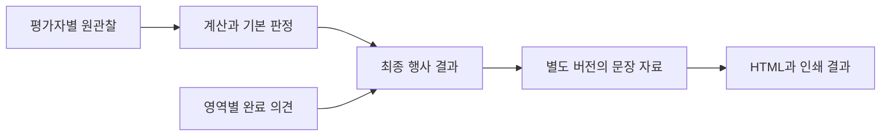

# K-DOG 9월 29일 개발 기준 변경 검토

버전: v1.1 · 2026-09-30 · 검토 대상: 고객 전달본 `큐브전달_20260929`와 현재 구현 `2d402d3`

v1.1은 v1.0을 재리뷰한 문서다. 누락된 실행·설문 완료·관찰 예외·저장/배포 연결을 §14에 추가하고, 일정은 파일별 범위를 산정한 [개발 반영 계획](K-DOG_개발반영계획_v1.0_20260930.md)으로 갱신했다. 원본과 애플리케이션 코드는 수정하지 않았다.

## 1 검토 결론

**접수·저장·영상 처리 기반은 유지하고, 채점 도메인은 새 판본으로 교체한다.** 이번 전달본은 기존 42항목의 문구 수정이 아니다. 원항목 117행 중 사용 113행이며, 직접 채점·메모 109행과 자동 계산 4행으로 구성된다. 관찰 시간창, 자료형, 판정 방식, 설문 집계, 리포트 우선순위가 함께 바뀌었다.

현재 활성 기능은 P0의 42항목 계약·계산과 P1의 접수·설문·촬영·전처리 및 검수 개선이다. 새 AI 채점·사람 채점·리포트 화면은 아직 구현 전이다. 따라서 이미 완성된 리포트 서비스를 철거하는 작업보다 **기존 운영 기능을 안전하게 전환하고 미구현 P2·리포트를 새 기준으로 구현하는 작업**에 가깝다.

9월 29일 자료를 기본 개발 기준으로 삼되, 문서가 명시한 미확정 사항이나 원본 내부의 충돌은 별도로 관리한다. Excel의 빈칸이나 루키 견본을 근거로 빠진 규칙과 관찰값을 만들지 않는다. 검토 단계에서는 애플리케이션 코드, 원본 자료, 기존 계획서를 변경하지 않았다.

## 2 자료의 적용 우선순위

| 용도 | 기준 자료 | 적용 방식 |
| --- | --- | --- |
| 전체 반영 기준과 예외 | [00 회신 및 개발 반영 기준](../큐브전달_20260929/00_큐브_회신및개발반영기준_20260929.docx) | 변경 기준과 보류 사항의 출발점 |
| 설문 원문·척도·동의 | [01 현행 설문](../큐브전달_20260929/기준자료/01_보호자_설문지_20260919.docx) | 파일 날짜 대신 현행 본문·해시 적용. 빈칸 안내도 보존 |
| 행동 원항목·눈금·배점·계산 | [02 채점 원본](../큐브전달_20260929/기준자료/02_개_행동채점표_최종정리_20260929.xlsx) | 원본 해시·시트·행·셀과 함께 추출. 02b·02c는 보기용 |
| 촬영 구간·실제 사건·중단 | [04 진행절차](../큐브전달_20260929/기준자료/04_행동실험_진행절차_20260929.docx) | 실제 시각과 구간 상태를 저장. 약 250초를 고정 시각으로 대체하지 않음 |
| 설문과 행동의 대응 | [03 비교 대응표](../큐브전달_20260929/기준자료/03_설문_행동_비교_대응표_20260929.docx), [결과 연결 JSON](../큐브전달_20260929/02_결과항목_연결표.json), [28문항 JSON](../큐브전달_20260929/03_설문28문항_대응표.json) | 문항·행동코드·시간창으로 연결. A~E 알파벳끼리 연결하지 않음 |
| 판정과 의견 적용 | [07 결과 판정](../큐브전달_20260929/기준자료/07_결과판정_애착유형_사회성_행동동조_20260929.docx) | 원자료·기본 판정·최종 행사 해석을 구분 |
| 관찰 목적과 해석 한계 | [10 무엇을 보려고 하는가](../큐브전달_20260929/기준자료/10_무엇을_보려고_하는가_20260929.docx) | 설문 단독·행동 단독·상황 대응, 원인·능력·기질 단정 제한 |
| 리포트 구성 | [루키 수정 견본](../큐브전달_20260929/01_루키_리포트_수정견본_20260929.html) | 화면과 표현의 참고. 새 채점의 정답 자료로 사용하지 않음 |

본문의 `아스트라_` 접두어는 이전 파일명이다(00 마지막 안내). 설문 파일명은 20260919, 본문 말미 날짜는 9월 25일이지만 전달본의 현행 내용과 해시를 기준으로 한다. 충돌이 발견되면 파일 날짜나 셀 주소만으로 어느 쪽이 맞는지 결정하지 않는다.

## 3 현재 구현과 변경 범위

| 영역 | 현재 구현 | 권고 |
| --- | --- | --- |
| 인증·접수·원본 저장·백업 | 역할, 참가자 정보, 불변 manifest, 해시, 입력 revision, 삭제 상태 재확인 | 재사용. 새 동의 항목·평가자 권한의 범위만 확인 |
| 행동 카탈로그·계약 | 42개 ID와 9/24/9개 구성, 1~5 라벨, 비음수 정수 점수, 3상태 | 새 판본 계약 필요. 항목 수 제한만 늘리지 않음 |
| 설문 | 전 문항 1~5, 7~9 NA, A/B/C/E 평균과 D 유형 | 문항별 척도, 8개 보고영역, 새 결측 정책으로 변경 |
| 촬영 | 8구간 전부 입력·양의 길이로 확정, 저장된 배열 위치로 표시 | 절차 판본·구간 상태·하위 사건창 추가. ID로 시각 조회 |
| 전처리 | 자극 시각 4개 필수, 사건 이후 최대 5초 8fps 및 나머지 2fps | 실제 접촉·국면·미실시를 반영하도록 계획 생성 변경. FFmpeg 실행·저장 기반 재사용 |
| AI 채점·사람 채점 | 활성 새 라우트와 화면 없음. worker는 55항목 legacy를 참조 | 실행 보호장치를 재사용하고 새 채점 단계 구현 |
| 리포트·내보내기 | 구판 코드만 남음. 42항목 리포트는 계획 문서 단계 | 새 결과 구조·완료 의견·문장 자료에 맞춰 구현 계획 변경 |

코드 근거: `backend/app/domain/catalog.py:13–38,67–121`, `domain/contracts.py:14–24,40–52,98–125`, `api.py:51,263–277,381–396`, `input_models.py:106–157`, `preprocess.py:22–59`, `frontend/src/types.ts:10–15`, `pages/Recording.tsx:50–62`, `App.tsx:16–23`.

기존 리포트 구현 계획(2026-10-02 제거, 저장소 이력에만 존재) §1의 유형명 미표시, 사람 검수 채점만 입력, 7개 설문 하위영역 및 구판 근거 연결은 신자료와 맞지 않는다. 유형 표시와 영역별 의견 우선 적용으로 재작성해야 한다. 자동 생성과 현장 발급 여부는 구분하며, 일괄 승인이나 공개 링크 같은 운영 기능은 별도 합의 없이 추가하지 않는다.

## 4 먼저 처리할 판본과 데이터 보존

세션에는 현재 `survey_version`만 있고 `protocol_version`이 없다. 설문 조회 계산도 현재 카탈로그 하나를 사용한다. 새 자료 파일만 교체하면 기존 응답과 시각을 새 기준으로 해석할 위험이 있다.

권고하는 최소 구조는 다음과 같다. 이름은 설계 제안이며 아직 구현된 필드가 아니다.

- 세션에 촬영 절차 판본, 설문 응답에 설문 판본, 채점 시트에 행동 카탈로그 판본을 기록한다. 산출물에는 계산·문장·비교자료 버전과 원본 해시를 고정한다.
- 확인된 42항목 촬영 세션은 9월 13일 판본으로 보존한다. 55항목 자료에서 이관된 세션 등 절차를 확인할 수 없는 기록은 구판/미확인으로 구분한다. 새 세션부터 9월 29일 절차를 사용한다. 영상 원본과 이전 입력 revision을 재작성하지 않는다. 기존 이관은 영상·세션 ID를 유지하며 설문 판본을 바꾸므로 `survey_version`만 보고 촬영 판본을 추정하지 않는다(`legacy/input_models_v1.py:56–75`).
- 기존 10~14번의 편안함 1~5 응답은 새 두려움 0~4와 문항 의미가 다르다. 빼기 1이나 역채점으로 옮기지 않고 새 응답을 수집한다. 7·8도 문장이 바뀌므로 문장·척도·조건을 확인한 항목만 명시적으로 이관한다.
- 구간은 `windows[i]`가 아니라 구간 ID로 조회하고 해당 판본의 순서로 표시한다. 옛 촬영 순서는 입장→기준→혼자→낯선 사람→재회→무시→걷기→퇴장이다.
- 새 판본에서는 저장·조회·가져오기·계산이 동일한 판본을 사용하도록 한다. 현재 `save_survey()`는 답을 바꿔도 세션 판본을 갱신하지 않으므로 이 부분도 함께 고친다.
- 기존 카탈로그·규칙 파일을 덮어쓰지 않는다. 판본별 검증과 구판 읽기를 필요한 범위에서 유지하고 범용 규칙 엔진은 만들지 않는다.

## 5 행동 채점과 판정의 변경

### 원항목과 값

02와 03의 항목 수는 다음과 같다. 문서의 바·개·보 번호는 원본 행 코드이므로 현재 카탈로그의 연속 번호와 동일한 뜻으로 읽지 않는다.

| 구분 | 바디시그널 | 개행동 | 보호자행동 | 합계 |
| --- | ---: | ---: | ---: | ---: |
| 원항목 행 | 41 | 56 | 20 | 117 |
| 사용 행 | 41 | 52 | 20 | 113 |
| 미사용 행 | 0 | 4 | 0 | 4 |

미사용은 개20·31·33·35, 자동 계산은 개26·27·36·60이다. 직접 채점·메모 109행을 109개의 동일한 수치 점수로 취급하지 않는다. 자료형에는 −2~+2 행동 범주, 0~4 신호, 0~3 발성 비중·거리 등급, 1~3 조건, 횟수, 초, 메모가 있다. 개32의 99는 코 접촉 미발생 코드이며 99초가 아니다.

원자료에는 값, 상태·사유, 실제 관찰창, 관찰 가능 초, 사건·가림, 평가자, 기준 판본을 연결한다. 관찰한 0과 미관찰·기회없음·미실시·무효·복지 중단을 구분한다. 절차가 무효가 되어도 이미 관찰한 원값을 삭제하지 않고 계산·출력의 유효 상태를 별도로 기록한다. 상태값의 최종 API 이름은 고객과 고정해야 한다(00 §3).

### 계산은 명시적 함수로 구현

| 결과 | 새 기준 | 기존 코드에서 바꿀 부분 |
| --- | --- | --- |
| 걷기 근접 국면 비율 | 개38~43의 6국면 모두 존재, 보13=1/2일 때 거리등급 0/1 국면 수÷6. 개37은 분모 밖 | 기존 DOG-21 국면 수 입력 기반 계산 교체. 누락·조건 미확인·무효를 별도 상태로 출력 |
| 분리 행동 연결 | 개9 초기10초→개10 후기50초의 25조합 | 숫자 차이나 절댓값으로 불안 증감 계산 금지 |
| 몸 상태 변화 | `abs(개58)−abs(개18)`와 두 원점수. 분리 전체 대 재회 후반15초 | 접촉 여부·보12를 새 산출 조건으로 추가하지 않음. 원인·회복력으로 단정하지 않음 |
| 기준과 무시의 비교 | `abs(개8)−abs(개23)`와 두 원점수, 보12=1/2 | 구판 적응 지표의 이름과 해석을 그대로 쓰지 않음 |
| 발성량 | 바6·개11·47·48·49·50의 누적 발성초÷실제 관찰초. 0 없음, 1은 0초과~1/3, 2는 1/3초과~2/3, 3은 2/3초과 | 발성 종류·음량으로 배점하지 않음. 전체 비중을 판단할 수 없는 미청취는 빈값과 사유 |
| 보호자 교육태도 | 보6·9 / 보22·39 / 보23·24의 항목별 v0.2 배점, 장면별 평균 후 합산 | 기존 EDU 평균 교체. 기회 조건과 0배점 범주 제외를 적용 |
| 애착·관계 | 네 관계 이름과 판정보류, 접근·몸 상태·발성·기회·사건의 다중 근거 판정 | 기존 임계값 공식과 짧은 유형명 교체. AU/BK나 한 지표로 대신하지 않음 |
| 환경·사람 기술 지표 | AW 환경 최소2/3 관찰 및 보14=1/2, AX 사람 최소4/7, AY 두 지표 유효 시 관찰 수 가중 | 기존 6영역 mean/lean/width/degree를 새 영역 전체에 적용하지 않음 |

중앙범주 기술 지표는 관찰한 항목에 대해 `mean(100−50×abs(raw))`를 계산한다. 높은 값이 좋은 사회성을 뜻하지 않는다. 예를 들어 개15의 고개만 돌린0은 100, 접근한+1은 50이므로 능력점수나 진단 경계로 표시하면 안 된다(07 §3.2).

보호자 자동 초안의 최소 근거는 3항목·2장면, 우세 비율 60% 이상 및 1·2위 차이 15%p 이상이다. 이는 임시 배점 기준이며 성격 확률이 아니다. 보22는 보38=2/3, 보39는 보38=1/3, 보24는 보40=1/2의 기회를 확인한다. 수동 유형은 유형·근거·작성자/일자가 갖춰진 경우에만 적용한다(07 §5).

새 애착 이름은 ‘곁에서 안심하는 사이’, ‘가까이 있어도 안심이 어려운 사이’, ‘거리를 두고 지내는 사이’, ‘다가감과 물러섬이 함께 나오는 사이’다. 판정보류는 다섯 번째 유형이 아니다. AI 기본 판정·자동 생성을 위해서는 항목 채점 뒤 다중 근거를 읽고 유형·근거·반대 근거·관찰 기회·보류 사유를 기록하는 단계가 필요하다. 보호자 전달 시점과 승인 정책은 별도 운영 확인 사항이다. LLM에 누락값을 채우게 하지 않는다.

### 그대로 복제하면 안 되는 원본 연결

검토 과정에서 다음 충돌 또는 상태 손실을 확인했다. 원본은 수정하지 않았으며 앱 구현의 판단 기록으로 남겨야 한다.

| 원본 위치 | 발견 사항 | 권고 |
| --- | --- | --- |
| `여러쌍비교!A2` | 보호자 유형을 평균으로 만들지 않는다는 잔존 설명의 범위가 불명확. 원점수 영역평균과 배점 장면평균은 다른 계산 | 직접 모순으로 단정하지 않고 07 §5와 원배점표 기준으로 설명 범위를 고객 확인 |
| `여러쌍비교!M6`, `2_개행동!B70/C70/G70/I70` | M은 유형 선택을 연결하지만 근거·평가자·완료 상태까지 확인하지 않아 미완성 선택이 노출 가능 | 앱에서 판정 완결성 확인 후 적용하는 기준을 고정. Excel 표시값만 최종 유형으로 채택하지 않음 |
| `2_개행동!J27`→`여러쌍비교!Z6`→`한마리상세!B19` | 원본의 ‘무효’가 빈칸으로 전달되어 ‘자료 부족’ 표시로 바뀜 | 앱 결과는 무효와 결측을 구분하고 사유를 끝까지 전달 |
| `여러쌍비교!V6`와 JSON 환경 설명 | Excel에는 보12 조건이 있으나 연결 JSON 서술에 조건이 생략 | 계산 함수에 조건을 명시. JSON만으로 계산 규칙을 생성하지 않음 |
| `여러쌍비교!CO6`, `CS6/CT6` | CO 기본 연결은 방향 요약이고 CS/CT는 완료 의견 연결. AI 기본 서술을 전부 공급하지 않음 | 결과·근거에서 기본 서술을 만드는 기능을 별도로 구현 |

셀 주소는 추적 근거다. 프로그램의 참가자 키나 실행 가능한 계산 설정으로 사용하지 않는다. Excel 수식은 검증용으로 읽고 핵심 식을 순수 계산 함수로 구현한다.

## 6 설문 변경은 10에서 14번보다 넓다

새 설문은 28문항을 유지하지만 8개 보고영역과 문항25 단독으로 집계한다(03 §Ⅰ·Ⅱ).

| 보고영역 | 문항 | 척도와 집계 |
| --- | --- | --- |
| 가르치는 방식 | 1~6 | 1~5 평균 |
| 사회화에 들이는 노력 | 7~9 | 1~5, 한 문항이라도 비면 미응답 |
| 낯선 사람 두려움 | 10·11 | 0~4 원방향, 두 문항 완전응답 평균 |
| 비사회적 두려움 | 12~14 | 0~4 원방향, 세 문항 완전응답 평균 |
| 정서적 친밀감 | 15~21 | 1~5 평균 |
| 떨어졌을 때 불안 | 22·23 | 1~5 평균 |
| 다시 만났을 때 안정 | 24 | 1~5 단일값 |
| 감정의 일관성 | 26~28 | `6−응답` 후 평균 |

7·8에는 늦게 데려온 반려견의 ‘평소’ 조건이 추가되었고 7~9의 해당 없음 칸은 삭제됐다. 현행 코드의 NA 처리, CSV/Excel 양식, 안내 문구와 완료 집계를 바꿔야 한다. 20번 문구는 현재 카탈로그에도 있으므로 새로 바뀐 문항으로 과장하지 않는다.

D는 22·23 평균과 24를 나란히 표시하며 유형 이름을 붙이지 않는다. 기존 설문 ‘안정·불안·회피 쪽·무덤덤’ 자동 이름은 새 판에서 사용하지 않는다. 3.5/4 경계는 서술을 돕는 임시 구분이며 영상의 네 관계 유형과 같은 분류가 아니다. 문항25는 영역 평균에서 제외한다.

7~9와 두 두려움 하위척도 이외의 부분응답 정책은 00 §2의 추가 확정 사항이다. 완전응답 평균은 03의 명시 식으로 지금 계산할 수 있다. 일부 빈 경우에는 원응답·응답 수·사유를 보존하고 해당 부분평균만 정책 확정까지 보류한다. 기존 부분평균을 자동 승계하지 않는다.

문항별 허용값·라벨·보고영역·결측 규칙을 카탈로그에 둔다. 현재의 전체 공통 `response_scale`, `Answer(1..5)`, `SurveyEdit`, CSV `parse_answer()`와 프론트의 `index+1` 표시를 함께 바꿔야 0점이 정상 저장된다. 입력 방식은 현재의 CSV·Excel 가져오기를 유지하는 것을 기본으로 한다. 화면 직접 입력이나 종이 설문 자동 판독을 추가 범위로 가정하지 않는다.

## 7 촬영과 전처리의 변경

새 순서는 **입장→기준→분리→재회→무시→걷기→낯선 사람→퇴장**이다. 약 250초 외에 S 이동·착석·5초 대기·줄 재착용 등의 전환을 별도로 기록한다. 기존 8구간 입력 화면을 재사용하되 다음 정보를 추가해야 한다.

- 구간 상태와 사유: 정상 실시, 단축, 미실시, 복지 중단. 분리 생략 시 재회도 미실시이며 애착 유형은 판정보류다. 가짜 0초 창으로 확정하지 않는다.
- 분리 초기0~10초와 이후10~60초, 재회 전반0~15초와 후반15~30초, 실제 부름·접촉 시작/끝을 구분한다. 예정 시각과 실제 사건이 어긋나면 실제 시각을 남긴다.
- 걷기 시작 거리와 이동3·정지3 국면의 실제 경계를 기록한다. S까지 이동과 본 구간 전 이름1회는 전환이다.
- 낯선 사람은 안전문 밖, 입실, 부름 전 접근, 이름 부름, 실제 접촉/미접촉, 퇴장으로 나눈다. 이름 부르기 전 접근12~16초와 문 밖 첫10초는 다른 관찰이다.
- 물건 앞 정지·첫 바닥 접촉·접촉 기회·경로 이탈·가림·먹이 사용·중단 시각을 영향받은 항목에 연결한다.

현재 자극4개를 모두 요구하는 전처리는 실제 미접촉·분리 생략 사례를 처리하지 못한다. 새 계획 생성은 실시된 구간과 유효한 관찰창을 대상으로 동작해야 한다. FFmpeg 절단, 오디오 보존, 원본 해시, 새 batch 저장, 완료 시 revision 재확인, 실패·중단 표시, 규칙 변경 후 이전 산출물 표시 기능은 재사용한다.

기존 사건 이후5초 8fps/나머지2fps는 9월 13일 Excel 임시 규칙이다. 새 문서가 전 항목에 이 조건을 승인한 것은 아니다. 바8·10의 실제 사건창, 짧은 접촉·꼬리·얼굴 행동과 음성의 판독을 실영상에서 확인해야 한다. 모든 항목을 자극 하나 뒤5초로 채점하지 않는다. 잘라낸 클립의 시각은 원본 시각으로 역추적할 수 있어야 한다.

파일 여러 개 등록 기능은 유지한다. 현재 전처리는 기준 영상 하나만 처리하며 다른 카메라는 자동 동기화되지 않는다. 두 영상으로 손·줄·개 전신·음성을 보완할 계획이라면 기준 영상 대비 실제 시각 차이와 영상별 관찰 가능성을 확인해야 한다. 자동 개체 식별이나 자동 동기화를 추가 요구로 가정하지 않는다.

## 8 의견과 리포트의 최소 구조

권고 흐름은 다음과 같다.

평가자별 시트는 AI·전문가1·전문가2의 같은 영상·항목·시간창을 독립 보존한다. 행사 의견은 별도 레코드로 저장한다. 여섯 의견 영역은 애착·관계, 보호자 교육태도, 사람 사회성, 비사회적 두려움, 환경 적응·회복, 개의 성향이다.

작성자·일자·완료 상태를 확인하고 내용이 있는 영역만 우선 적용한다. 작성 중 의견은 AI 기본 결과를 대체하지 않는다. 기본 유형, 최종 유형, 적용 출처, 근거·원문·변경 사유를 보존한다. 유형이 바뀌면 요약·상세·총평·조언을 같은 최종 결과에서 다시 만든다. 원점수·자동 근거비율·걷기 비율·몸 상태 변화는 의견에 맞춰 바꾸지 않는다.

보호자 화면에는 별도 전문가 의견 칸을 만들지 않는다. 기존 견본의 흐름에 교육태도 유형을 먼저 배치하고 애착·관계, 사람·환경 반응, 함께 걷기를 이어서 표시한다. 내부에는 사람이 쓴 의견의 출처를 남긴다. AI 결과를 본 뒤 고친 사람 의견을 독립 채점 자료로 사용하지 않는다.

계산 함수, 판정 결과, 출력 문장 자료를 분리한다. 문장 버전만 변경해도 원점수와 판정은 유지할 수 있어야 한다. 리포트 산출물에는 입력·시트·의견 revision, 규칙·문장·비교자료 버전을 고정하고, 변경 후 기존 출력은 이전 기준으로 표시한다. 문장 자료가 아직 없는 영역은 확인된 관찰과 보류 사유를 출력하며 임의의 맞춤 조언을 확정하지 않는다.

연결 JSON은 실행 코드가 아니다. `Q01-Q06` 같은 범위와 ‘각 영역의 확정 근거’ 같은 서술을 판본별 문항·행동코드·관찰창으로 정규화해 검증한다. 범용 DSL이나 수식 실행기를 만들 필요는 없다.

현재 reviewer는 읽기 권한만 가진다(`api.py:106`). 교수진의 독립 채점과 의견 작성 기능을 넣을 때 대상 배정·자기 기록 수정·완료 후 잠금과 운영자 재개방의 범위를 확정해야 한다. 모든 입력 권한을 일괄 열지 않는다.

## 9 비교 자료의 적용

미국 비교 영역은 두려움 하위척도별 0~4 축에서 당사자·동일 판본 조사집단·미국 연구 평균을 보여줄 구조까지 구현할 수 있다. 조사집단 평균이 없으면 해당 점을 생략한다. 영상 원코드를 같은 축으로 환산하거나 국가 정상치·진단 경계·백분위로 표시하지 않는다.

비교 데이터에는 출처, 문항·번안, 척도, 결측 규칙, 표본 n, 기준일, 승인 상태를 남긴다. 출처 확인 전에는 화면 구조와 비활성 상태만 구현하고 실제 비교값의 운영 적용은 보류한다. 구판 설문은 조사집단 평균에 섞지 않는다.

2026-09-30 온라인 확인에서 [Wilkins 등 2024 원문](https://journals.plos.org/plosone/article?id=10.1371/journal.pone.0299973)의 435쌍 설문 장문판·축약판 비교를 확인했다. AI 영상 채점 정확도 연구가 아니다. [Serpell·Powell 출판사 페이지](https://www.sciencedirect.com/science/article/pii/S1558787825001078)와 [국내 연구 출판사 PDF](https://www.kjvr.org/upload/pdf/kjvr-20220011.pdf)는 검색에서 식별했으나 직접 열람이 403으로 제한되어 Table1·Table8의 값 검증은 완료하지 못했다.

전달 문서의 미국 평균0.66/1.03 및 국내 참고값4.00/3.42/4.57/4.27은 최종 승인된 비교 데이터로 간주하지 않는다. 국내 값은 두 집단의 표 평균을 재구성한 참고값이며 수정된 7·8·20번 문항과 늦게 데려온 집단의 비교 허용 범위를 확인해야 한다. 번안·사용 허가 완료 여부도 문서에서 확인 중으로 남아 있다.

## 10 현재 자료로 할 수 있는 검증과 추가 자료

| 검증 대상 | 현재 자료로 가능 | 추가 자료가 필요한 부분 |
| --- | --- | --- |
| 원본 추출·계약 | 117/113/109/4 구분, 허용값·자동입력 거절·원본 해시 검증 | 모호한 눈금·대표값 선택의 고객 답변 |
| 설문 | 문항별0~4/1~5, NA 삭제, 역채점, 완전응답·구판 비교 차단 | 나머지 영역의 부분응답 정책, 수정 문항의 비교 조건 |
| 계산 | 걷기 분모·누락·보13=1/2/3, 99, 발성1/3·2/3 경계, 보호자 배점·기회·동률 합성시험 | 임시 유형·배점의 연구 타당성 |
| 촬영·전처리 | 합성 영상으로 시각 역추적·미실시·단축·실패·이전 기준 표시 | 현행 절차 영상, 실제 오디오·카메라 시각차·몸길이·가림 |
| AI 채점 | 요청/응답 계약·근거 누락 거절·재시도·저장 기능 | 실제 판독 품질, 대표값 일치, 항목별 비용·처리시간 |
| 리포트 | 의견 없음/일부 완료/작성 중/유형 변경, 숫자와 근거 일관성, 문장 버전·인쇄 검증 | 현행 절차의 완성 채점 사례와 교수진 확인 |
| 연구 일치도 | 평가자별 독립 시트·동일 시간창·내보내기 | 전문가2인의 독립 채점, 포함·제외 기준과 통계 분석계획 |

우선 요청할 실자료는 현행 절차 정상 영상과 두 전문가의 독립 채점이다. 단축·생략·미접촉·가림 사례를 함께 받으면 예외를 검증할 수 있다. 촬영 파일의 해상도·fps·코덱·오디오·시각차와 배치·몸길이 기준도 함께 필요하다. 예비 영상은 판독·전처리 시험에 활용할 수 있지만 현행 판정의 정답으로 자동 이식하지 않는다.

## 11 추가 확인 사항

| 우선순위 | 확인할 내용 | 개발에 미치는 영향 |
| --- | --- | --- |
| 높음 | 애착 판정 완료 조건과 M열 연결의 미완성 유형 처리 | 자동 발급에서 근거 부족을 유형으로 확정할 위험 |
| 높음 | 영역별 최소 관찰량, 주된 시간 동률, 가림·단축 처리 | AI와 사람의 대표값 선택·계산 유효성 |
| 높음 | 7~9·두려움 외 설문 영역의 부분응답 계산 정책 | 원응답 저장은 가능, 해당 집계는 확정 필요 |
| 높음 | 정상/단축/생략과 조건2·3의 포함·제외 범위, 경로 이탈 처리 | 원자료 보존과 행사 해석·연구 비교의 유효성 |
| 높음 | 즉시/사후 발급, 완료 의견 대기 여부, 재발급·전달 경로 | 현장 목표와 리포트 구현 범위 |
| 높음 | 교수진 채점·의견 작성 권한과 독립 기록 확정 방식 | 역할·수정·잠금 정책 |
| 중간 | 몸길이 측정·거리 보정·최종 배치·요원·카메라 동기화 | 걷기 등급과 짧은 장면 판독 |
| 중간 | 개32의 초 정밀도: Excel은 소수0~99 허용, 03 설명은 정수초 | 원코드99와 실제 초·결측을 구분하고 허용 정밀도 고정 |
| 중간 | 연구 원문·수정 문항 비교 범위·사용 조건·조사집단 갱신 주체 | 비교 영역 활성화 |
| 중간 | 설문 두 동의 항목과 외부AI·보관·삭제 조건의 운영 처리 | 기존 동의 확인1개를 어떻게 확장할지 결정. 연락처 수집을 자동 추가하지 않음 |
| 중간 | 최종 성향문장 자료와 확인자, 리허설·본행사 날짜 | 문장·검수·일정 기준 고정 |

구판 R1~R9의 답변 대기 목록을 그대로 새 기준에 적용하지 않는다. 이번 문서에서 해결된 항목과 위 미확정 항목을 대응시켜 차기 구현 계획에 반영해야 한다.

## 12 권장 구현 순서와 예상 일정

원본·계약→판본 이관→설문/촬영→전처리→독립 시트/계산→AI 실행→완료 의견/문장/리포트→비교 구조/연구 내보내기→배포 검수 순서로 진행한다. 실제 실행은 [PR별 개발 반영 계획](K-DOG_개발반영계획_v1.0_20260930.md)의 기본 15개 PR과 조건부 2개 PR을 따른다.

1인 개발, 기존 인프라 재사용, 핵심 기준 회신, CSV/Excel 설문 입력과 로컬 출력 기준으로 운영 전환판은 약 **9~14개발일(2~3주)**, 전체 구조 구현은 **30~45개발일(6~9주)**로 재산정했다. v1.0의 22~30일은 큰 기능 묶음의 초안 추정이었다. 이번 상세 계획에는 새 시트 UI·provider 스키마/설정/계량·파일 참조/복구·배포 및 출력 이력까지 포함한다. 담당자·회신 시점·병행 인력이 확정되지 않아 계약 납기나 확정 완료일은 아니다.

실제 영상과 두 전문가 독립 채점 수령 후 초기 판독·일치·성능 검토는 별도 5~10개발일을 확보한다. 문헌 비교 활성화는 근거 확보 후 별도 1~2개발일이며 원문·허가 확인 대기는 제외한다. 정식 연구 검증은 표본·분석계획·수용 기준에 따라 기간을 정한다. 자료가 늦으면 구조·합성시험까지 진행하되 실측 검증 완료로 표시하지 않는다.

10월31일 본촬영 일정이 유지된다면 운영판과 리허설을 우선한다. 최종 리포트 자동 생성과 당일 보호자 전달은 다른 운영 목표이며, 당일 전달까지 요구하면 기준·실자료·발급 조건의 조기 확정과 인력·범위 재산정이 필요하다.

## 13 이번 검토의 확인 범위

첨부목록의 14파일은 크기와 SHA-256이 모두 일치했다. DOCX 본문·표, 원본 Excel의 행·눈금·수식, 연결 JSON, HTML 견본 소스와 현행 API·계약·화면·저장·전처리·리포트 잔존 코드를 대조했다. 원본 Excel의 재계산, DOCX/HTML의 시각적 렌더링 품질, 실제 영상 판독, 새 규칙의 사람 채점 일치도는 검증하지 않았다.

필수 `codebase-memory-mcp`가 현재 세션에 노출되지 않아 인덱스와 코드 그래프 검증을 할 수 없었다. 이 제한을 알린 후 파일 검색과 직접 소스 대조를 사용했다. OOXML 추출은 번들 Python 표준 라이브러리만 사용했으며 의존성 설치·변경은 없다. 애플리케이션 코드 변경이 없는 검토이므로 백엔드·프론트 테스트는 재실행하지 않았다.

후속 구현에서는 기존 PR 절차를 유지한다. 각 PR의 규칙·계약·이관 시험, 필요한 UI build/e2e, 원본 대조 `--check`, 리뷰와 수용 기록을 완료한 뒤 진행한다. 이번 문서는 변경 범위와 실행 순서의 제안이며 새 고객 규칙을 대신 확정하지 않는다. PR별 실행 기준은 같은 폴더의 [개발 반영 계획](K-DOG_개발반영계획_v1.0_20260930.md)을 따른다.

## 14 재리뷰에서 추가한 내용

전체 전환 방향은 유지한다. 다음은 v1.0에서 개괄적으로만 다뤘거나 실제 구현 연결이 빠진 항목이다. [PR 계획](K-DOG_개발반영계획_v1.0_20260930.md)과 [확인대장](K-DOG_확인사항및검증자료_v1.0_20260930.md)에 반영했다.

| 추가 보완 | 근거와 변경 계획 |
| --- | --- |
| 원본 추출의 행과 라벨 | 보호자20행은 5,6,9,10,11,12,13,14,16,17,18,22,23,24,25,26,27,38,39,40으로 불연속이다. 설명행을 항목으로 세지 않고 행별 눈금/유효성/본문을 대조한다. A열 원문 라벨과 여러 실제 관찰창을 분리한다(C00) |
| 설문 빈칸·완료·판본 조회 | 01은 본 적 없는 상황을 비우도록 한다. 새 NA 삭제와 별개다. 답/명시 빈칸사유를 저장하고 등록·집계·비교 가능 상태를 분리한다. App.tsx 전역 카탈로그 조회와 importer 판본 자동삽입/동일답 no-op도 수정한다(C02) |
| 완전응답 집계 | 03에 완전응답 평균식이 있으므로 바로 계산 가능하다. 고객 확인이 필요한 부분응답 평균만 보류한다. 인쇄 A~E와 계산8영역은 다른 필드다(C00/C02) |
| 접촉·단축·복지 사건 | 개53=3은 접촉 전/중 중단을 모두 포함할 수 있어 실제 접촉 원값을 자동삭제하지 않는다. 개10은 단축 시 빈칸, 발성은 부분청취만으로 전체비중을 만들지 않는다. 복지/직원신호 뒤 안전조치 배점 제외를 기회코드와 함께 적용한다(C03/C06/C07B) |
| 구판 무효/지표 재사용 제한 | 보12=3의 무시 무효를 전체 애착 자동무효로 전파하지 않는다. 몸변화는 보12와 무관하다. 구판 stranger_calming·4지표 목록·6영역 평균을 신판 계약에 남기지 않는다(C06) |
| 방향별 합계와 입장 판단 | 07 §3.2와02 안내의 −/+ 분리 합계·관찰 수·접촉 정보를 보존한다. 입장 판단은 같은 행사 의견 블록의 선택·근거·작성자·완료 조건을 모두 확인하고, 미완성 선택은 기본 초안을 대체하지 않는다(C00/C06/C08) |
| 실행 종류와 불변 DB | 새 run kind·입력 파서·생성/중지/재시도 API가 필요하다. 현재 user_version=6의 명시 migration과 불변trigger 갱신, legacy run 분리, claim/lease/adopt·F-04 표시선택을 유지한다(C07A) |
| provider 스키마·sampling·계량 | gemini.response_contract는55용이고 settings 기본prompt도 구판이다. 신규 계약 경로·설정·trial이 필요하다. 로컬8fps와 provider 기본1fps는 다르며, 둘과 media_resolution을 snapshot/reuse hash에 넣는다. 새 AI 단계를 호출예약·수리상한·불명확결제·usage에 연결한다(C07B) |
| 독립성·결과 입력 선택·생성 조건 | 평가자뿐 아니라 AI 공개 전/후와 행사 의견을 구분한다. 최신 사람final을 자동 선택하지 않고 입력 hash를 명시 고정한다. 정상8구간·전항목숫자·사람완료·6의견완료·유형확정을 생성 필수조건으로 만들지 않는다(C05/C08/C10) |
| 백업·복원·삭제 참조 | maintenance는 현재 inputs/videos/runs/reviews/exports/settings/clips와 cases/runs/steps/changes를 순회한다. 새 시트/의견/결과 표·파일은 각 저장 PR에서 참조·hash·backup·purge/FK를 연결해야 한다. DB 복사만으로 파일 백업이 완료되지 않는다(C05/C06/C08/C10/C12) |
| 패키지와 리허설 | build_release는 resources의 HTML/CSS/SVG를 현재 제외한다. 자산 포함·시작요건을 수정하고, 구판 순서/척도/분리유형 및 전처리까지만 검증하는 rehearsal을 새 예외·시트·의견·출력·복구까지 확장한다(C09/C13) |
| 비교 대상과 실제 검증 | 국내 사회화 집단의 입양 나이는 현재 정수년/자유문자 기간으로 확정할 수 없고 ‘어릴 때’ 경계도 미정이다. 대상 미확인으로 보류한다. 코호트는 동일판본·완전응답·중복회차 규칙/hash/n을 고정한다. 비교 활성화(C14)와 실영상/독립채점 검증(C15)은 자료 수령 후 별도 PR이다 |

원본 해시·상대 링크·PR 의존·구판 전제·신규 저장/배포 연결을 다시 점검했다. 구현 계획의 검증 항목은 앞으로 수행할 작업이다. 이번 문서 작업에서 앱 시험·실모델 호출·실영상 일치도 시험을 수행했다는 뜻이 아니다.
