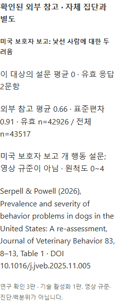
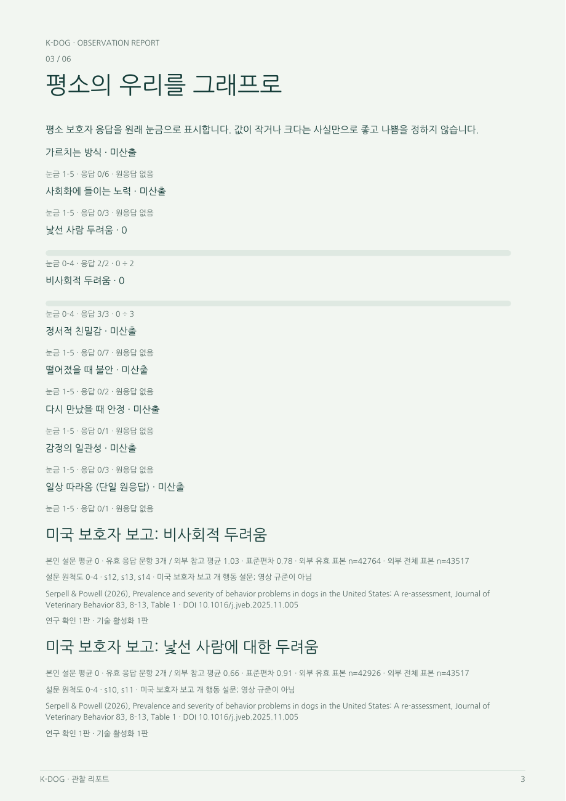

# PR-S17 외부비교활성화

버전: v1.0 · 2026-10-03 · 상태: 조건부 구현·합성 검증 완료, 실제 D06 활성화 대기 · 선행: S13·S15 · 기준: main 3654596

상위: [전체 계획](K-DOG_개발반영계획_v1.0_20261003.md). 공통 검증·리뷰·버전 확인·저장 보호는 상위 §7을 적용한다.

브랜치 제안: `veluga/s17-approved-comparisons` · 권장 PR 제목: `feat: 확인된 근거 범위의 외부 비교 활성화`

## 문제와 결과

S13의 비교 차단 구조에 실제 연구 확인자료를 연결하여 승인된 범위만 활성화한다. 논문 PDF나 숫자를 확보한 사실만으로 척도 동등성·번안/사용 조건이 해결됐다고 간주하지 않는다.

근거: 통합명세 10.2절·D06, 산출규칙 R19. **조건부 PR**이며 연구자 확인자료가 선행한다.

## 착수 자료

- 원문 논문·표와 평균/표준편차/유효 n의 실제 대조.
- 사용 설문 28문항 중 비교 대상의 문항·척도·방향·산식 대응 확인.
- 수정/축약/번안·사용 조건 및 화면 표기의 확인 기록.
- 국내 참고값의 대상 범위와 필요한 프로필, 중복 회차 포함 규칙.
- 확인자·확인일·적용 버전·허용/불허 범위. 자료가 없으면 해당 비교는 비활성 유지.

## 파일별 변경

| 파일 | 변경 | 구현 내용 |
| --- | --- | --- |
| `resources/report/comparison-sources-v4.json` | 수정 | 확인된 출처·수치·조건·상태·버전 |
| `backend/app/comparisons_v4.py` | 필요한 수정 | 확인된 조건의 검증과 활성화, 임의 범위 확대 금지 |
| `backend/tests/test_comparisons_v4.py`, `frontend/tests/comparisons-v4.spec.ts` | 확장 | 승인/범위 밖/철회·각 출력 경로 |
| 본 폴더 확인사항 대장·비교 근거 확인 기록 | 갱신/신설 | D06 자료·결정·적용 결과 |

## 구현 순서

1. 문헌 수치와 명세 참고값을 대조하고 차이가 있으면 원문 위치와 함께 기록한다. 숫자 불일치를 조용히 고쳐 승인된 값처럼 쓰지 않는다.
2. 문항·척도·점수 방향·결측 정책의 동등성 확인 결과를 비교 기능의 입력 조건으로 옮긴다. 영상 S1 코드에 설문 규준을 적용하지 않는다.
3. 허용된 출처·설문 판본·하위척도·표본 설명만 새 설정 버전으로 활성화한다. 연구자 확인이 일부만 있으면 그 범위만 활성화한다.
4. S13 자체 집단의 실제 평균/n과 외부 참고를 시각적으로 구분한다. 국내 수정 문항 참고를 미국 두려움 그래프에 섞지 않는다.
5. 새 리포트 생성에서만 새 비교 snapshot을 사용한다. 이미 발급한 파일은 당시 판본과 출처를 유지한다.
6. 잘못된 확인자료 철회/버전 변경은 새 출력 차단으로 반영하고 기존 발급본에 영향 이력을 기록한다.

## 검증과 완료 조건

- 문헌 표·수치·유효 n·문항 대응·사용 조건의 근거가 기록되어야 실제 활성화가 가능하다.
- 승인 범위와 정확히 일치하는 입력만 API/HTML/PDF/export에 표시된다.
- 구판1~5 편안함·수정 문항·누락 프로필·판본 불일치·승인 철회 입력은 비교를 보류한다.
- 외부 비교 없이도 유효 리포트의 나머지 부분은 정상 출력된다.
- 실제 확인이 없는 상태를 합성 승인 fixture 통과로 대체하지 않는다.

## 완료 경계

S17의 미완료는 외부 비교값 사용만 제한한다. S1 원자료 채점·계산·리포트의 다른 기능이 모두 미완료라는 뜻은 아니다. 전국 규준·백분위·진단 정확도 개발은 범위 밖이다.

## 구현 및 검증 기록

- [x] 구현·변경 파일 및 commit/PR 기록
- [x] 명세 기대값과 실제 시험 결과·미실행 사유 기록
- [x] 라이브러리/API 최신·선택 버전·확인일·근거 기록
- [x] 리뷰 발견사항과 수용/보류/거절·수정·재검증 기록
- [x] 남은 D/G 확인, 활성/보류 기능, 다음 PR 인계 기록

### 2026-10-04 승인 구조 구현과 실제 활성화 경계

S13의 신규 비교 모듈에 연구 확인자료와 관리자 기술 활성화를 분리한 계약을 구현했다. 실제 외부 비교는 활성화하지 않았다. 합성 임시 저장소의 승인 fixture를 실제 연구 승인으로 기록하지 않는다.

`ResearchReviewV4`는 출처 자산 hash, 확인자/일자, 실제 근거 파일 ref/hash, 문헌 수치·문항 동등성·척도/방향·결측 정책·번안/사용·대상 범위의 각각의 확인 상태와 근거 위치를 보존한다. 확인자료는 불변 `ResearchConfirmationV4`로 저장한다. 관리자만 별도 `TechnicalActivationV4`를 기록할 수 있으며, 현재 연구 확인자료의 정확한 판본을 명시해야 켤 수 있다.

API/HTML/PDF/export용 공통 함수 `external_for_report`는 모든 확인 상태와 설문 원문 hash·문항·척도·방향·산식·결측 정책·대상 조건이 정확히 맞는 경우에만 평균/표준편차/유효 n/전체 n을 반환한다. 영상 측정값을 설문 비교 대상으로 만드는 계약은 허용하지 않는다. 미승인·범위 밖·대상 정보 미확인·근거 손상·새 연구 판본·관리자 비활성화에서는 수치 객체가 없는 차단 결과를 반환한다. 이전 확인자료와 당시 생성된 불변 결과는 소급 덮어쓰지 않는다.

S13의 20개 합성 시험 중 외부 비교 시험은 기본 차단, 연구 확인만으로 미활성, 관리자 전용 활성화, 정확한 승인 범위, 대상 정보 미확인, 철회/판본 경합, 근거 손상을 검증했다. 실제 원논문 표 대조·번안/사용 조건·연구자 확인자료는 D06/P06 후속이다. 현재 통합명세의 미국 참고값은 미승인 기록이며 국내 참고값의 적용 범위를 추정하거나 미국 두려움 그래프에 혼합하지 않는다. 외부 비교를 제외한 채점·계산·리포트 기능의 완료와 이 연구 승인 대기를 구분한다.

원본 hash·의존성 확인·실행 명령은 [S13 구현 기록](K-DOG_PR-S13_집단비교와출력조건_v1.0_20261003.md)의 2026-10-04 항목을 따른다. 실제 승인 확인 전 S17의 착수 자료·실제 활성화 완료 조건 체크는 완료로 바꾸지 않는다.

### 2026-10-04 조건부 출력 연결과 독립 검토

기존 리포트 실행·렌더러 회귀 `uv run --locked python -X utf8 -m unittest tests.test_report_runs_v4 tests.test_report_render_v4 -q`도 **25개, 79.624초 통과**했다. 외부 비교를 선택하지 않은 리포트 경로는 계속 정상 동작한다.

두 출처 합성 PDF의 전 페이지 독립 시각 검수에서, 3쪽의 중복 사용 범위 안내가 고아 페이지를 만드는 문제를 추가 수용했다. 선택된 외부 비교의 안내를 6쪽 출처 영역에 한 번만 배치하고 기존 구성요소 크기는 유지했다. 실제 두 출처 HTML/PDF 생성·철회 시험에 안내 1회와 PDF 6쪽 회귀를 추가하여 **1개, 18.162초 통과**했다. 긴 실제 설명의 합리적인 추가 페이지 허용은 유지한다.

초기 검토에서 `external_for_report`의 승인 검사만 있고 실제 리포트·연구 내보내기에서 이를 선택·고정하는 실행 경로가 없음을 확인했다. 이는 실측 후속으로 넘길 수 없는 구현 누락으로 수용하여 다음 종단 경로를 연결했다. 실제 연구 확인자료를 새로 확보하거나 운영 저장소에 승인 기록을 쓰지는 않았다.

- `external_comparisons_v4.py`와 `domain/comparisons_v4.py`: 관리자의 원근거 파일 업로드(파일별 16 MiB), 불변 연구 확인자료, 별도 기술 활성화, 출처별 현재 상태, 대상별 불변 외부 비교 snapshot을 제공한다. snapshot은 명시 선택한 출처, 정확한 case/session/input revision/ref/hash, 설문 정책·자산 hash, 승인 근거 판본·hash, 활성 판본을 보존한다. 파일 수령이나 수치 보유를 연구 승인으로 자동 추론하지 않는다.
- `comparisons_v4.py`·API: 일반 출처/목록 조회에는 수치를 보내지 않는다. 관리자 연구 확인 화면은 미승인 참고값과 확인할 범위를 구분한다. 대상별 상세와 출력은 여섯 연구 확인, 별도 기술 활성화, 실제 동의, 동일 원문·척도·방향·산식·결측 정책, 명시된 대상 조건이 모두 일치할 때만 수치를 제공한다. 알 수 없는 프로필 조건, 구판 설문, 불완전한 대상 문항은 보류한다.
- `domain/report_profile_v4.py`·`domain/report_runs_v4.py`·`report_runs_v4.py`: 사용자가 고른 정확한 외부 snapshot이 해당 최종본의 입력 pin과 일치해야 실행할 수 있다. ReportContent와 발급 manifest에 같은 객체를 고정하며, 실행 단계와 최종 채택·상세·다운로드에서 현재 승인/철회 조건을 재검사한다. 미선택 optional 필드는 직렬화에서 생략하여 기존 S1 불변 JSON/hash를 유지한다.
- `report_render_v4.py`·`report_pdf_v4.py`: 본인 설문과 외부 참고를 구분해 평균·표준편차·원척도·문항·대상 범위·문헌/DOI·연구 확인 판본·활성 판본을 표시한다. 본인 `local_n`은 **유효 응답 문항**이고 외부 `valid_n`은 **외부 유효 표본**이다. 긴 내부 ID/hash는 본문에 반복하지 않고 manifest에 보존한다. 두 출처를 함께 선택한 합성 HTML/PDF/manifest를 생성하여 별도 시각 검수에 인계했다.
- `exports_v4.py`·`domain/exports_v4.py`·`maintenance.py`: 명시 선택한 연구 원자료의 동일 입력 pin만 외부 비교에 대응시킨다. CSV/XLSX는 본인 원응답 평균 0, 외부 평균·표준편차·유효/전체 표본, 출처·연구/활성 판본을 구분하여 보존한다. 백업 참조는 typed file pointer만 방문하며 임의 프로필 문자열을 파일 경로로 취급하지 않는다. 대상 삭제/복원 시 외부 snapshot과 의존 리포트·내보내기를 함께 제거한다.

새 연구 판본·철회·대상 조건 변경은 이미 발급된 파일의 bytes를 덮어쓰지 않는다. 현재 제공 조건이 어긋나면 그 발급본의 재다운로드와 새 출력은 차단하고 외부 snapshot별 영향 이력을 추가한다. 새 승인 범위는 새 snapshot을 명시 선택하여 새 결과를 만들 때만 적용한다.

검증은 모두 합성 임시 저장소에서 수행했다. `uv run --locked python -X utf8 -m unittest tests.test_external_comparisons_v4 tests.test_external_exports_v4 -q`는 **16개, 38.254초 통과**했다. 실제 HTTP로 원근거 업로드→연구 확인→기술 활성화→명시 대상 snapshot→철회 후 수치 마스킹을 검증했고, 실제 HTML/PDF 및 CSV/XLSX를 다시 읽어 원값 0과 외부값·분모·출처를 확인했다. 기존 비교/API 회귀와 미선택 직렬화 보존, 잘못된 입력 pin, 승인 후 파일 변조, 출력 중 철회, 삭제 후 옛 백업 복원도 확인했다. 실제 연구 승인이나 영상 실측을 수행한 시험은 아니다.

독립 cold review에서 상세 응답의 마지막 문서 읽기 도중 철회되면 이번 응답에 수치가 남는 P2를 수용했다. 마지막 읽기 후 승인 조건과 동일 pin을 다시 검사하며 실패 시 `document=None`으로 비운다. 같은 위치에 철회를 주입한 회귀와 별도 재현으로 수정이 확인되었다. export/domain/maintenance의 정확한 선택 pin·권한·해시·철회·삭제/복원·빈 optional 직렬화는 독립 검토에서 잔여 actionable finding이 없었다. UI 조건 key의 `dog.` 접두사 불일치는 UI 소유자에게 전달하여 적용 범위를 맞췄다.

새 의존성 설치나 무관한 업그레이드는 없다. 2026-10-04 공식 확인은 [FastAPI PyPI](https://pypi.org/project/fastapi/)(최신 0.142.2, 기존 잠금 0.141.1 유지), [Pydantic PyPI](https://pypi.org/project/pydantic/)(최신/선택 2.13.5)를 사용했다. 잠금 판본과 기존 API 계약을 유지했고, 실제 승인 자료가 없는 `D06/P06`은 계속 후속 대기다. `comparison-sources-v4.json`의 실제 출처 상태나 참고값을 승인된 것으로 변경하지 않았다. 국내 참고값·전국 규준·백분위·진단 정확도는 추가하지 않았다. commit/PR과 최종 UI·시각 검수 결과는 상위 통합 기록에 연결한다.

### UI 충돌·종단 검증과 합성 화면

관리자 초안은 작성을 시작한 출처/hash/연구 확인 판본을 고정한다. 새로고침으로 다른 관리자의 판본이 바뀌어도 기존 초안을 최신 판본에 덮어쓰지 않으며, 명시 새 작성 전에는 기존 expected revision으로 409를 받는다. 독립 cold review에서 이 경합 P2를 수용해 수정했고 실제 브라우저에서 초안 보존→409→명시 초기화→새 판본 저장을 확인했다.

`frontend/tests/external-v4.spec.ts`의 합성 종단 시험은 확인 대기·6개 조건·실제 근거 업로드·별도 활성화→고정 최종 입력의 외부 snapshot(응답 유실 재시도 멱등)→실제 report Worker의 HTML/PDF→연구 CSV ZIP→철회 후 다운로드 차단을 확인했다. 모바일·인쇄 검증을 포함한 1개가 41.1초에 통과했다. 관리자·리포트 선택·내보내기 선택 360px 가로 넘침 없음, 오프라인 HTML 6섹션·인쇄 클리핑 없음·외부 요청 0을 확인했다. root가 화면 이미지5개와 두 출처 PDF 전6쪽을 직접 검토했다. 새 의존성 없이 기존 React/Playwright 잠금 버전을 사용했으며 공식 최신/선택 버전 확인은 상위 실행 기록을 따른다.

아래는 **합성 임시 저장소의 검증 화면**이며 실제 연구 승인이나 실제 참가자 결과가 아니다. 이 문서의 구현·기록 체크는 완료했지만 실제 D06 확인과 운영 활성화는 P06 후속으로 유지한다.

