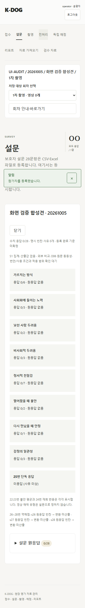
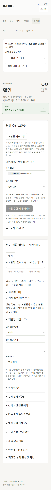

# K-DOG UI·UX 개선 및 독립 Cold Review

버전: v1.0 · 2026-10-05 · 기준: `main / 09fe889` · 브랜치: `veluga/uiux-layout-fixes`

사용자는 2026-10-05 조사에서 확인한 UI·UX 문제를 수정하고 검증 → cold review → 발견 이슈 수용 여부 검토 → 수용안 반영 → 로컬·원격 병합을 승인했다. 이 문서는 실행 근거와 리뷰 판단을 기록한다. [개발 반영 계획](K-DOG_개발반영계획_v1.0_20261003.md)의 PR 절차를 따른다.

## 수정 범위

1. 모바일 알림: 성공·오류·처리 알림을 하단 안전 영역에 표시하여 주 메뉴를 가리지 않도록 변경했다. 닫기, 긴 오류의 내부 스크롤과 접근성 역할을 유지한다.
2. 참가자·회차 맥락: 식별 정보와 선택 세션은 계속 노출한다. 모바일 보조 안내·바로가기는 명시 버튼으로 펼치고, 페이지·참가자·회차 변경 시 접는다. 데스크톱은 안내·바로가기를 그대로 노출한다. 다른 요청이 회차를 변경한 경고는 접힘 영역 밖에 둔다.
3. 촬영 기록: 기존 입력을 8개 native `details` 구역으로 나눴다. 구역을 접어도 입력을 언마운트하거나 초기화하지 않는다. 저장·확정·수정·버리기 도구를 상단 sticky 영역에 두어 긴 입력에서도 접근한다.

적용 파일은 `frontend/src/App.tsx`, `RecordingPanelV4.tsx`, `style.css`다. S04/S15 운영 화면의 사용성 개선이며 R01–R25 산식·정책과 데이터 계약은 변경하지 않는다. 실제 참가자, 영상, 계정, 키를 변경하지 않았고 저장소 밖 임시 합성 서버를 사용했다. 시작 시 주 작업트리의 `.gitignore`, `docs/DEVELOPMENT.md`, `tools/` 변경은 별도 작업트리를 사용하여 보존했다.

## 검증

- `npm run build`: TypeScript 검사와 Vite 52 modules 통과.
- 관련 회귀 `layout.spec.ts`, `recording-v4.spec.ts`, `context.spec.ts`, `notifications.spec.ts`: 9개/52.8초 통과.
- 새 레이아웃 회귀 4개: 360·390·768·1440px에서 알림/주 메뉴, 모바일 맥락 높이, 키보드 펼치기, 접힌 입력 보존, sticky 저장, 가로 넘침과 크기 변경 후 보조 이동 접근을 확인한다.
- 기존 촬영 회귀는 저장·확정·409 충돌의 초안 유지·회차 변경·검토자 읽기 전용 검증을 유지하며 새 구역을 실제로 펼쳐 조작한다.
- 초기 새 시험에서 참가자 목록 로딩 뒤 기존 접수 폼이 접히는 동작을 기다리지 않아 대기 실패했다. 마지막 조회 완료를 확인한 뒤 폼을 펼치도록 시험을 수정했으며 위 최종 관련 회귀는 모두 통과했다.
- 전체 브라우저 `npm run test:e2e -- --trace retain-on-failure`: **45개/4.0분/exit0** 통과. Windows asyncio 연결 종료 로그 WinError10054가 1회 있었으며 모든 시험은 통과했다.
- 독립 합성 서버에서 9개 화면 × 4개 너비를 확인했다. 가로 넘침0·pageerror0. 신규 빈 촬영 화면 360px 높이는 **10,112 → 3,372px(66.7% 감소)**이며, 구역을 펼치면 필요한 전체 입력이 다시 노출된다.

[데스크톱 촬영 화면](images/uiux-recording-desktop-20261005.png)
- `git diff --check` 및 `graft build` → `graft check` 통과. 새 문서 상대 링크·스크린샷 참조 누락0. 리뷰 이후 `git diff main...HEAD --check`를 확인한다.

이번 변경은 frontend에 한정되어 backend 전체 시험과 원본 재추출을 반복하지 않는다. 실측·실제 외부 AI 정확도·물리3PC·D/G 승인 상태는 기존 [후속 대장](K-DOG_실측및확인후속대장_v1.0_20261003.md)의 경계를 유지한다.

## 독립 Cold Review 및 수용 판단

검증한 구현 commit은 `2114c9f`다. 별도 `npx --yes @openai/codex@0.160.0 review --base main` 프로세스로 구현자의 대화 이력 없이 변경을 리뷰했다. 리뷰의 결론은 **“No actionable regressions were identified.”**로, 신규 수정 요구0건이다.

| 검토 대상 | 결과 | 수용 판단·조치 |
| --- | --- | --- |
| UI·입력·권한 회귀 | 독립 검토에서 actionable regression 없음. 빌드와 관련 브라우저7개 통과. | 조사에서 승인한3개 개선을 유지한다. 신규 수용 수정은 없다. |
| 독립 리뷰의 촬영2개 실행 | FFmpeg 실행이 Windows 리뷰 sandbox에서 제한되어 준비 단계 실패. | 제품 버그로 수용하지 않는다. 구현 담당의 관련9개 및 전체45개 통과와 구별하여 기록한다. |
| 초기 CLI 실행 | 설치된0.145.0에서 설정 모델 미지원으로 리뷰 시작 실패. | 리뷰 통과 근거에서 제외한다. 공식 최신0.160.0을 npx로 별도 실행했으며 전역 CLI/앱/프로젝트 잠금은 변경하지 않았다. |

리뷰 로그의 추가 변경 없이 동일 구현을 비교했다. 별도의 미해결 actionable finding이나 정책 승인 변경은 없다. 독립 리뷰 sandbox 제한을 전체45개 통과로 숨기거나 독립9개 통과로 표시하지 않는다.

## 라이브러리·프레임워크 확인

확인일은 2026-10-05다. 공식 문서·릴리스·registry에서 최신 안정판과 사용 버전의 runtime/peer 조건을 확인했다. 신규 라이브러리 설치·도입 및 lockfile 변경은 없다. 기존 프로젝트 잠금 조합으로 UI를 수정하며, 무관한 업그레이드는 포함하지 않았다.

| 패키지 | 최신 안정판 | 선택/기존 버전 | 출처·호환성 |
| --- | --- | --- | --- |
| React / react-dom | 19.3.0 | 19.2.8 | [React registry](https://registry.npmjs.org/react/latest), [DOM registry](https://registry.npmjs.org/react-dom/latest), [공식 JSX/DOM API](https://react.dev/reference/react-dom/components/common). DOM19.2.8의 peer React `^19.2.8` 충족. |
| @types/react / react-dom | 19.3.0 | 19.2.18 / 19.2.7 | [React 타입 registry](https://registry.npmjs.org/@types/react/latest), [DOM 타입 registry](https://registry.npmjs.org/@types/react-dom/latest). DOM 타입19.2.7의 peer `^19.2.0` 충족. |
| Vite | 8.3.2 | 8.2.2 | [registry](https://registry.npmjs.org/vite/latest), [공식 안내](https://vite.dev/guide/). Node24.13.0은 `^20.19.0 || >=22.12.0` 충족. |
| TypeScript | 7.0.2 | 7.0.2 | [registry](https://registry.npmjs.org/typescript/latest), [공식 문서](https://www.typescriptlang.org/docs/). Node `>=16.20.0` 충족. |
| Codex CLI (독립 리뷰 도구) | 0.160.0 | npx 0.160.0 | [registry](https://registry.npmjs.org/@openai/codex/latest), [공식 review 옵션](https://learn.chatgpt.com/docs/developer-commands?surface=cli#cli-codex-review). Node `>=16` 충족. 전역 설치0.145.0은 유지. |
| Playwright | 1.63.0 | 1.63.0 | [registry](https://registry.npmjs.org/@playwright/test/latest), [공식 릴리스](https://playwright.dev/docs/release-notes), [locator API](https://playwright.dev/docs/locators). Node `>=20` 충족. |

## PR·병합

구현 commit `2114c9f`. PR URL은 생성 후 기록한다. 승인된 병합의 최종 SHA와 로컬·원격 main 일치 확인은 PR 병합 이벤트 및 작업 완료 응답을 따른다.
