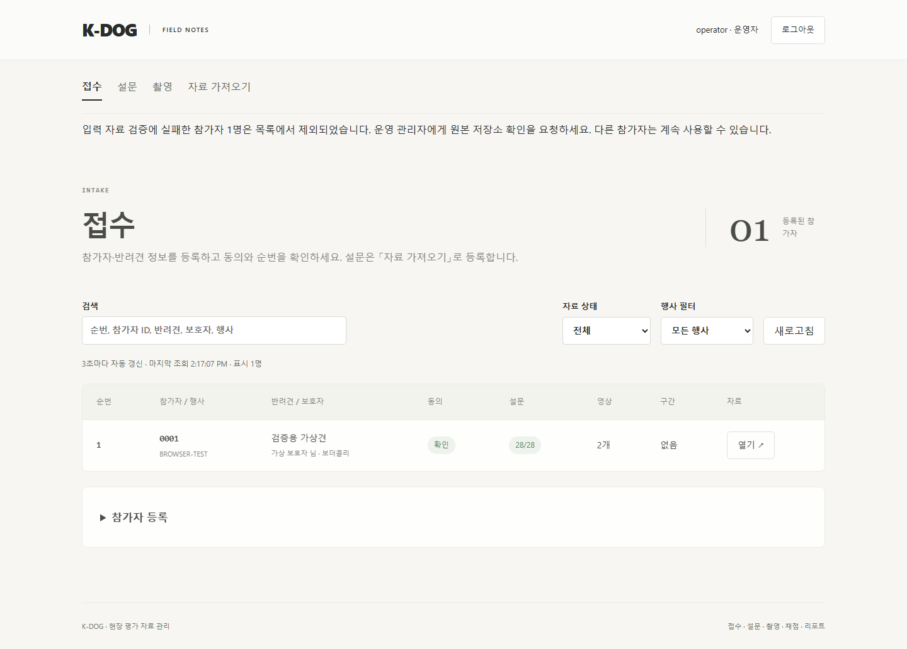

# PR-A01 이관 전 원본 무결성 검증

버전: v1.0 · 2026-09-16 · 상태: 구현·검증·리뷰 완료 · 우선순위: 높음 · 독립 PR

상위: [검수 결과](../K-DOG_검수결과_v1.0_20260916.md) B01. 대상 커밋 `d5491af`. 근거: 검수 인계 §7.3, P1 계획 §1의 불변 입력 보존.

## 문제와 재현

`backend/app/storage.py:117~132`의 `migrate_manifests`는 원본을 읽어 변환하고 새 해시를 저장하지만, 먼저 DB의 `manifest_hash`와 비교하지 않는다. 일반 조회의 `manifest()`는 161행에서 비교하므로 이관 경로만 보호가 빠진다.

저장소 밖 임시 폴더에서 기존 `tests/test_intake_api.py:381`의 합성 v1 형태를 만들고 q01=1의 해시를 DB에 기록했다. 파일만 q01=5로 바꾼 뒤 `user_version=4`에서 Store를 재시작하면 해시 불일치에도 s01=5, revision=2로 정상 조회된다. 이는 새 계산 규칙의 문제가 아니라 손상된 입력을 새 정상 입력으로 인정하는 문제다.

## 변경 범위

- `storage.py`: 원본 바이트의 SHA-256을 DB와 대조한 뒤에만 역직렬화·변환한다. case_id·event_id·participant_id·선택 세션·revision도 DB 참조와 일치하는지 검사한다.
- 실패한 참가자의 원본 파일·DB 참조를 보존하고 해당 자료가 검증되지 않았음을 명확히 반환한다. 원문·개인정보가 로그에 나오지 않게 한다.
- 전체 앱을 계속 사용할지의 정책은 기존 「읽을 수 없는 참가자만 접근 실패」 원칙을 따른다. 단 `user_version=6` 이후 실패한 v1을 영구히 잊지 않도록 미완 이관 판별·재시도 경로를 함께 설계한다. 새 원본을 임의로 만들어 복구하지 않는다.
- `tests/test_intake_api.py`: 정상 이관 시험 옆에 해시 불일치·참조 불일치·재시작 시험을 추가한다. legacy 계산 및 문항 매핑은 변경하지 않는다.

## 완료 조건

1. 바이트 수정 후 DB 해시가 그대로인 v1은 변환되지 않고 새 정상 해시도 발급되지 않는다.
2. 한 참가자의 이관 실패가 다른 정상 참가자의 접근을 막지 않으며, 실패 상태가 재시작 후에도 식별된다.
3. 정상 v1은 한 번만 이관되고 이전 원본·run snapshot·버린 응답 메모가 보존된다.
4. 백엔드 전체 시험·카탈로그 대조·`git diff --check` 통과. 실제 운영 자료 없이 합성 fixture로 검증한다.

권장 PR 제목: `fix: 이관 전 원본 해시와 참가자 참조 검증`

## 완료 기록 (2026-09-16)

- [x] 원본 해시 대조 후 변환, DB의 식별자·revision·선택 세션 대조, 세션 존재·중복 검증.
- [x] 실패한 원본·DB 참조 보존. 매 시작 시 미완 v1 재확인. 검증된 백업 복구 후 재시작하면 한 번만 이관.
- [x] 합성 손상 8종(해시·5개 참조·세션 부재·형식 오류), 재시작·복구 회귀 시험. 기존 원본/run snapshot/응답 메모 보존 시험 유지.
- [x] cold review: 구현 후 요구조건과 diff를 별도 재검토. 발견한 전체 목록 실패 문제는 다른 정상 참가자 접근 보장에 필수이므로 **수용**. 목록은 정상 자료와 제외 건수 헤더를 반환하고 화면에 관리자 확인 안내를 표시한다. 개별 손상 자료는 409로 거절하며 원문은 반환하지 않는다.
- [x] 백엔드 전체 113개, 관련 intake 20개, 카탈로그 대조, 프론트 빌드, 전체 e2e 10개, `git diff --check` 통과. 실제 영상·실제 운영 자료는 사용하지 않음.

### 의존성 확인

2026-09-16 공식 레지스트리와 문서를 확인했다. Pydantic 최신/선택 2.13.5([PyPI](https://pypi.org/project/pydantic/), [검증 API](https://docs.pydantic.dev/latest/concepts/models/)), FastAPI 최신/선택 0.141.1([PyPI](https://pypi.org/project/fastapi/), [릴리스](https://fastapi.tiangolo.com/release-notes/))는 Python 3.14 환경에서 전체 시험을 통과했다. React 최신 19.3.0/선택 19.2.8([버전](https://react.dev/versions), [effect API](https://react.dev/reference/react/useEffect)), Vite 최신 8.3.0/선택 8.2.2([공식 가이드](https://vite.dev/guide/)), TypeScript 최신/선택 7.0.2, Playwright 최신/선택 1.63.0([릴리스](https://playwright.dev/docs/release-notes/)). npm 공식 레지스트리의 latest 및 react-dom 19.2.8 peer 범위 `react ^19.2.8`도 확인했다. 기존 잠금 버전을 유지하여 검수 수정과 무관한 업그레이드를 섞지 않는다. 새 의존성은 없다.
