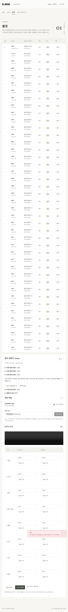

# PR-A02 촬영 회차별 편집 상태와 충돌 보호

버전: v1.0 · 2026-09-16 · 상태: 구현·검증·리뷰 완료 · 우선순위: 높음 · 독립 PR

상위: [검수 결과](../K-DOG_검수결과_v1.0_20260916.md) B02·B03. 근거: 01 §2, 검수 인계 §7.3, 입력 revision 충돌 보호 원칙.

## 문제와 재현

`frontend/src/pages/Recording.tsx:40`은 패널을 case_id만으로 구분한다. 48~51행의 영상·편집 모드·시각은 최초 값이고, 55행은 영상 개수 변화만 감시한다. 확정된 1차에서 「새 촬영 시작」을 누르면 2차 DB의 구간은 없는데 이전 `0:39.0`과 잠긴 입력이 남았다.

70행은 저장할 때 현재 props의 최신 revision을 쓴다. 브라우저에서 1개 시각을 편집하는 동안 다른 요청이 전체 구간을 +50초로 저장하고 3초 목록 갱신을 기다렸다. 화면에는 이전 퇴장 끝 39초가 남았고, 초안 저장은 200으로 다른 요청의 89초를 39초로 덮어썼다. API의 오래된 revision 거절 시험만으로는 잡히지 않는다.

## 변경 범위

- 편집 대상을 case_id와 session_id로 고정한다. 회차가 바뀌면 새 회차의 저장값으로 시각·기준 영상·확정 상태를 함께 초기화한다. 미저장 값이 있으면 사용자의 이동/취소 선택을 먼저 받는다.
- 기존 `Editing.ts`의 `useEditBase` 방식처럼 편집 시작 시 입력값과 revision을 같은 묶음으로 보관한다. 자동 조회가 저장 요청의 기준 revision만 바꾸지 않게 한다.
- 읽기 중에는 최신 저장값을 반영할 수 있지만 편집 중에는 「다른 변경이 저장됨」을 알리고 명시적으로 최신 값 불러오기/입력 유지 선택을 제공한다. 자동 병합·자동 재전송을 하지 않는다.
- 409가 나면 입력을 보존하고 차이를 확인한 뒤 다시 편집하게 한다. revision을 최신으로 바꾸기만 하는 재시도는 금지한다.
- 주 변경: `Recording.tsx`, 필요시 `Editing.ts`, `frontend/tests/recording.spec.ts`. API의 revision 보호는 유지한다.

## 완료 조건

1. 1차 확정→2차 추가 직후 2차는 빈 구간·수정 가능한 상태이고, 1차 값은 보존된다. 두 회차의 영상 수가 같아도 올바르게 전환된다.
2. 편집 중 다른 요청이 저장하고 자동 조회가 돌아도 기존 편집 저장은 409이며 다른 요청의 89초가 보존된다.
3. 최신 값 불러오기를 선택하면 입력·기준 영상·revision·확정 상태가 함께 바뀐다.
4. 교수/검토자는 회차를 조회해도 쓰기를 할 수 없다. 1440px·768px에서 상태 안내를 확인한다.
5. 빌드·촬영 e2e·전체 e2e 통과. 합성 자료만 사용한다.

권장 PR 제목: `fix: 촬영 회차 전환과 구간 편집 충돌 보호`

## 완료 기록 (2026-09-16)

- [x] case/session 키로 편집 패널 초기화. 외부 회차 변경도 미저장 입력 이동 확인을 받고, 취소하면 기존 회차를 유지한다.
- [x] 시각·영상·확정 상태와 함께 기준 revision을 저장. 자동 조회는 미저장 입력 및 기준 revision을 갱신하지 않는다.
- [x] 충돌 시 입력 유지/최신 값 불러오기 제공. 409 뒤 입력을 보존하고 자동 재전송하지 않는다.
- [x] 합성 브라우저 시험: 39→89초 외부 저장 뒤 40초 편집 저장 409, 서버 89초 유지, 최신 확정본 불러오기, 2차 빈 구간, 동일 영상 수의 회차 전환, 이동 취소/허용, reviewer UI와 API 403.
- [x] 빌드·촬영 e2e 2개·전체 e2e 11개·diff check 통과. 1440px 기본 흐름과 768px 충돌 안내 확인. 실제 영상 제외.
- [x] cold review: diff와 완료조건을 별도로 재검토. 외부 회차 변경 시 key 교체만으로 입력이 사라질 수 있는 위험을 **수용**하여 이동 확인 및 취소 상태 보존을 추가 검증했다. 추가 미해결 사항 없음. 확정 버튼 문구/부분 구간 계약은 A04 범위로 유지.

의존성은 [A01 확인 기록](K-DOG_PR-A01_이관무결성_v1.0_20260916.md#의존성-확인)의 2026-09-16 조회 결과 및 기존 잠금 버전을 사용한다. 추가 설치·업그레이드 없음.

