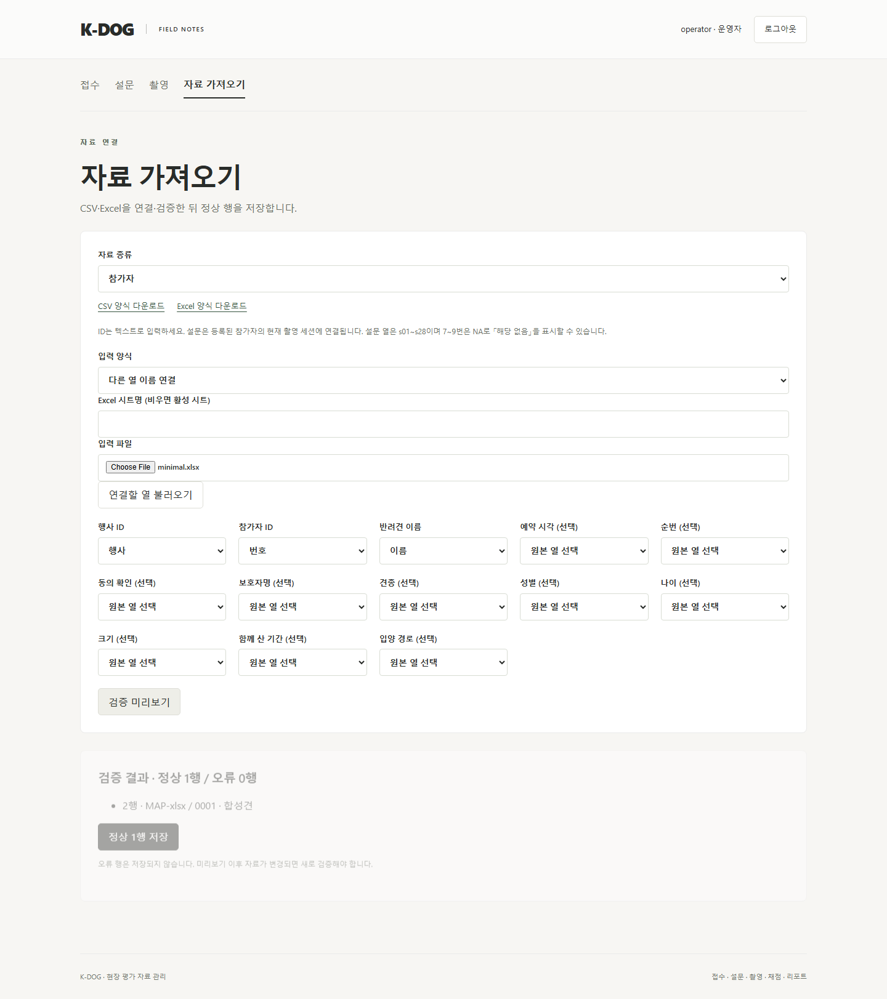

# PR-A03 가져오기 필수 열과 순번 중복 검증

버전: v1.0 · 2026-09-16 · 상태: 구현·검증·리뷰 완료 · 우선순위: 보통 · 독립 PR

상위: [검수 결과](../K-DOG_검수결과_v1.0_20260916.md) B04·B05. 근거: P1 계획 §3의 접수 선택 열, 검수 인계 §7.6의 미리보기→저장.

## 문제와 재현

`frontend/src/Importer.tsx:41`의 `required.includes(field) || field.startsWith('s')` 때문에 `sequence_no`도 필수다. 다음 CSV에서 행사·참가자·이름만 연결하면 「순번 (선택)」에서 브라우저가 제출을 막는다. API 미리보기 요청은 발생하지 않는다.

```csv
행사,번호,이름
AUDIT,0001,합성견
```

`backend/app/intake.py:205~209`는 아래 두 행을 정상으로 분류한다. `/imports/commit`은 DB의 행사·순번 유일성에 걸려 409로 전체 롤백한다. 충돌은 미리보기 전에 이미 존재했으므로 정상 행으로 안내하면 안 된다.

```csv
event_id,participant_id,dog_name,sequence_no
AUDIT,0001,합성견A,1
AUDIT,0002,합성견B,1
```

## 변경 범위

- 프론트 필수 열을 참가자 `event_id/participant_id/dog_name`, 설문 `event_id/participant_id/s01~s28`로 정확히 지정한다. prefix 검사로 판별하지 않는다. 설문 표준 양식의 버전 검증은 유지한다.
- 미리보기에서 `(event_id, sequence_no)`를 기존 DB 및 파일 내 정상 후보와 대조한다. 같은 참가자 ID 검증도 유지한다. 빈 순번은 허용하고 다른 행사의 같은 순번은 허용한다.
- 파일 내 중복 순번은 충돌한 행을 모두 오류로 표시하는 방식을 권장한다. 어느 행을 살릴지 자동 선택하지 않는다. 사용자가 순번을 고친 뒤 다시 검증한다.
- DB 유일성 제약과 커밋 트랜잭션을 유지한다. 미리보기 이후 다른 사용자가 같은 순번을 등록하면 여전히 409로 전체 롤백하고 재검증을 안내한다.
- 범위: `Importer.tsx`, `intake.py`, 관련 백엔드 시험·브라우저 가져오기 시험. 입력 설명 개편은 A06에서 별도로 한다.

## 완료 조건

1. 필수 3열만 연결한 CSV/XLSX를 미리보기·저장할 수 있고 선택 접수 필드는 미기재로 남는다.
2. 설문은 28열의 연결을 요구하며 숫자 ID 자동 변환·잘못된 NA·중복 원본 열은 계속 거절한다.
3. 기존 DB 충돌·파일 내 충돌·빈 순번·행사 간 동일 순번을 각각 검증한다. 미리보기 오류 행은 저장 대상에서 빠진다.
4. 미리보기 뒤 발생한 충돌은 409·부분 저장 없음으로 끝나고 재검증 방법을 보여준다.
5. 백엔드 시험, XLSX 열 연결 e2e, 빌드·전체 e2e 통과.

권장 PR 제목: `fix: 가져오기 선택 열과 행사별 순번 검증 일치`

## 완료 기록 (2026-09-16)

- [x] 참가자 필수 3열/설문 28문항 및 ID 연결을 정확히 구분. 순번은 선택 열.
- [x] DB 행사·순번 충돌과 정상 후보 간 중복을 미리보기에서 거절. 같은 파일의 중복 순번 행은 모두 제외, 빈 순번과 다른 행사의 같은 순번 허용.
- [x] 미리보기 후 충돌은 409로 전체 롤백, 이전 미리보기 폐기와 재검증 안내. DB 제약 유지.
- [x] 백엔드 114개, 카탈로그 대조, 빌드, 전체 e2e 13개, diff check 통과. CSV/XLSX 3열 연결·저장 및 경쟁 등록 후 부분 저장 없음 확인. 기존 숫자 ID·NA·중복 열·버전 검증 유지.
- [x] cold review: 커밋 성공 뒤 목록 갱신 실패까지 저장 충돌로 안내할 위험을 **수용**하여 catch 범위를 커밋 요청에만 한정. 신규 e2e의 저장 응답 대기 및 합성 참가자 정리 누락도 **수용**하여 시험 간 영향을 제거. 추가 미해결 사항 없음.

실제 영상은 사용하지 않았다. 의존성은 A01 확인 기록과 동일하며, XLSX 시험용 openpyxl 최신/선택 3.1.5도 2026-09-16 [공식 PyPI](https://pypi.org/project/openpyxl/)·[공식 튜토리얼](https://openpyxl.readthedocs.io/en/3.1/tutorial.html)에서 확인했다(Python >=3.8, 현 Python 3.14 시험 통과). 잠금 버전 변경·추가 설치 없음.


