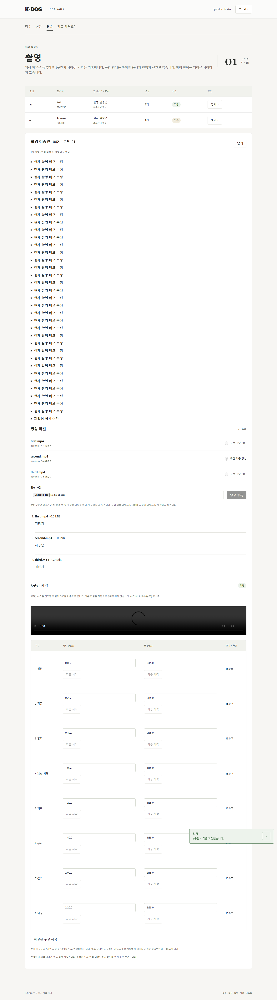

# PR-A04 구간 입력과 확정의 의미 명확화

버전: v1.0 · 2026-09-16 · 상태: 구현·검증·리뷰 완료 · 우선순위: 보통 · 의존: A02

상위: [검수 결과](../K-DOG_검수결과_v1.0_20260916.md) B06. 근거: 01 §2의 8구간 기록, 검수 인계 §7.4의 끝>시작.

## 문제와 재현

`backend/app/domain/contracts.py:82`는 끝<시작만 거절한다. 등록된 합성 파일에 절차 순서대로 8개 모두 시작=끝=0, confirm=true를 보내면 200·확정으로 저장된다. `preprocess.py:28`은 모두 건너뛰어 클립 계획이 0개다. 구간이 없는 것을 확정 완료로 표현해서는 안 된다.

촬영 화면의 「확정 해제 후 수정」(`Recording.tsx:99`)은 편집 칸만 열고 서버의 confirmed는 바꾸지 않는다. 기존 e2e도 DB가 true인 것을 확인한다. 또 「초안 저장」은 16개 시각을 모두 채워야 하므로 구간 일부만 기록하고 쉬려는 사용자가 의미를 오해하기 쉽다.

## 변경 범위

- 확정 가능한 구간은 끝>시작이어야 한다. API와 전처리에 같은 검증을 적용하고, 0개 산출물을 정상 완료로 기록하지 않는다.
- 최초 수정은 「확정본 수정 시작」으로 명명하고 「아직 저장된 확정본은 유지됩니다. 초안 저장 시 미확정으로 바뀝니다」를 알린다. 실제 해제 저장이 필요하다면 별도 명시적 동작과 revision 변경으로 구현하며, 편집 버튼을 누르는 것만으로 자동 저장하지 않는다.
- 구간 표에 시작·끝·길이를 함께 보여주고, 오류는 해당 구간 옆에 표시한다. 예: 「기준 끝 0:45가 혼자 시작 0:40보다 늦습니다」.
- 기준 영상 설명: 「8구간 시각은 선택한 파일의 0:00을 기준으로 합니다. 다른 파일은 자동으로 동기화되지 않습니다」. 파일 변경 시 기존 시각 재검토 필요를 알린다.
- 「지금 시각」은 재생 위치가 준비된 경우에만 활성화한다. 시각 입력 예시 `1:23.4`와 단위를 제공한다. 검토자가 구간 시작으로 바로 이동하는 버튼은 읽기 기능으로 제공할 수 있다.
- 이번 PR의 최소 범위에서는 기존 완전한 8구간 초안 계약을 유지하고, 버튼을 「8구간 초안 저장」으로 표시하며 빈 칸 안내를 한다. 일부 구간 서버 저장은 별도 계약 변경으로 분리한다. 빈칸을 0초로 채워 우회하지 않는다.

## 고객 확인 경계

구간 자체가 촬영되지 않은 경우의 저장 상태·사유·확정 허용 조건은 합의가 필요하다. 기존 3상태 **항목 점수**를 구간 상태에 임의 적용하지 않는다. 회신 전에는 0초로 정상 확정하지 않고 보완 필요로 남긴다. 영상 길이의 API 검사 도입은 메타데이터 수집 경로가 준비된 때 수행하며, 현재의 전처리 길이 검사를 제거하지 않는다.

## 완료 조건

1. 모두 0초 또는 한 구간의 시작=끝인 확정 요청이 거절되고 DB revision·기존 확정본은 유지된다.
2. 초안→확정→수정 시작→초안 저장→재확정을 브라우저와 API 상태까지 확인한다.
3. 형식·겹침·순서·끝 시각 오류에서 어떤 칸을 고칠지 보이고 입력은 보존된다.
4. 자동 저장·자동 구간 추정 없이 운영자가 선택한 동작만 수행한다. 기존 합성 전처리·백엔드·e2e 시험 통과.

권장 PR 제목: `fix: 빈 구간 확정 차단과 촬영 시각 입력 안내`

## 완료 기록 (2026-09-16)

- [x] 확정 구간의 끝>시작 계약을 API·전처리에 공통 적용. 과거의 빈 구간 확정본도 전처리 전에 거절하고 성공 산출물로 기록하지 않음. 초안의 기존 계약은 유지.
- [x] 「확정본 수정 시작」「8구간 초안 저장」 및 저장 전 확정본 유지 안내. 기준 파일의 0:00·비동기 파일 주의·기준 영상 변경 시 재검토·16칸 필요 안내.
- [x] 구간별 길이·형식·겹침·순서·끝 오류 표시, 유한 시각 검증, 재생 메타데이터 준비 전 「지금 시각」 비활성화.
- [x] 모두 0초/한 구간 0초 확정 거절과 revision·기존 확정본 보존, 과거 잘못된 확정본 전처리 거절, 브라우저 초안→확정→수정 시작→초안 저장→재확정 검증.
- [x] 백엔드 114개·빌드·diff check 통과. 전체 e2e에서 12/13 통과 후 새 시험의 완료 대기 누락을 수정하고 촬영 2/2 재실행 통과(나머지 11개 통과 유지). 합성 FFmpeg 시험 포함, 실제 영상 제외.
- [x] cold review: API와 전처리가 같은 확정 계약을 쓰는지, 수정 버튼만으로 저장되지 않는지, A02 충돌 보호가 유지되는지 별도 검토. 추가 코드 결함 없음. 시험의 일시적 busy 비활성화를 저장 완료로 오인하는 문제는 **수용**하여 완료 알림 대기로 수정.

미촬영 구간의 사유·확정 허용 정책은 고객 확인 경계를 유지하며 새 상태를 만들지 않았다. 의존성은 A01의 2026-09-16 확인 결과와 기존 잠금 버전을 유지했다.

