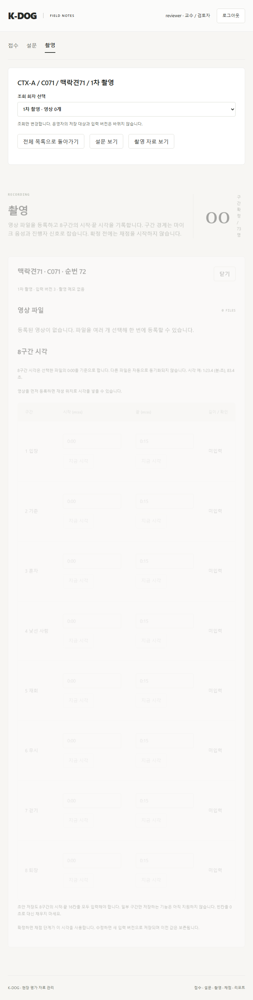

# PR-A05 업무 메뉴와 참가자 작업 맥락 연결

버전: v1.0 · 2026-09-16 · 상태: 구현·검증·리뷰 완료 · 분류: should-fix · 의존: A02

상위: [검수 결과](../K-DOG_검수결과_v1.0_20260916.md) U01·U02·U05. 사용자 방향: 과한 자동화보다 운영자·교수 입장에서 목적이 분명한 메뉴.

## 현재 사용 흐름의 문제

`frontend/src/App.tsx:49~51`의 메뉴 이동은 참가자 선택을 지운다. `Survey.tsx:12`, `Recording.tsx:24`는 각각 별도 선택을 가진다. 운영자가 접수에서 한 참가자를 확인한 뒤 설문·촬영으로 가면 다시 찾아야 한다. 설문·촬영에는 검색·행사 필터가 없고 상세 패널이 전체 목록 아래에 열려, 긴 목록에서 작업 위치를 찾기 어렵다.

촬영 회차 선택은 `CaseDetail.tsx:25`에 있어 과거 촬영을 보려면 접수로 돌아가야 한다. 교수/검토자는 접수에서 로컬 요약만 바꿀 수 있고 그 선택이 설문·촬영 조회로 이어지지 않는다. `App.tsx:114`의 자료 백업은 관리자에게 모든 메뉴 하단에 반복된다.

## 제안하는 메뉴 책임

| 메뉴 | 사용자가 여기서 하는 일 | 다른 메뉴로 이어지는 동작 |
| --- | --- | --- |
| 접수 | 참가자 등록·기본 정보 정정·동의·순번 | 선택 참가자의 「설문 보기」「촬영 자료 보기」 |
| 설문 | CSV/Excel 가져오기·등록 현황·원응답·영역 결과 조회 | 같은 참가자·회차의 촬영 자료 보기 |
| 촬영 | 영상 등록·회차 선택·메모·기준 영상·구간 시각 | 확정 자료의 전처리 화면 열기(A08) |
| 자료 가져오기 | 참가자/설문 파일을 명시적으로 선택해 일괄 등록 | 해당 업무 메뉴의 동일 가져오기 화면과 같은 상태·설명 사용 |
| 직원 계정 | 운영 관리자만 계정·역할 관리 | 역할별 할 수 있는 일 안내 |
| 자료 관리 | 운영 관리자만 백업 현황·백업 생성·복원 안내 | 기존 API 재사용, 백업의 자동 실행은 추가하지 않음 |

기존 상위 메뉴를 하나의 마법사로 합치지 않는다. 「자료 가져오기」와 「설문 파일 가져오기」는 진입점만 다르고 같은 기능이다. 두 경로의 결과·옵션이 달라지지 않게 한다. 새로운 AI 채점·리포트 메뉴를 빈 화면으로 추가하지 않는다.

## 변경 범위

- 셸에서 행사·case_id·조회 회차를 유지하고, 모든 상세 상단에 행사/참가자 ID/반려견/촬영 회차를 같은 순서로 표시한다. 전체 목록으로 돌아가기도 명시적으로 제공한다.
- 설문·촬영에 검색(순번·ID·반려견·보호자)과 행사 필터를 둔다. 작업 대상을 선택하면 상세가 즉시 보이는 별도 영역/화면으로 전환하고 제목에 포커스를 옮긴다. 목록 아래 긴 스크롤을 요구하지 않는다.
- 교수/검토자의 회차 선택은 읽기 전용 조회 상태로 관리한다. 서버 전체의 selected_session_id를 바꾸지 않고 해당 회차 설문·영상·구간을 읽을 수 있도록 API 조회 인자를 확장한다.
- 운영자의 저장 대상 변경은 현재 회차를 확인하고 명시적으로 선택한다. 조회 회차와 저장 회차를 혼동하지 않게 표시한다. 새 회차에 설문·구간을 자동 복사하지 않는다.
- `App.tsx`, 세 업무 페이지, `CaseDetail.tsx`, 관련 읽기 API와 e2e가 범위다. 자료 관리 메뉴 이동은 기존 Recovery 컴포넌트를 옮기는 수준으로 제한한다.

## 완료 조건

1. 합성 72명·서로 다른 행사에서 같은 참가자 ID가 있는 목록으로 검증한다. 검색 후 선택한 참가자가 접수→설문→촬영에서 유지된다.
2. 2개 회차를 가진 참가자를 교수가 조회하고 이동해도 DB revision·선택 세션은 변하지 않는다. 쓰기 요청은 계속 403이다.
3. 목록의 첫 행·마지막 행을 열어도 상세 제목이 바로 보인다. 768px에서 메뉴와 대상 표시가 읽히고 가로 넘침이 없다.
4. 메뉴 이동이 자동 저장·확정·전처리를 유발하지 않는다. 미저장 입력 이동 보호는 A02 및 A06과 일관된다.
5. 업무별 주요 동작을 모르는 사용자에게 보여줄 수 있는 스크린샷을 PR에 첨부하고 빌드·전체 e2e를 통과한다.

권장 PR 제목: `feat: 업무 메뉴 사이 참가자와 촬영 회차 맥락 유지`

## 완료 기록 (2026-09-16)

- [x] 셸의 공통 참가자·회차·검색·행사 상태를 접수/설문/촬영에서 공유. 상세 선택 시 목록 대신 상세를 표시하고 공통 대상 제목에 포커스. 전체 목록 복귀 및 업무 연결 버튼 제공.
- [x] 운영자의 저장 대상 회차 선택과 교수/검토자의 조회 회차 선택을 구분. 읽기 API의 session_id로 과거 설문 결과를 조회하며 DB 선택 회차·revision은 변경하지 않음.
- [x] 자료 백업은 관리자 자료 관리 메뉴로 이동. 직원 계정에 역할별 업무 안내, 좁은 화면 메뉴 줄바꿈.
- [x] 72명과 다른 행사의 동일 ID 합성 시험: 첫/마지막 참가자 상세 제목 즉시 표시·포커스, 검색·행사 유지, 메뉴 이동, 교수의 1차 조회 후 DB 불변, 768px 표시 확인. A02의 회차 변경 미저장 입력 보호·403 시험 유지.
- [x] 백엔드 115개·빌드·전체 e2e 14개·diff check 통과. 실제 영상·AI 호출 없음.
- [x] cold review: 읽기 API에서 쓰기용 현재 회차 보호 함수를 재사용하면 과거 조회를 막는 문제를 **수용**하여 해당 참가자의 회차 존재 검사로 분리. 쓰기 API 검사는 그대로 보존. 메뉴 증가로 인한 360px 넘침도 **수용**하여 줄바꿈으로 수정. 상세 전환에 따라 기존 목록 클릭 시험을 갱신. 추가 미해결 사항 없음.

의존성은 A01의 2026-09-16 확인 결과와 기존 잠금 버전을 유지했다. 브라우저 새로고침 후에는 목록에서 다시 선택한다(서버에 조회 선택을 저장하지 않음).

### 후속 cold review 보완 (2026-09-16)

A07 화면 검수 중 RecordingPanel의 SessionEditor·VideoUpload가 같은 형제 key를 사용하여 자동 조회 때 메모 제목이 누적되는 결함을 발견했다. 이 이슈는 **수용**하여 두 자식의 중복 key를 제거했다. 회차 초기화는 기존 부모 case/session key가 보장한다. 자동 갱신·충돌 뒤 메모 편집기 1개 유지 회귀 검증을 추가했다. A07 고객 회신과 무관한 수정이므로 별도 후속 PR로 병합한다.

검증: 빌드·전체 e2e 17개 통과. 자극 시각을 포함한 합성 흐름에서 메모 중복 없음과 회차 초기화 유지 확인. 실제 영상 제외.
