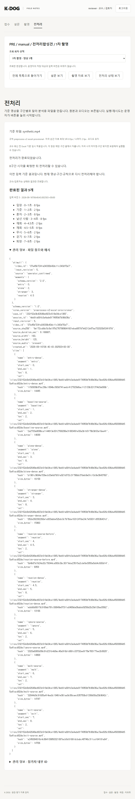

# PR-A07 자극 시점을 기준으로 전처리 창 지정

버전: v1.0 · 2026-09-16 · 상태: Excel 기준 임시 적용 구현·검증·cold review 완료 · 분류: should-fix · 의존: A04 및 창 배치 확인

상위: [검수 결과](../K-DOG_검수결과_v1.0_20260916.md) S01. 근거: 고객 01 §2·§5. 실제 영상 정확도는 이번 판단의 근거로 사용하지 않았다.

## 요구사항과 구현의 차이

01 §5의 촘촘히 볼 순간은 낯선 바닥을 처음 밟을 때, 보호자가 일어나 나갈 때, 낯선 사람이 들어올 때, 재회 접촉 때다. 같은 문서 §2에서 재회는 입장→의자에 앉기→이름 부르기·접촉의 순서다. 따라서 재회 시작과 접촉은 같은 사건이 아니다.

`backend/app/preprocess.py:31`은 해당 구간 시작~시작+5초를 8 fps, 이후를 2 fps로 만든다. 합성 구간 재회 80~100초, 접촉 88초를 가정하면 계획은 80~85초 8 fps·85~100초 2 fps다. 원본 문서가 지목한 접촉 순간이 촘촘한 창 밖에 있다. 기존 시험은 현재 구간 시작 분할만 검증한다.

## 최초 확인 요청과 임시 적용 결정

고객 문서에는 「자극 순간 앞뒤 5초」와 「각 5초」가 함께 있다. 앞뒤 각각 5초인지, 총 5초인지, 사건 전후 비율은 무엇인지 확인해야 한다. 최초 계획에서는 자동으로 ±2.5초 또는 이후 5초로 정하지 않기로 했다. 이후 2026-09-16 사용자가 「교수에게서 답변 오면 수정 … 엑셀 기준으로 처리」하도록 지시하여, 아래 Excel 근거와 명시한 임시 처리로 진행한다. [채점규칙 확인 요청](../K-DOG_채점규칙_확인요청_v1.0_20260916.md)에 시간 창 질문을 별도 추가하는 것이 좋다.

## 제안 범위

- 기존 8구간 시각과 별도로 네 자극 시각/창을 기록한다. 기준 영상 ID·입력 revision·운영자가 확인한 값이라는 출처를 함께 보존한다.
- 촬영 화면에 「낯선 바닥 첫 접촉」「보호자 퇴실 동작」「낯선 사람 입장」「재회 접촉」을 우리말로 표시하고, 영상 재생 위치에서 명시적으로 지정하게 한다. AI 추정이나 구간 시작값 자동 확정은 추가하지 않는다.
- 고객 확인 뒤 총 길이·사건 전후·구간/영상 경계에서의 처리·여러 창 겹침 규칙을 데이터로 기록한다. UI에서 최종 시작·끝을 검토할 수 있게 한다.
- 창을 모르면 확인 필요로 남긴다. 사건이 없거나 판독할 수 없는 경우의 사유·전처리 가능 범위는 합의 후 구현한다. 현재 구간 시작 방식이 요구사항을 만족한다고 표시하지 않는다.
- `input_models.py`, 도메인 검증, 관련 API·촬영 UI, `preprocess.py`, 규칙 파일·시험이 범위다. 기존 자료는 미지정으로 이관하고 자극 시각을 만들어 채우지 않는다. 규칙 버전도 구분한다.

## 완료 조건

1. 구간 시작과 사건이 8초 다른 합성 입력에서 사건을 포함하는 합의된 창이 8 fps에 배정된다.
2. 사건이 영상 앞/뒤 경계에 있는 경우, 입력 누락·범위 초과·창 중첩을 명시한 규칙대로 처리한다.
3. 오디오·원본 해시·새 batch 불변성·삭제/수정 후 결과 공개 차단은 유지한다.
4. 구간 시각 저장만으로 자극 시점이 확정되거나 전처리가 시작되지 않는다.
5. 합성 자료로 API·계획 분할·FFmpeg 절단을 검증한다. 실제 영상 시험은 별도 세션에서 수행한다.

권장 PR 제목: `feat: 운영자가 확인한 자극 시점으로 전처리 창 지정`

## 시각 기록 선행 단계 (2026-09-16, 임시 적용 지시 전)

- [x] 네 사건 시각을 구간 시작과 별도로 기록하는 계약·API·촬영 UI 구현. 영상 ID, 저장 입력 revision, operator_confirmed 출처를 보존한다. 원본 해시·영상 길이를 검사하고 음수/비유한/범위 초과 값을 거절한다.
- [x] 기존 자료는 stimuli 미지정으로 읽는다. 빈칸을 구간 시작이나 0으로 채우지 않는다. 부분 입력은 미지정 그대로 저장하며 사건 없음·판독 불가의 의미를 임의 부여하지 않는다.
- [x] 재생 위치에서 명시적으로 기록, 편집 중 외부 저장 시 revision 충돌·입력 유지, 미저장 메뉴 이동 취소, 교수 조회 전용 검증. 선택 영상이 달라지면 기존 기록을 자동 적용하지 않는다.
- [x] 기록 저장은 전처리를 실행하지 않으며 현재 preprocess-v1의 구간 시작 규칙을 바꾸지 않는다. 화면에서 자극 시각이 아직 전처리에 적용되지 않음을 표시한다.
- [x] 백엔드 전체 122개·빌드·전체 e2e 17개·diff check 통과. 실제 영상 및 합의 전 창 절단 시험은 제외.
- [x] cold review: domain 계약의 schema_version을 시간 범위 검사에서 제외하도록 수정. 화면 검수에서 동일 부모의 SessionEditor·VideoUpload가 같은 key를 써 자동 갱신마다 메모 제목이 중복되는 문제를 발견해 **수용**했다. 불필요한 중복 key를 제거하고 갱신 후 제목 1개 회귀 검증을 추가했다. 회차별 초기화는 부모 RecordingPanel의 case/session key가 담당한다. 이 독립 수정은 [A05 후속 PR #24](https://github.com/syleeVeluga/k-dog-proj/pull/24)로 먼저 병합했다. 편집 중 기준 영상 변경과 구간 저장이 자극 미저장 입력을 소실시키지 않는지 확인. 창 길이/중첩/경계 처리를 추정해서 구현하는 안은 **수용하지 않음**.
- 이후 사용자 임시 적용 지시를 받아 아래 완료 기록으로 이어진다. 교수의 최종 회신은 질문 문서에 계속 대기한다.

고객 확인 질문은 [채점규칙 확인 요청 1장 질문 8](../K-DOG_채점규칙_확인요청_v1.0_20260916.md)에 모았다. 이 문서의 「먼저 확인할 해석」에 따라 ±2.5초·이후 5초 중 어느 것도 자동 채택하지 않았다. 실제 영상 시험은 요청에 따라 범위에서 제외했다.

## Excel 기준 임시 적용 완료 기록 (2026-09-16)

- [x] 사용자 지시를 근거로 교수 회신을 기다리지 않고 임시 적용. 교수의 최종 확정과 구분한다.
- [x] Excel `03_행동_채점표_42항목_20260913.xlsx`의 `1_바디시그널!C8·C10`은 사건 순간부터 5초 안을 명시한다. 입장·혼자는 이를 직접 적용하고, 낯선 사람·재회도 동일 길이를 임시 적용한다. 원본 파일은 수정하지 않았다.
- [x] `preprocess-v2-excel-provisional`: 전 0초·후 5초, 해당 구간 끝에서 자르기. 구간은 기존 순서·겹침 금지 검증으로 분리되므로 여러 dense 창도 겹치지 않는다. 구간 밖·미지정·끝과 같은 사건 시각은 실행 거절한다. 사건 없음·판독 불가는 임의 값으로 대체하지 않고 확인 후 실행한다. 이 경계·결측 정책은 Excel의 명문 규칙이 아닌 임시 운영 처리다.
- [x] 전처리 화면에서 모든 최종 시작·끝·fps를 실행 전에 검토. 교수는 읽기 전용, 운영자는 명시적으로 실행한다. 최신 준비 요건은 이전 완료 상태와 별도로 표시한다.
- [x] 새 batch의 결과에는 실제 적용 자극 시각·원본 해시·입력 revision·규칙 버전을 보존한다. 이전 규칙 결과는 이전 입력 결과로 표시한다.
- [x] 재회 구간 22~36초·접촉 30초 합성 영상에서 22~30초 sparse, 30~35초 dense, 35~36초 sparse를 API 미리보기와 실제 FFmpeg 출력으로 대조. 0초 사건·짧은 구간 끝에서 자르기·구간 끝 사건 거절·시각 누락·범위 초과·영상 불일치·겹친 구간 거절 검증.
- [x] cold review: 기존 완료 메시지가 새 미지정 상태의 보완 안내를 가리는 문제를 **수용**해 준비 안내를 별도 표시. 새 규칙 파일을 런처 필수 파일과 합성 리허설에 연결하는 누락을 **수용**해 수정. 기존 v1 규칙/산출물은 보존한다.
- [x] 합성 영상 시험만 수행. 공급자 호출·실제 영상 시험 없음. 의존성은 앞선 PR에서 확인한 기존 잠금 버전을 유지하며 새 라이브러리 추가 없음.

질문 8은 교수 회신 대기로 유지한다. 회신 시 새 규칙 버전·창 미리보기·합성 시험 기대값을 함께 수정하고 이전 산출물을 덮어쓰지 않는다.

- [x] 최종 검증: 백엔드 전체 123개, 전체 e2e 17개, 프론트 빌드, 상대 링크·diff check 통과. 구현→검증→cold review→수용안 반영→문서 완료 체크 순서를 마쳤다.

