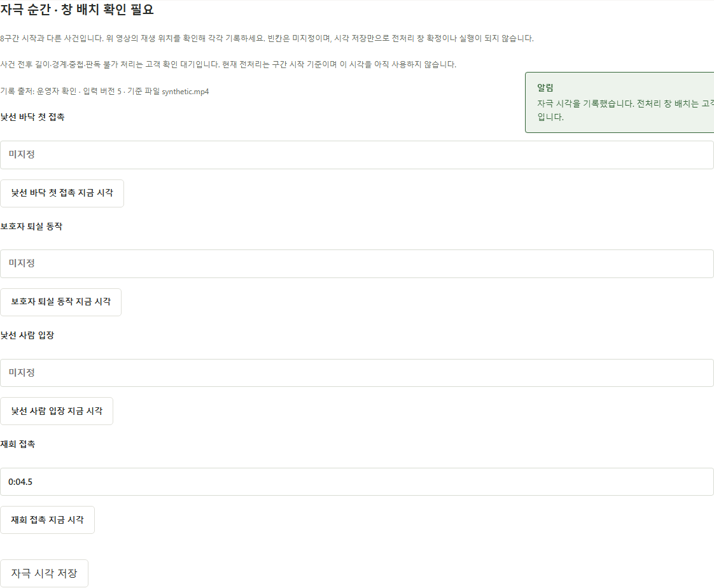

# PR-A07 자극 시점을 기준으로 전처리 창 지정

버전: v1.0 · 2026-09-16 · 상태: 시각 기록 구현·검증, 창 규칙 회신 대기 · 분류: should-fix · 의존: A04 및 창 배치 확인

상위: [검수 결과](../K-DOG_검수결과_v1.0_20260916.md) S01. 근거: 고객 01 §2·§5. 실제 영상 정확도는 이번 판단의 근거로 사용하지 않았다.

## 요구사항과 구현의 차이

01 §5의 촘촘히 볼 순간은 낯선 바닥을 처음 밟을 때, 보호자가 일어나 나갈 때, 낯선 사람이 들어올 때, 재회 접촉 때다. 같은 문서 §2에서 재회는 입장→의자에 앉기→이름 부르기·접촉의 순서다. 따라서 재회 시작과 접촉은 같은 사건이 아니다.

`backend/app/preprocess.py:31`은 해당 구간 시작~시작+5초를 8 fps, 이후를 2 fps로 만든다. 합성 구간 재회 80~100초, 접촉 88초를 가정하면 계획은 80~85초 8 fps·85~100초 2 fps다. 원본 문서가 지목한 접촉 순간이 촘촘한 창 밖에 있다. 기존 시험은 현재 구간 시작 분할만 검증한다.

## 먼저 확인할 해석

고객 문서에는 「자극 순간 앞뒤 5초」와 「각 5초」가 함께 있다. 앞뒤 각각 5초인지, 총 5초인지, 사건 전후 비율은 무엇인지 확인해야 한다. 자동으로 ±2.5초 또는 이후 5초로 정하지 않는다. [채점규칙 확인 요청](../K-DOG_채점규칙_확인요청_v1.0_20260916.md)에 시간 창 질문을 별도 추가하는 것이 좋다.

## 제안 범위

- 기존 8구간 시각과 별도로 네 자극 시각/창을 기록한다. 기준 영상 ID·입력 revision·운영자가 확인한 값이라는 출처를 함께 보존한다.
- 촬영 화면에 「낯선 바닥 첫 접촉」「보호자 퇴실 동작」「낯선 사람 입장」「재회 접촉」을 우리말로 표시하고, 영상 재생 위치에서 명시적으로 지정하게 한다. AI 추정이나 구간 시작값 자동 확정은 추가하지 않는다.
- 고객 확인 뒤 총 길이·사건 전후·구간/영상 경계에서의 처리·여러 창 겹침 규칙을 데이터로 기록한다. UI에서 최종 시작·끝을 검토할 수 있게 한다.
- 창을 모르면 확인 필요로 남긴다. 사건이 없거나 판독할 수 없는 경우의 사유·전처리 가능 범위는 합의 후 구현한다. 현재 구간 시작 방식이 요구사항을 만족한다고 표시하지 않는다.
- `input_models.py`, 도메인 검증, 관련 API·촬영 UI, `preprocess.py`, 규칙 파일·시험이 범위다. 기존 자료는 미지정으로 이관하고 자극 시각을 만들어 채우지 않는다. 규칙 버전도 구분한다.

## 완료 조건

1. 구간 시작과 사건이 8초 다른 합성 입력에서 사건을 포함하는 합의된 창이 8 fps에 배정된다.
2. 사건이 영상 앞/뒤 경계에 있는 경우, 입력 누락·범위 초과·창 중첩을 명시한 규칙대로 처리한다.
3. 오디오·원본 해시·새 batch 불변성·삭제/수정 후 결과 공개 차단은 유지한다.
4. 구간 시각 저장만으로 자극 시점이 확정되거나 전처리가 시작되지 않는다.
5. 합성 자료로 API·계획 분할·FFmpeg 절단을 검증한다. 실제 영상 시험은 별도 세션에서 수행한다.

권장 PR 제목: `feat: 운영자가 확인한 자극 시점으로 전처리 창 지정`

## 진행 기록 (2026-09-16)

- [x] 네 사건 시각을 구간 시작과 별도로 기록하는 계약·API·촬영 UI 구현. 영상 ID, 저장 입력 revision, operator_confirmed 출처를 보존한다. 원본 해시·영상 길이를 검사하고 음수/비유한/범위 초과 값을 거절한다.
- [x] 기존 자료는 stimuli 미지정으로 읽는다. 빈칸을 구간 시작이나 0으로 채우지 않는다. 부분 입력은 미지정 그대로 저장하며 사건 없음·판독 불가의 의미를 임의 부여하지 않는다.
- [x] 재생 위치에서 명시적으로 기록, 편집 중 외부 저장 시 revision 충돌·입력 유지, 미저장 메뉴 이동 취소, 교수 조회 전용 검증. 선택 영상이 달라지면 기존 기록을 자동 적용하지 않는다.
- [x] 기록 저장은 전처리를 실행하지 않으며 현재 preprocess-v1의 구간 시작 규칙을 바꾸지 않는다. 화면에서 자극 시각이 아직 전처리에 적용되지 않음을 표시한다.
- [x] 백엔드 전체 122개·빌드·전체 e2e 17개·diff check 통과. 실제 영상 및 합의 전 창 절단 시험은 제외.
- [x] cold review: domain 계약의 schema_version을 시간 범위 검사에서 제외하도록 수정. 화면 검수에서 동일 부모의 SessionEditor·VideoUpload가 같은 key를 써 자동 갱신마다 메모 제목이 중복되는 문제를 발견해 **수용**했다. 불필요한 중복 key를 제거하고 갱신 후 제목 1개 회귀 검증을 추가했다. 회차별 초기화는 부모 RecordingPanel의 case/session key가 담당한다. 이 독립 수정은 [A05 후속 PR #24](https://github.com/syleeVeluga/k-dog-proj/pull/24)로 먼저 병합했다. 편집 중 기준 영상 변경과 구간 저장이 자극 미저장 입력을 소실시키지 않는지 확인. 창 길이/중첩/경계 처리를 추정해서 구현하는 안은 **수용하지 않음**.
- [ ] 고객 합의된 창 길이·사건 전후·영상/구간 경계·중첩 및 사건 없음/판독 불가 처리 반영.
- [ ] 최종 창 미리보기, 새 규칙 버전, 사건을 포함하는 8 fps 분할·FFmpeg 절단 검증.
- [ ] 전체 완료 체크 및 병합. 위 두 항목이 미확정이므로 draft PR로 보존한다.

고객 확인 질문은 [채점규칙 확인 요청 1장 질문 8](../K-DOG_채점규칙_확인요청_v1.0_20260916.md)에 모았다. 이 문서의 「먼저 확인할 해석」에 따라 ±2.5초·이후 5초 중 어느 것도 자동 채택하지 않았다. 실제 영상 시험은 요청에 따라 범위에서 제외했다.

