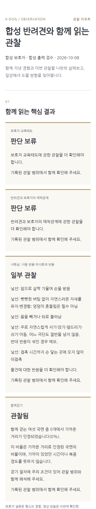
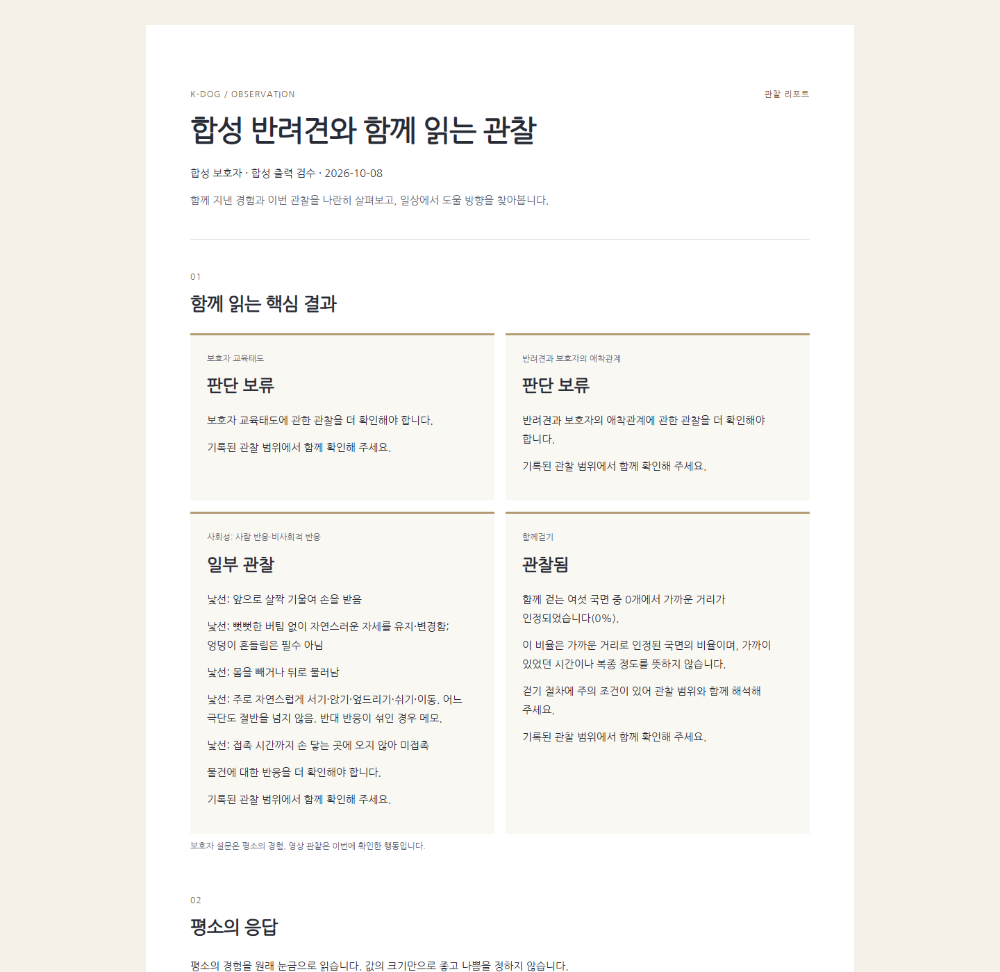

# PR-RP04 장면 제거와 HTML·PDF 출력 개편

버전: v1.0 · 2026-10-07 · 상태: 구현·합성 검증·전체 출력 시각 검수 완료, 독립 cold review 준비 · 선행: RP03 원격·로컬 병합 완료

상위: [수용안 적용 계획](K-DOG_리포트수용안적용계획_v1.0_20261007.md). 연결: A05/A06, R20~R23, T16/T22/T23/O10, RP-T09~11.

브랜치 제안: `veluga/rp04-report-design` · PR 제목: `feat: redesign reports without photo scenes`

## 문제와 목표

예시에서 가져온 섹션·색상·6쪽 배치와 사진 장면이 현재 구현에 남아 있다. 새 리포트에서는 ‘오늘의 장면들’ 영역과 관련 자리표시자·사진 추출 단계를 제거한다. 명세의 필수 내용은 유지하면서 세련되고 친근한 디자인으로 재구성한다.

## 변경 범위

| 기존/제안 파일 | 변경 내용 |
| --- | --- |
| `backend/app/report_profile_v4.py`, `backend/app/domain/report_profile_v4.py` | 신규 출력의 장면/장면부족 안내·선정 상태 제거 또는 미사용 계약으로 분리 |
| `backend/app/report_runs_v4.py`, `backend/app/domain/report_runs_v4.py` | 신규 리포트 실행에서 `capture_images` 및 장면 이미지 검증 의존 제거 |
| `backend/app/report_render_v4.py`, `backend/app/report_pdf_v4.py`, `backend/app/domain/report_render_v4.py` | HTML/PDF 렌더러를 새 내용·구성에 연결. 폰트·PDF 생성·검증 재사용 |
| `resources/report/presentation-v4.json`, `resources/report/templates/s1.html`, `s1.css` | 새 판본 자산으로 디자인 교체. 제안 신규 `presentation-20261007.json`, 템플릿 파일은 기존 구조에 맞춰 결정 |
| `frontend/src/ReportRunsV4.tsx`, `frontend/src/pages/Report.tsx`, 관련 타입 | 생성·조회·다운로드 상태와 장면 없는 새 결과 연결 |
| 기존 렌더/실행/내용/장면·브라우저 시험 | 새 출력 검증 및 분석 사건 보호 회귀 |

## 구현 순서와 디자인 방향

1. 원본/예시의 레이아웃을 복제하지 않고 정보 순서를 정한다. 기본안은 대상·일자와 핵심 결과→설문/영상 설명→총평·실천→출처·관찰 한계다. 네 결과의 이름과 자료 부족 안내는 유지한다.
2. 중립 배경, 읽기 쉬운 한국어 글꼴, 충분한 여백, 절제한 강조색을 사용한다. 사진 없는 카드·표·필요한 그래프를 구성하며 색만으로 설문/영상·상태를 구분하지 않는다. 예시의 청록/코랄 배색을 고정 요구로 삼지 않는다.
3. 사진 장면 섹션·캡션·빈 사진 상자·장면 부족 안내·장면 전용 페이지를 제거한다. ‘장면’이라는 단어가 있는 관찰 설명까지 무조건 삭제하지 않는다. 분석에 필요한 사건·영상 근거/시간은 계속 보존한다.
4. 신규 실행은 리포트 사진을 위해 동영상 프레임을 읽지 않는다. 장면 함수 제거 전 `graft callers`로 공통 사건 정규화·중복 방지·검증 호출을 확인한다. 공유 함수나 과거 S1 산출물의 읽기/삭제 참조를 무조건 지우지 않는다.
5. HTML/PDF에 같은 RP03 검증 내용·비교값·출처를 사용한다. 고정 6쪽을 해제하고 실제 내용에 따라 쪽을 나눈다. 긴 한국어·표·그래프가 잘리지 않게 조정하며 이미지 대신 정보가 명확한 구성을 택한다.
6. 교수 외부 비교표 미수령 시 외부 그래프 공간을 비워두거나 임의 수치로 채우지 않는다. 본인 결과와 자체 집단의 확인된 출력은 유지하고 RP06 적용 지점을 분리한다.

## 검증과 완료 조건

- RP-T09~11: 사진/캡션/빈 장면 쪽 없음, 신규 실행의 프레임 추출 없음, 사건 근거·중복 보호 유지.
- 완전·부분 결측·긴 문장·조언 0~3개·비교 없음/있음의 합성 사례를 각각 HTML과 PDF로 만든다.
- 360px 모바일, 데스크톱, A4 인쇄를 확인한다. 생성 PDF의 전체 페이지를 렌더링해 잘림·겹침·글꼴·차트·고아 제목을 직접 확인한다. 6쪽 일치 시험은 새 품질/내용 기준으로 대체한다.
- HTML의 외부 네트워크 의존·스크립트 삽입 없이 기존 제공 방식을 유지한다. 장면 제거를 이유로 최종 결과·설문·총평·실천이 빠지지 않는다.

새 디자인·문장 시험을 포함한 관련 backend 87개가 110.837초에 통과했다. frontend build 및 기존 리포트·인쇄 E2E 5개가 통과했고 새 출력 E2E는 검수 fixture 보완 및 인쇄 쪽 경계 수정 후 1개, 12.4초에 통과했다. 상세 명령·최종 보완 검증은 [실행 기록](K-DOG_리포트구현실행기록_v1.0_20261007.md)에 기록한다.

## 실제 구현과 출력 검수

- `report-run-20261007-rp04`와 `report-presentation-20261007-rp04`를 추가했다. 새 실행 입력 profile은 사진 선정·부족 안내·장면 검토 항목이 없고 프레임 추출을 수행하지 않는다. 사건 근거·원영상 hash·타임라인·계산·완료 의견은 유지한다. 기존 발급본의 이미지 참조·검증·삭제 경로는 보존한다.
- 새 `presentation-20261007.json` 및 HTML/CSS를 별도 자산으로 pin했다. 네 핵심 결과→평소 응답→28문항 설문/영상 설명→세부 관찰→총평/실천→출처 순서이며 중립 배경·갈색·설문 보라·영상 녹색을 사용한다. 장면 전용 페이지와 고정 6쪽을 해제했다.
- PDF는 긴 한국어를 이어 쓰고 표의 머리글을 반복한다. 짧은 출처 묶음, 브라우저의 카드·설문 그래프·실천·출처는 쪽 경계에서 함께 읽히게 보완했다. 긴 내용에는 다음 쪽을 허용한다. 외부 미확정 그래프나 빈 사진 상자는 만들지 않는다.
- 9개 합성 사례를 HTML/PDF로 생성했다. 설문 완전 응답+유효 영상 구간, 부분 결측, 전부 결측, 긴 이름/설명, 자체 비교 있음, 실천 0~3개를 구분했다. 기본 fixture의 미정 영상 창·청취 metadata 없는 발성은 관찰된 것으로 꾸미지 않는다. 83개 직접 숫자 관찰의 실물 완전 사례 검증을 완료했다고 표시하지 않는다.
- 서버 PDF는 합계 54쪽(사례당 4~9쪽), 브라우저 A4 PDF는 네 사례 합계 32쪽(6~11쪽)을 PNG로 렌더링해 전체 페이지를 확인했다. 한국어·표·차트·제목·출처 및 긴 설명 끝 표식을 점검했다. 360px·데스크톱, 오프라인/외부 요청 0·script/image 없음·28행 유지도 확인했다. 합성 문장과 교수 검토 품질은 별도다.
- RP03 발급본의 내용/출력 bytes 보존, RP03→RP04 내용 재사용 거절 및 새 실행의 프레임 추출 무호출을 시험했다. 실제 공급자 호출과 운영 데이터 초기화는 0회다.

## 인계

RP05에 새 표현 자산 판본, 합성 HTML/PDF·화면 캡처, 장면 출력 요구를 대체한 T22/O10 검증 근거를 전달한다. 기존 S1 발급본 bytes를 새 디자인으로 덮어쓰지 않는다. 디자인 세부 조정은 필수 내용·읽기·인쇄 품질을 유지하는 범위에서 진행한다.
