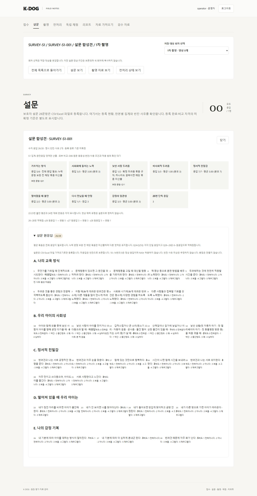
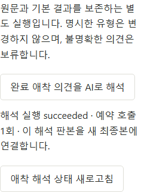

# K-DOG 리포트 개편 구현 실행 기록

버전: v1.0 · 2026-10-07 · 최초 작업 기준: `main / aa3f3ac` · 상태: RP01 원격·로컬 병합 완료, RP02 구현·검증·수용 수정 완료

상위: [수용안 적용 계획](K-DOG_리포트수용안적용계획_v1.0_20261007.md). 이 대장은 제품 구현과 원격·로컬 병합의 실제 근거를 기록한다. 교수 검토·실제 공급자·외부 기준표 수령을 합성 자동 검증과 구별한다.

## 1 PR 진행 상태

| 단계 | 구현·검증·리뷰 | 원격·로컬 병합 | 남은 경계 |
| --- | --- | --- | --- |
| [RP01](K-DOG_PR-RP01_설문응답정책_v1.0_20261007.md) | 완료, [수용 4건](K-DOG_PR-RP01_ColdReview_v1.0_20261007.md) 반영 | [PR #54](https://github.com/syleeVeluga/k-dog-proj/pull/54), `edc0d475` 원격·로컬 일치 | 구글폼 설정 실물 확인은 의뢰자 담당 |
| [RP02](K-DOG_PR-RP02_AI애착판단_v1.0_20261007.md) | 완료, [수용 3건](K-DOG_PR-RP02_ColdReview_v1.0_20261007.md) 반영 | [PR #55](https://github.com/syleeVeluga/k-dog-proj/pull/55), 최종 head 확인·병합 대기 | 교수 적절성 검토는 기술 합성 검증과 별도 |
| [RP03](K-DOG_PR-RP03_AI리포트문장_v1.0_20261007.md) | 미착수 | 미실행 | 새 AI 내용 계약·실행 |
| [RP04](K-DOG_PR-RP04_장면제거와출력개편_v1.0_20261007.md) | 미착수 | 미실행 | 장면 제거·새 HTML/PDF·시각 검수 |
| [RP05](K-DOG_PR-RP05_통합검증과교수검토_v1.0_20261007.md) | 미착수 | 미실행 | 통합 기술 검증과 실제 교수 검토 분리 |
| [RP06](K-DOG_PR-RP06_외부비교기준표적용_v1.0_20261007.md) | 조건부 대기 | 미실행 | 교수 확정 두 기준표는 계획상 미수령; 자료 위치를 사용자에게 확인 중 |

### RP01 실행

제품 구현 commit: `d7e78725d803aa67a4578dffd40ea2049b410670`. 한 브랜치에서 구현→검증→독립 cold review→수용 수정→관련 재검증을 수행했다. 새 runtime 정책은 `survey-policy-20261007-rp01`이며 원본 추출 정책·원점수·구 S1 발급 bytes를 보존한다. 원격·로컬 병합 결과는 PR 생성 뒤 여기에 기록한다.

원격 [PR #54](https://github.com/syleeVeluga/k-dog-proj/pull/54)를 생성해 이 채팅에 연결했다. `a8c7258f377021fcc42c64a5d2684225c2aa92e5` 조회에서 원격 checks/statuses는 비어 있고 `CLEAN`/`MERGEABLE`이었다. 자동 CI 통과나 별도 원격 리뷰 완료로 표시하지 않는다. 문서 기록을 포함한 최종 head를 다시 확인해 일치할 때만 병합하며, 최종 상태·merge commit은 PR와 후속 단계 기록에서 확인한다.

최종 head `7329f4dc4cec270a835f779840abb076ed284209`에서도 checks/statuses가 비어 있고 `CLEAN`/`MERGEABLE`인 것을 확인한 뒤, `--match-head-commit`으로 2026-10-07 13:52:00 UTC 병합했다. merge commit은 `edc0d475fcfe8127d218e8481d19c0f4f43e876c`. `git switch main` 및 `git pull --ff-only` 뒤 로컬 `HEAD`와 `origin/main`이 이 commit으로 일치했다.

| 확인 | 명령·결과 |
| --- | --- |
| 초기 확대 backend | `uv run --locked python -X utf8 -m unittest tests.test_survey_v4 tests.test_forms_import_v4 tests.test_forms_api_v4 tests.test_comparisons_v4 tests.test_exports_v4 tests.test_report_content_v4 tests.test_report_validation_v4 tests.test_report_runs_v4 tests.test_external_comparisons_v4 tests.test_external_exports_v4 -v` — 138개, 147.810초, OK |
| 수용 수정 후 backend | `uv run --locked python -X utf8 -m unittest tests.test_exports_v4 tests.test_report_runs_v4 tests.test_external_exports_v4 tests.test_comparisons_v4 tests.test_report_content_v4 -v` — 74개, 101.767초, OK |
| 재생성 안내 추가 회귀 | `uv run --locked python -X utf8 -m unittest tests.test_report_runs_v4.ReportRunV4Tests.test_rp01_previous_policy_report_keeps_bytes_and_requests_regeneration -v` — 1개, 3.294초, OK |
| frontend | `npm run build` 통과. `$env:KDOG_TEST_INTAKE_SPEC='20261002'; npx playwright test tests/survey-v4.spec.ts tests/importer-v4.spec.ts tests/comparisons-v4.spec.ts` — 5개, 20.5초, 통과. 보완 문항 UI 추가 후 build·설문 시험 1개, 7.3초, 재통과 |
| 원본 추출 | `uv run --locked python -X utf8 -m app.import_catalogs --spec 20261002 --check` — 8개 자산 source verified. G01/G04 실물 검증은 미수령 대기이며 Excel import 비활성 유지 |
| 원본 hash | SRC02 `4a1b3696246d55b34f6ca2b919c1599da4b15b47fa7a4e5ae624a2669a17493a`, SRC03 `11b9fd6c1241679d175998d04e0f29fd4420228dc2abb0d0d84e72f055b22941` — [원본 목록](../개발반영_20261003/K-DOG_원본자료목록_v1.0_20261003.md)과 일치 |

검사 수를 합산해 전체 통과 수치로 표시하지 않는다. 초기 실패는 변경 전 정책을 기대하던 시험 5건과 fixture 연결 오류였으며 새 정책 요구와 정확한 고정 입력을 반영한 후 위 최종 결과로 확인했다. 실제 공급자 호출·운영 데이터 초기화는 0회다.

문서 10개·로컬 상대 링크 43개와 `git diff --check`를 확인했고 합성 화면 링크 1개를 추가했다. 아래는 최종 보완 문항 표시를 포함한 합성 브라우저 화면이며 실제 참가자 자료가 아니다.

### RP02 실행

구현 기준 `edc0d475`, 브랜치 `veluga/rp02-attachment-ai`, 구현 commit `e5278afd64942c13ca440da607901eeaf3218a57`. [RP02 계획·구현 인계](K-DOG_PR-RP02_AI애착판단_v1.0_20261007.md)에 새 판단·별도 완료 의견 해석·우선순위·hash/권한 보호 계약을 기록했다. 독립 cold review 세 발견을 수용하고 재검토·관련 재검증을 완료했다. 원격 PR·병합은 후속 기록으로 확인한다.

수용 수정·문서 commit `d0f5f488bd489ffc477e19058fc11ffd04b75c53`을 push하고 [PR #55](https://github.com/syleeVeluga/k-dog-proj/pull/55)를 채팅에 연결했다. 이 head의 checks/statuses는 비어 있고 `CLEAN`/`MERGEABLE`이었다. CI 통과로 표시하지 않는다. 이 기록을 포함한 최종 head를 다시 확인한 후 일치하는 commit만 병합한다.

| 검증 | 실제 결과 |
| --- | --- |
| 확대 backend | `uv run --locked python -X utf8 -m unittest tests.test_attachment_ai_v4 tests.test_judgements_v4 tests.test_final_results_v4 tests.test_opinions_v4 tests.test_scoring_ai_v4 tests.test_ai_api_v4 tests.test_gemini_v4 tests.test_settings_v4 tests.test_run_v4 tests.test_report_content_v4 tests.test_report_validation_v4 tests.test_report_runs_v4 tests.test_exports_v4 tests.test_packaging -v` — 171개, 258.994초, OK |
| 추가 통합 | `tests.test_attachment_ai_v4.AttachmentPipelineTests.test_actual_provider_to_basic_final_and_report_evidence` — 1개, 21.674초, OK. 실제 공개 배정·독립 제출·grant/reveal→최종 조립→부모 hash 읽기→리포트 카드·근거 연결. 물리 영상 probe만 합성으로 대체 |
| 완료 의견 안전 경계 | `tests.test_attachment_ai_v4.AttachmentOpinionTests` — 5개, 8.308초, OK. 명시 유형 우선, 원문·원점수 보존, 철회·권한 및 영상 hash 변경 차단 |
| frontend | `npm run build` 통과. `$env:KDOG_TEST_INTAKE_SPEC='20261002'; npx playwright test tests/judgements-v4.spec.ts tests/opinions-v4.spec.ts tests/scoring-ai-v4.spec.ts` — 최종 7개, 43.3초, 통과 |
| 원본 추출 | `uv run --locked python -X utf8 -m app.import_catalogs --spec 20261002 --check` — 기존 원본 파생 8개 자산 일치. G01/G04 실물 미수령·Excel import 비활성 경계 유지 |
| 수용 수정 후 backend | `uv run --locked python -X utf8 -m unittest tests.test_attachment_ai_v4 tests.test_final_results_v4 tests.test_report_content_v4 tests.test_report_validation_v4 tests.test_run_v4 -v` — 66개, 123.283초, OK |
| 수용 수정 후 frontend | build 통과. 위 세 E2E 파일 7개, 44.4초, 통과. 종료 뒤 명시 재실행 응답 유실 보완 후 build 및 RP02 시험 1개, 8.1초, 재통과 |

초기 시험 실패는 새 단계의 실행 상태 enum 누락, 함수 지역명 충돌, 합성 관찰 창 및 공개 배정 target revision 오류로 구분하여 수정하고 재검증했다. 기존 원점수·설문 정책·교육태도 비율·과거 S1 발급 bytes를 변경하지 않았다. 실제 공급자·운영 데이터 호출/초기화는 0회이며 교수 적절성·처리 시간·정산은 미측정이다. 새 UI 시험은 가상 실행 참조 전달을 검사하고 실제 최종본 채택은 거절하는 합성 mock이며, 위 backend 실제 조립 시험과 구별한다.

## 2 라이브러리·프레임워크 확인

### 확인한 버전과 공식 근거

RP02에서도 2026-10-07 공식 [Gemini 3.8 Flash 안정 모델](https://ai.google.dev/gemini-api/docs/models/gemini-3.8-flash), [Interactions API](https://ai.google.dev/gemini-api/docs/interactions-overview), [구조화 출력](https://ai.google.dev/gemini-api/docs/structured-output), [2026-05 breaking changes](https://ai.google.dev/gemini-api/docs/interactions-breaking-changes-may-2026)를 확인했다. 기존 `gemini-3.8-flash` 모델과 REST adapter의 `steps`/`response_format` 계약을 재사용하고, 텍스트 전용 입력을 사용한다. 새 SDK 설치나 무관한 의존성 갱신은 없다. 기존 Pydantic 2.13.5의 strict 계약·조건부 필드 제외를 사용해 과거 S1 직렬화 hash를 유지한다. 실제 외부 호출 검증으로 표시하지 않는다.

확인일: 2026-10-07. 공식 문서·릴리스·PyPI/npm registry를 조회했다. 새 패키지를 설치하거나 관련 없는 업그레이드를 하지 않고 기존 manifest/lockfile에 고정된 버전을 사용한다. Python 3.14.2와 Node 24.13.0에서 검증했다.

| 대상 | 최신 안정판 / 선택판 | 선택·호환 근거 |
| --- | --- | --- |
| Pydantic | 2.13.5 / 2.13.5 | Python ≥3.9, 현 Python 3.14와 호환. 기존 `model_validator`/엄격 JSON 검증 API 사용. [PyPI](https://pypi.org/project/pydantic/), [릴리스](https://github.com/pydantic/pydantic/releases), [검증 API](https://docs.pydantic.dev/latest/concepts/validators/) |
| React / React DOM | 19.3.0 / 19.2.8 | 기존 잠금판 유지, RP01은 표시·타입 수정이며 새 19.3 기능 도입 없음. React DOM peer `react ^19.2.8` 충족. [버전](https://react.dev/versions), [19.3 변경](https://react.dev/blog/2026/09/09/react-19-3), [npm React](https://registry.npmjs.org/react/latest), [선택 DOM peer](https://registry.npmjs.org/react-dom/19.2.8) |
| TypeScript | 7.0.2 / 7.0.2 | 선택판 Node ≥16.20.0 충족, `tsc --noEmit` 통과. [공식](https://www.typescriptlang.org/docs/), [registry](https://registry.npmjs.org/typescript/latest) |
| Vite | 8.3.3 / 8.2.2 | 기존 잠금판 유지, 정책 변경에 bundler 업그레이드를 섞지 않음. 선택판 Node `^20.19.0 또는 ≥22.12.0` 충족. [공식](https://vite.dev/guide/), [최신 registry](https://registry.npmjs.org/vite/latest), [선택판](https://registry.npmjs.org/vite/8.2.2) |
| Playwright Test | 1.63.0 / 1.63.0 | Node ≥20 충족, 기존 브라우저와 API 사용. [릴리스](https://playwright.dev/docs/release-notes), [registry](https://registry.npmjs.org/@playwright/test/latest) |
| openpyxl | 3.1.5 / 3.1.5 | Python ≥3.8 충족. 기존 `load_workbook` 읽기로 CSV/XLSX 정책 열 검증. [PyPI](https://pypi.org/project/openpyxl/), [공식 API](https://openpyxl.readthedocs.io/en/stable/) |

RP02 이후 공급자 API·새 사용 라이브러리의 확인은 해당 단계 기록에 추가한다. 교수 전문 기준을 라이브러리/API 문서로 대체하지 않는다.
