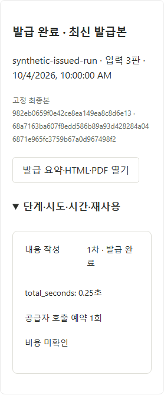

# K-DOG 리포트 개편 구현 실행 기록

버전: v1.0 · 2026-10-07 · 최초 작업 기준: `main / aa3f3ac` · 상태: RP01~RP05 기술 검증·원격/로컬 병합 완료, 실제 공급자·교수 검토·RP06 확정표 적용 대기

상위: [수용안 적용 계획](K-DOG_리포트수용안적용계획_v1.0_20261007.md). 이 대장은 제품 구현과 원격·로컬 병합의 실제 근거를 기록한다. 교수 검토·실제 공급자·외부 기준표 수령을 합성 자동 검증과 구별한다.

## 1 PR 진행 상태

| 단계 | 구현·검증·리뷰 | 원격·로컬 병합 | 남은 경계 |
| --- | --- | --- | --- |
| [RP01](K-DOG_PR-RP01_설문응답정책_v1.0_20261007.md) | 완료, [수용 4건](K-DOG_PR-RP01_ColdReview_v1.0_20261007.md) 반영 | [PR #54](https://github.com/syleeVeluga/k-dog-proj/pull/54), `edc0d475` 원격·로컬 일치 | 구글폼 설정 실물 확인은 의뢰자 담당 |
| [RP02](K-DOG_PR-RP02_AI애착판단_v1.0_20261007.md) | 완료, [수용 3건](K-DOG_PR-RP02_ColdReview_v1.0_20261007.md) 반영 | [PR #55](https://github.com/syleeVeluga/k-dog-proj/pull/55), `35637f9` 원격·로컬 일치 | 교수 적절성 검토는 기술 합성 검증과 별도 |
| [RP03](K-DOG_PR-RP03_AI리포트문장_v1.0_20261007.md) | 완료, [수용 2건](K-DOG_PR-RP03_ColdReview_v1.0_20261007.md) 반영 | [PR #56](https://github.com/syleeVeluga/k-dog-proj/pull/56), `66984cf` 원격·로컬 일치 | 교수 문장 품질은 실제 검토 대기 |
| [RP04](K-DOG_PR-RP04_장면제거와출력개편_v1.0_20261007.md) | 완료, [수용 1건](K-DOG_PR-RP04_ColdReview_v1.0_20261007.md) 반영 | [PR #57](https://github.com/syleeVeluga/k-dog-proj/pull/57), `15c4065` 원격·로컬 일치 | 실제 공급자/전문 품질은 별도 |
| [RP05](K-DOG_PR-RP05_통합검증과교수검토_v1.0_20261007.md) | 기술 검증 완료, [수용 2건](K-DOG_PR-RP05_ColdReview_v1.0_20261007.md) 반영 | [PR #58](https://github.com/syleeVeluga/k-dog-proj/pull/58), `edeb63b` 원격·로컬 일치 | 실제 공급자·교수 검토 대기 |
| [RP06](K-DOG_PR-RP06_외부비교기준표적용_v1.0_20261007.md) | 수령 전 합성 검증·[독립 review](K-DOG_PR-RP06_ColdReview_v1.0_20261007.md) 완료, 발견 0건 | 수령 전 범위 PR 준비 | 교수 확정 두 기준표 미수령; 실제 적용 미실행 |

### RP01 실행

제품 구현 commit: `d7e78725d803aa67a4578dffd40ea2049b410670`. 한 브랜치에서 구현→검증→독립 cold review→수용 수정→관련 재검증을 수행했다. 새 runtime 정책은 `survey-policy-20261007-rp01`이며 원본 추출 정책·원점수·구 S1 발급 bytes를 보존한다. 원격·로컬 병합 결과는 PR 생성 뒤 여기에 기록한다.

원격 [PR #54](https://github.com/syleeVeluga/k-dog-proj/pull/54)를 생성해 이 채팅에 연결했다. `a8c7258f377021fcc42c64a5d2684225c2aa92e5` 조회에서 원격 checks/statuses는 비어 있고 `CLEAN`/`MERGEABLE`이었다. 자동 CI 통과나 별도 원격 리뷰 완료로 표시하지 않는다. 문서 기록을 포함한 최종 head를 다시 확인해 일치할 때만 병합하며, 최종 상태·merge commit은 PR와 후속 단계 기록에서 확인한다.

최종 head `7329f4dc4cec270a835f779840abb076ed284209`에서도 checks/statuses가 비어 있고 `CLEAN`/`MERGEABLE`인 것을 확인한 뒤, `--match-head-commit`으로 2026-10-07 13:52:00 UTC 병합했다. merge commit은 `edc0d475fcfe8127d218e8481d19c0f4f43e876c`. `git switch main` 및 `git pull --ff-only` 뒤 로컬 `HEAD`와 `origin/main`이 이 commit으로 일치했다.

| 확인 | 명령·결과 |
| --- | --- |
| 초기 확대 backend | `uv run --locked python -X utf8 -m unittest tests.test_survey_v4 tests.test_forms_import_v4 tests.test_forms_api_v4 tests.test_comparisons_v4 tests.test_exports_v4 tests.test_report_content_v4 tests.test_report_validation_v4 tests.test_report_runs_v4 tests.test_external_comparisons_v4 tests.test_external_exports_v4 -v` — 138개, 147.810초, OK |
| 수용 수정 후 backend | `uv run --locked python -X utf8 -m unittest tests.test_exports_v4 tests.test_report_runs_v4 tests.test_external_exports_v4 tests.test_comparisons_v4 tests.test_report_content_v4 -v` — 74개, 101.767초, OK |
| 재생성 안내 추가 회귀 | `uv run --locked python -X utf8 -m unittest tests.test_report_runs_v4.ReportRunV4Tests.test_rp01_previous_policy_report_keeps_bytes_and_requests_regeneration -v` — 1개, 3.294초, OK |
| frontend | `npm run build` 통과. `$env:KDOG_TEST_INTAKE_SPEC='20261002'; npx playwright test tests/survey-v4.spec.ts tests/importer-v4.spec.ts tests/comparisons-v4.spec.ts` — 5개, 20.5초, 통과. 보완 문항 UI 추가 후 build·설문 시험 1개, 7.3초, 재통과 |
| 원본 추출 | `uv run --locked python -X utf8 -m app.import_catalogs --spec 20261002 --check` — 8개 자산 source verified. G01/G04 실물 검증은 미수령 대기이며 Excel import 비활성 유지 |
| 원본 hash | SRC02 `4a1b3696246d55b34f6ca2b919c1599da4b15b47fa7a4e5ae624a2669a17493a`, SRC03 `11b9fd6c1241679d175998d04e0f29fd4420228dc2abb0d0d84e72f055b22941` — [원본 목록](../개발반영_20261003/K-DOG_원본자료목록_v1.0_20261003.md)과 일치 |

검사 수를 합산해 전체 통과 수치로 표시하지 않는다. 초기 실패는 변경 전 정책을 기대하던 시험 5건과 fixture 연결 오류였으며 새 정책 요구와 정확한 고정 입력을 반영한 후 위 최종 결과로 확인했다. 실제 공급자 호출·운영 데이터 초기화는 0회다.

문서 10개·로컬 상대 링크 43개와 `git diff --check`를 확인했고 합성 화면 링크 1개를 추가했다. 아래는 최종 보완 문항 표시를 포함한 합성 브라우저 화면이며 실제 참가자 자료가 아니다.

### RP02 실행

구현 기준 `edc0d475`, 브랜치 `veluga/rp02-attachment-ai`, 구현 commit `e5278afd64942c13ca440da607901eeaf3218a57`. [RP02 계획·구현 인계](K-DOG_PR-RP02_AI애착판단_v1.0_20261007.md)에 새 판단·별도 완료 의견 해석·우선순위·hash/권한 보호 계약을 기록했다. 독립 cold review 세 발견을 수용하고 재검토·관련 재검증을 완료했다. 원격 PR·병합은 후속 기록으로 확인한다.

수용 수정·문서 commit `d0f5f488bd489ffc477e19058fc11ffd04b75c53`을 push하고 [PR #55](https://github.com/syleeVeluga/k-dog-proj/pull/55)를 채팅에 연결했다. 이 head의 checks/statuses는 비어 있고 `CLEAN`/`MERGEABLE`이었다. CI 통과로 표시하지 않는다. 이 기록을 포함한 최종 head를 다시 확인한 후 일치하는 commit만 병합한다.

최종 head `f2a89bcf1ddd4b5542c84b646373730d22b1c9fa`의 checks/statuses 없음 및 `CLEAN`/`MERGEABLE`을 다시 확인해 `--match-head-commit`으로 2026-10-07 14:31:59 UTC 병합했다. merge commit `35637f9b1a7f48eb04120ff04d7d32563818f434`로 로컬 `main`과 `origin/main`이 일치했고 RP03 브랜치를 그 commit에서 시작했다.

| 검증 | 실제 결과 |
| --- | --- |
| 확대 backend | `uv run --locked python -X utf8 -m unittest tests.test_attachment_ai_v4 tests.test_judgements_v4 tests.test_final_results_v4 tests.test_opinions_v4 tests.test_scoring_ai_v4 tests.test_ai_api_v4 tests.test_gemini_v4 tests.test_settings_v4 tests.test_run_v4 tests.test_report_content_v4 tests.test_report_validation_v4 tests.test_report_runs_v4 tests.test_exports_v4 tests.test_packaging -v` — 171개, 258.994초, OK |
| 추가 통합 | `tests.test_attachment_ai_v4.AttachmentPipelineTests.test_actual_provider_to_basic_final_and_report_evidence` — 1개, 21.674초, OK. 실제 공개 배정·독립 제출·grant/reveal→최종 조립→부모 hash 읽기→리포트 카드·근거 연결. 물리 영상 probe만 합성으로 대체 |
| 완료 의견 안전 경계 | `tests.test_attachment_ai_v4.AttachmentOpinionTests` — 5개, 8.308초, OK. 명시 유형 우선, 원문·원점수 보존, 철회·권한 및 영상 hash 변경 차단 |
| frontend | `npm run build` 통과. `$env:KDOG_TEST_INTAKE_SPEC='20261002'; npx playwright test tests/judgements-v4.spec.ts tests/opinions-v4.spec.ts tests/scoring-ai-v4.spec.ts` — 최종 7개, 43.3초, 통과 |
| 원본 추출 | `uv run --locked python -X utf8 -m app.import_catalogs --spec 20261002 --check` — 기존 원본 파생 8개 자산 일치. G01/G04 실물 미수령·Excel import 비활성 경계 유지 |
| 수용 수정 후 backend | `uv run --locked python -X utf8 -m unittest tests.test_attachment_ai_v4 tests.test_final_results_v4 tests.test_report_content_v4 tests.test_report_validation_v4 tests.test_run_v4 -v` — 66개, 123.283초, OK |
| 수용 수정 후 frontend | build 통과. 위 세 E2E 파일 7개, 44.4초, 통과. 종료 뒤 명시 재실행 응답 유실 보완 후 build 및 RP02 시험 1개, 8.1초, 재통과 |

초기 시험 실패는 새 단계의 실행 상태 enum 누락, 함수 지역명 충돌, 합성 관찰 창 및 공개 배정 target revision 오류로 구분하여 수정하고 재검증했다. 기존 원점수·설문 정책·교육태도 비율·과거 S1 발급 bytes를 변경하지 않았다. 실제 공급자·운영 데이터 호출/초기화는 0회이며 교수 적절성·처리 시간·정산은 미측정이다. 새 UI 시험은 가상 실행 참조 전달을 검사하고 실제 최종본 채택은 거절하는 합성 mock이며, 위 backend 실제 조립 시험과 구별한다.

### RP03 실행

구현 기준 `35637f9`, 브랜치 `veluga/rp03-report-narrative`. 새 지침·구조화 문장·텍스트 공급자 stage·별도 생성 profile/hash 및 게시 content ref를 추가했다. 원근거 profile을 덮어쓰지 않고 이전 S1 설정과 발급 bytes를 보존한다. 새로운 문장 생성·제한된 수리·실패 상태·명시 재사용·다운로드 무호출·원문/D39 우선·원척도 숫자 고정을 시험했다.

| 검증 | 실제 결과 |
| --- | --- |
| 확대 backend | `uv run --locked python -X utf8 -m unittest tests.test_report_narrative_v4 tests.test_report_content_v4 tests.test_report_validation_v4 tests.test_report_runs_v4 tests.test_report_api_v4 tests.test_settings tests.test_packaging tests.test_ai_api_v4 tests.test_gemini_v4 -v` — 94개, 146.341초, OK |
| 최종 문장 회귀 | `uv run --locked python -X utf8 -m unittest tests.test_report_narrative_v4 -v` — 15개, 31.516초, OK. 새 실제 HTML/PDF·생성 내용 백업복원/삭제·수리 cap 포함 |
| renderer·복원 추가 | 실제 renderer 및 생성 내용 backup/restore/delete 두 시험 — 2개, 9.539초, OK |
| frontend | `npm run build` 통과. `$env:KDOG_TEST_INTAKE_SPEC='20261002'; npx playwright test tests/report-v4.spec.ts` — 3개, 20.6초, 통과. 생성 호출 예약과 비용 미확인 표시, 원격 응답 유실·고정 참조·다운로드·인쇄·공개 철회 |
| 수용 수정 후 확대 backend | 위 확대 명령 — 98개, 169.677초, OK. 단위·척도 및 카드별 최종 유형 연결 회귀 포함 |
| 독립 재검토 | 최초 경계 8개, 26.314초 및 수정 후 계약 8개, 1.085초, 모두 통과. 두 기존 재현 차단·정상 문장 허용 확인 |
| 원본·문서 | S1 추출 8개 자산 source verified. 문서 12개·로컬 상대 링크 61개·`git diff --check` 통과. 합성 UI 화면 추가 시험 1개, 11.8초, 통과 |

초기 실패는 존재하지 않는 시험 모듈명(`test_maintenance`/`test_usage`), 합성 원값의 문항 척도 불일치, 수용 수정 회귀의 유형 미확정 fixture로 구별해 정확한 기존 모듈·유효 입력·명시 완료 유형으로 수정했다. 최신 최종 결과를 위에 기록했으며 시험 횟수를 합산하지 않는다. 실제 공급자 호출·운영 데이터 초기화는 0회다. 신규 의미적 품질은 교수 검토 대기이며 자동 문자열·출처 검증만으로 적절성을 보장하지 않는다. 독립 cold review 두 P2를 모두 수용·수정하고 독립 재검토까지 완료했다.

구현 commit `9f166afffd7e426e74ab928b4d964e7f2939f3f2`와 수용 수정·문서 commit `3bd7a80037b26b45447554e40257059122cb68e9`를 push하고 [PR #56](https://github.com/syleeVeluga/k-dog-proj/pull/56)을 이 채팅에 연결했다. 수정 head의 원격 checks/statuses는 비어 있고 `CLEAN`/`MERGEABLE`이었다. CI 통과로 표시하지 않는다. 이 기록을 포함한 최종 head를 확인해 `--match-head-commit`으로 병합하고 원격·로컬 일치 결과를 후속 단계에서 기록한다.

### RP03 병합·RP04 실행

RP03 최종 head `c0dabfa773a9f66f3943146f47859562027b2d5b`의 checks/statuses 없음 및 `CLEAN`/`MERGEABLE`을 확인해 `--match-head-commit`으로 2026-10-07 15:02:33 UTC 병합했다. merge commit `66984cf5dd682c193dffff4c65f7cba9576df07b`로 로컬 `main`과 `origin/main`이 일치했고 RP04 `veluga/rp04-report-design`을 시작했다. RP04 검증은 2026-10-08 KST에 이어 수행했다.

| RP04 검증 | 실제 결과 |
| --- | --- |
| 관련 backend | `uv run --locked python -X utf8 -m unittest tests.test_report_design_v4 tests.test_report_narrative_v4 tests.test_report_render_v4 tests.test_report_content_v4 tests.test_report_validation_v4 tests.test_report_runs_v4 tests.test_report_api_v4 tests.test_report_scenes_v4 -v` — 87개, 110.837초, OK |
| PDF 쪽 경계 보완 후 | 새 디자인·실제 생성 renderer·기존 renderer 9개, 9.917초, OK. RP03 bytes/재사용 회귀 추가 뒤 `tests.test_report_design_v4` 4개, 9.427초, OK |
| frontend | build 통과. 기존 리포트/인쇄 E2E 5개 통과. 새 `tests/report-design-v4.spec.ts` 1개가 최종 12.4초 통과. 360px·데스크톱·A4, 오프라인·28문항·사진/script 없음·실천 0~3개·긴 표식 유지 |
| 시각 검수 | `uv run --locked python -X utf8 -m tests.build_report_design_v4 --output <저장소 밖 임시 경로>` — 9개 서버 PDF 54쪽 전체 PNG 검수. 브라우저 filled/missing/long/comparison PDF 32쪽 전체 PNG 검수. 서버 4~9쪽·브라우저 6~11쪽, 고정 페이지 수 없음 |
| 내용 보존 | pypdf로 13개 PDF에서 필수 제목·장면 사진 문구 없음·긴 설명 끝 표식 확인. 실제 frame 추출 함수 호출 금지 주입에서도 신규 발급 성공. 사진 제거 전후 facts/cards/timeline/source/comparisons 동일 |

초기 실패는 새 선택 인자를 받지 않는 시험 wrapper, 비어 있는 합성 총평, 정의되지 않은 관찰 창·memo/발성 입력 metadata의 QA fixture 범위를 구별해 수정했다. 제품의 누락 관찰을 0으로 채우거나 청취 metadata를 추정하지 않았다. 시각 검수에서 발견한 출처 단락·짧은 카드/그래프의 쪽 경계를 보완했다. actual provider 0회·교수 품질 미검증 경계를 유지하며 기술 회귀 수를 합산하지 않는다.

RP04 의존성 확인: 2026-10-07~08. ReportLab 최신/선택 5.0.1 ([PyPI](https://pypi.org/project/reportlab/), [5.0 변경](https://docs.reportlab.com/releases/notes/whats-new-50/), [표 API](https://docs.reportlab.com/reportlab/userguide/ch7_tables/)); Python ≥3.9,<4와 기존 Python 3.14.2 호환. Pillow 최신/선택 12.3.0 ([PyPI](https://pypi.org/project/pillow/), [릴리스](https://pillow.readthedocs.io/en/stable/releasenotes/12.3.0.html))는 QA contact sheet에만 사용했다. 제품 manifest/lockfile의 기존 판을 유지했다. Poppler 최신 26.10.0/선택 번들 26.07.0 ([공식 릴리스](https://poppler.freedesktop.org/))는 번들 read-only `pdfinfo`/`pdftoppm` 도구를 사용했다. 번들에 `pdftotext`가 없어 그 명령의 실패를 확인 후 pypdf 텍스트 추출로 대체했다. pypdf 최신 6.19.0/선택 번들 6.10.0 ([PyPI](https://pypi.org/project/pypdf/), [선택판 API](https://pypdf.readthedocs.io/en/6.10.0/user/extract-text.html))는 Python ≥3.9와 호환하는 번들 Python의 일회성 QA에만 사용했다. 무관한 앱 의존성 갱신·신규 설치는 없다.

RP04 독립 cold review 1건을 수용했다. `_outdated`가 실행 판본·내용 hash·템플릿 hash를 함께 비교하도록 수정하고 관련 디자인/실행/API 27개, 76.291초에 통과했다. 독립 재검토에서 기존 RP03 판본만 최신일 때는 `False`, RP04 판본에서는 `True`이며 과거 PDF bytes 보존을 확인했다(1개, 3.998초). 초기 독립 경계 검증 7개, 24.143초와 완료 의견 두 개의 긴 원문 끝 표식 확인은 별도 기록이다.

### RP04 병합·RP05 실행

RP04 최종 head `ee89e98a7368f40903dd202128116469fbab653c`는 checks/statuses가 없고 `CLEAN`/`MERGEABLE`이었다. CI 통과로 표시하지 않는다. `--match-head-commit`으로 2026-10-07 15:28:20 UTC [PR #57](https://github.com/syleeVeluga/k-dog-proj/pull/57)을 병합했다. merge commit `15c4065f2a80fbe7e5437a78f966d842f26ab338`로 로컬 `main`과 `origin/main`이 일치했고 RP05 브랜치를 시작했다.

RP05 신규 종단 시험은 합성 설문을 채점 전 입력 manifest에 고정하고 실제 AI 원관찰/계산·애착 실행 43개 예약→독립 제출·grant/reveal→최종본→텍스트 생성→실제 HTML/PDF로 이어진다. 명시 완료 의견과 D39를 적용한 새 발급, 기존 AI 발급 bytes 보존, 명시 재사용 무호출, 백업/복원·삭제까지 연결했다. 원본 미디어/전처리 파일·공급자 응답 및 물리 probe는 합성이며 실제 공급자 실행이 아니다. `tests.test_report_acceptance_v4` 1개, 51.733초에 통과했다. 초기 실패는 import 위치·사람 유형의 반대근거 검토 누락·검증 필드명 오류인 시험 fixture 문제였고 각각 기존 계약에 맞게 수정했다.

RP05 구현 commit `c17e150`. 전체 backend 명령은 646개, 682.571초에 643 통과·역사 v3 원본 미수령 2 skip·합성 리허설 1 오류로 종료했다. 리허설의 이전 무호출 리포트/HTML 구조 가정을 수정하고 관련 종단·리허설·패키징/사용량 23개, 113.810초에 통과했다. 전체 초기 실행을 모두 OK로 표시하지 않는다. frontend build 통과, S1 전체 E2E 46 통과·외부 비교 1 실패(4.2분) 후 해당 시험을 새 문장/출력 계약으로 수정해 1개, 30.1초에 통과했다. 동일 시험을 합산해 새 전체 실행 수치로 표시하지 않는다.

독립 cold review 두 P2를 수용했다. PDF를 최초 발급본으로 바꿔 반환해도 통과하던 검증을 실제 텍스트의 완료 원문·D39·최종 유형 및 bytes 차이 검사로 보완했고 변조가 예상대로 실패했다(47.028초). 독립 정상 종단 1개, 60.535초 및 실제 두 쌍 리허설 1개, 31.831초에 통과했으며 추가 미해결 발견은 없다. S1 추출 8개 source verified·SRC02/SRC03 hash 일치, 실제 공급자 호출/운영 데이터 초기화 0회를 유지한다.

RP05 PDF 검증의 dev-only `pypdf==6.19.0` 추가는 [cold review의 공식 버전·API 근거](K-DOG_PR-RP05_ColdReview_v1.0_20261007.md)에 기록했다. 제품 의존성과 기존 고정판을 바꾸지 않았다. RP-T12 교수 검토와 RP06 두 기준표 적용은 미수령·미실행이다.

### RP05 병합·RP06 수령 전 실행

RP05 최종 head `ad5193285ae9d606312f52a533cc147346c3459d`의 checks/statuses 없음 및 `CLEAN`/`MERGEABLE`을 확인했다. CI 통과로 표시하지 않는다. `--match-head-commit`으로 2026-10-07 15:48:54 UTC [PR #58](https://github.com/syleeVeluga/k-dog-proj/pull/58)을 병합했다. merge commit `edeb63beb3f37ca295621b7a3c8b26153ffbbf2a`로 로컬 `main`과 `origin/main` 일치를 확인했다. 문서 18개·committed 상대 링크 284개 및 `git diff --check`를 확인했다.

RP06은 실제 확정표 미수령 상태다. 기존 S13/S17의 조건부 확인·활성화·snapshot을 새 문장/디자인에 연결한 수령 전 합성 회귀만 추가했다. `tests.test_external_report_acceptance_v4 tests.test_external_comparisons_v4 tests.test_external_exports_v4 tests.test_comparisons_v4` 39개, 41.145초에 통과했다. actual provider 호출 0회·새 참고 수치/규칙/운영 활성화 0건이다. 교수 확정표의 API/HTML/PDF/CSV/XLSX 기대값 대조는 미실행이다.

RP06 추가 renderer/실행 27개, 68.976초 및 frontend build/S1 E2E 9개, 1.0분에 통과했다. 실제 브라우저 비교 PDF는 이 합성 사례에서 6쪽이며 pypdf 6.19.0으로 0 평균·참고 평균·유효 연구 표본 텍스트를 확인했다. 고정 6쪽 기준이나 실제 교수표 수치 대조로 표시하지 않는다.

RP06 독립 cold review는 신규 2개, 10.265초에 통과했고 actionable 발견은 0건이다. 새 참고 수치나 실제 승인 자산을 추가하지 않았다. 비교 PDF 6쪽의 전체 PNG 검수도 완료했다. 이 단계의 기술 PR은 수령 전 범위에 한정한다. 실제 공급자·RP-T12 교수 검토, 두 확정 기준표의 전사/기대값 검증/적용·운영 활성화는 미실행이다.

## 2 라이브러리·프레임워크 확인

### 확인한 버전과 공식 근거

RP02에서도 2026-10-07 공식 [Gemini 3.8 Flash 안정 모델](https://ai.google.dev/gemini-api/docs/models/gemini-3.8-flash), [Interactions API](https://ai.google.dev/gemini-api/docs/interactions-overview), [구조화 출력](https://ai.google.dev/gemini-api/docs/structured-output), [2026-05 breaking changes](https://ai.google.dev/gemini-api/docs/interactions-breaking-changes-may-2026)를 확인했다. 기존 `gemini-3.8-flash` 모델과 REST adapter의 `steps`/`response_format` 계약을 재사용하고, 텍스트 전용 입력을 사용한다. 새 SDK 설치나 무관한 의존성 갱신은 없다. 기존 Pydantic 2.13.5의 strict 계약·조건부 필드 제외를 사용해 과거 S1 직렬화 hash를 유지한다. 실제 외부 호출 검증으로 표시하지 않는다.

확인일: 2026-10-07. 공식 문서·릴리스·PyPI/npm registry를 조회했다. 새 패키지를 설치하거나 관련 없는 업그레이드를 하지 않고 기존 manifest/lockfile에 고정된 버전을 사용한다. Python 3.14.2와 Node 24.13.0에서 검증했다.

| 대상 | 최신 안정판 / 선택판 | 선택·호환 근거 |
| --- | --- | --- |
| Pydantic | 2.13.5 / 2.13.5 | Python ≥3.9, 현 Python 3.14와 호환. 기존 `model_validator`/엄격 JSON 검증 API 사용. [PyPI](https://pypi.org/project/pydantic/), [릴리스](https://github.com/pydantic/pydantic/releases), [검증 API](https://docs.pydantic.dev/latest/concepts/validators/) |
| React / React DOM | 19.3.0 / 19.2.8 | 기존 잠금판 유지, RP01은 표시·타입 수정이며 새 19.3 기능 도입 없음. React DOM peer `react ^19.2.8` 충족. [버전](https://react.dev/versions), [19.3 변경](https://react.dev/blog/2026/09/09/react-19-3), [npm React](https://registry.npmjs.org/react/latest), [선택 DOM peer](https://registry.npmjs.org/react-dom/19.2.8) |
| TypeScript | 7.0.2 / 7.0.2 | 선택판 Node ≥16.20.0 충족, `tsc --noEmit` 통과. [공식](https://www.typescriptlang.org/docs/), [registry](https://registry.npmjs.org/typescript/latest) |
| Vite | 8.3.3 / 8.2.2 | 기존 잠금판 유지, 정책 변경에 bundler 업그레이드를 섞지 않음. 선택판 Node `^20.19.0 또는 ≥22.12.0` 충족. [공식](https://vite.dev/guide/), [최신 registry](https://registry.npmjs.org/vite/latest), [선택판](https://registry.npmjs.org/vite/8.2.2) |
| Playwright Test | 1.63.0 / 1.63.0 | Node ≥20 충족, 기존 브라우저와 API 사용. [릴리스](https://playwright.dev/docs/release-notes), [registry](https://registry.npmjs.org/@playwright/test/latest) |
| openpyxl | 3.1.5 / 3.1.5 | Python ≥3.8 충족. 기존 `load_workbook` 읽기로 CSV/XLSX 정책 열 검증. [PyPI](https://pypi.org/project/openpyxl/), [공식 API](https://openpyxl.readthedocs.io/en/stable/) |

RP02 이후 공급자 API·새 사용 라이브러리의 확인은 해당 단계 기록에 추가한다. 교수 전문 기준을 라이브러리/API 문서로 대체하지 않는다.
